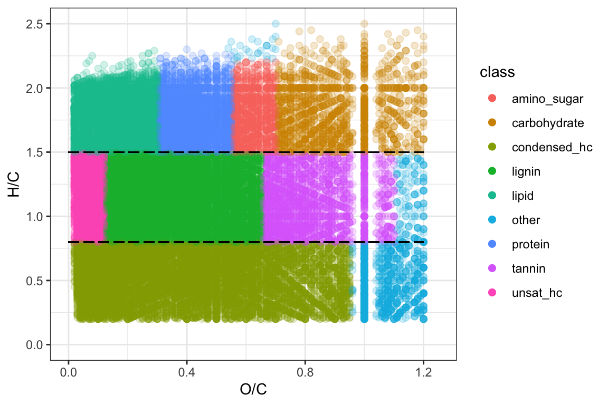
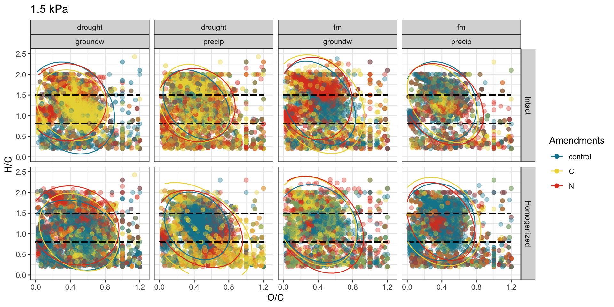
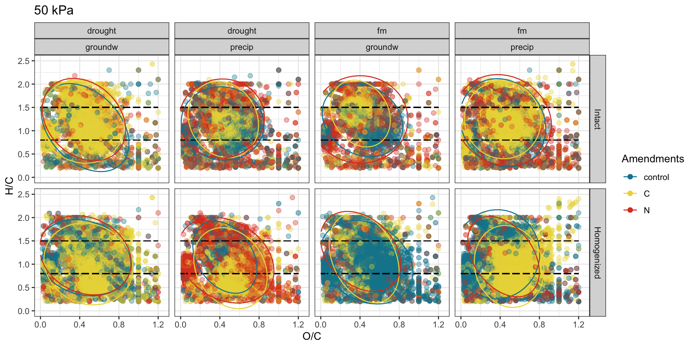
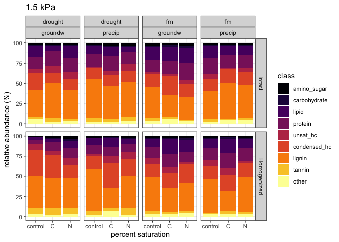
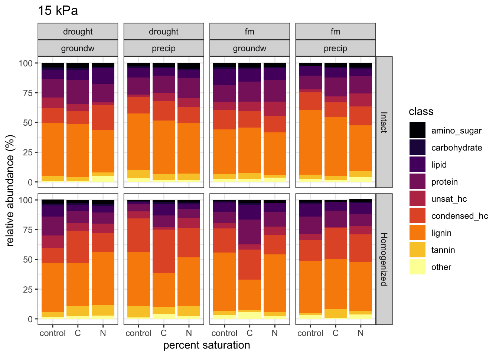
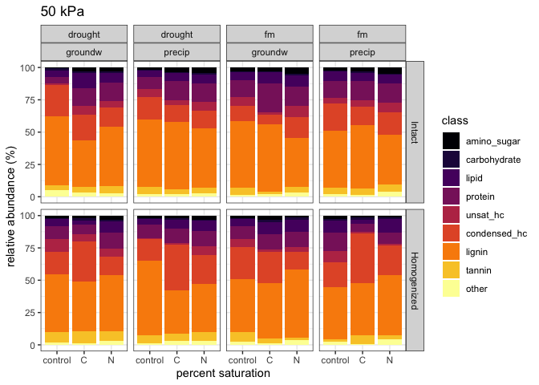

fticr
================

### fticr domains

<!-- -->

**aromatic peaks**

<!-- -->

-----

### van krevelens

<!-- --><!-- --><!-- -->

-----

### relative abundances

<!-- --><!-- --><!-- -->

<!-- -->

-----

### PEAKS

distinct peaks seen in each treatment type

    #> [1] "1.5 kPa -- INTACT"

| Moisture | Wetting | class         | control |    C |    N |
| :------- | :------ | :------------ | ------: | ---: | ---: |
| drought  | groundw | amino\_sugar  |      30 |   61 |   55 |
| drought  | groundw | carbohydrate  |      16 |   13 |   14 |
| drought  | groundw | lipid         |     123 |  140 |  180 |
| drought  | groundw | protein       |     133 |  335 |  226 |
| drought  | groundw | unsat\_hc     |      96 |  168 |  173 |
| drought  | groundw | condensed\_hc |     284 |  289 |  152 |
| drought  | groundw | lignin        |     356 |  870 |  445 |
| drought  | groundw | tannin        |      46 |  100 |   29 |
| drought  | groundw | other         |      60 |   44 |   33 |
| drought  | groundw | total         |    1144 | 2020 | 1307 |
| drought  | precip  | amino\_sugar  |      47 |   97 |   72 |
| drought  | precip  | carbohydrate  |      14 |   36 |   27 |
| drought  | precip  | lipid         |     142 |  268 |  114 |
| drought  | precip  | protein       |     199 |  427 |  261 |
| drought  | precip  | unsat\_hc     |      38 |  124 |  174 |
| drought  | precip  | condensed\_hc |     219 |  418 |  302 |
| drought  | precip  | lignin        |     746 |  953 |  715 |
| drought  | precip  | tannin        |      62 |  108 |   93 |
| drought  | precip  | other         |      43 |   68 |   65 |
| drought  | precip  | total         |    1510 | 2499 | 1823 |
| fm       | groundw | amino\_sugar  |      49 |   41 |   67 |
| fm       | groundw | carbohydrate  |      19 |   24 |   25 |
| fm       | groundw | lipid         |     193 |  187 |  256 |
| fm       | groundw | protein       |     169 |  176 |  334 |
| fm       | groundw | unsat\_hc     |      30 |   31 |  108 |
| fm       | groundw | condensed\_hc |     261 |  294 |  228 |
| fm       | groundw | lignin        |     518 |  302 |  371 |
| fm       | groundw | tannin        |      56 |   45 |   18 |
| fm       | groundw | other         |      47 |   60 |   39 |
| fm       | groundw | total         |    1342 | 1160 | 1446 |
| fm       | precip  | amino\_sugar  |      32 |   18 |   26 |
| fm       | precip  | carbohydrate  |       8 |    9 |    6 |
| fm       | precip  | lipid         |     125 |   83 |   75 |
| fm       | precip  | protein       |     145 |  118 |  106 |
| fm       | precip  | unsat\_hc     |      90 |   10 |   56 |
| fm       | precip  | condensed\_hc |     143 |  151 |  140 |
| fm       | precip  | lignin        |     313 |  356 |  262 |
| fm       | precip  | tannin        |      25 |   16 |   30 |
| fm       | precip  | other         |      24 |   36 |   37 |
| fm       | precip  | total         |     905 |  797 |  738 |

    #> [1] "15 kPa -- INTACT"

| Moisture | Wetting | class         | control |    C |    N |
| :------- | :------ | :------------ | ------: | ---: | ---: |
| drought  | groundw | amino\_sugar  |     177 |  142 |   47 |
| drought  | groundw | carbohydrate  |     106 |   49 |   18 |
| drought  | groundw | lipid         |     320 |  285 |  165 |
| drought  | groundw | protein       |     644 |  669 |  191 |
| drought  | groundw | unsat\_hc     |     504 |  242 |   39 |
| drought  | groundw | condensed\_hc |     614 |  387 |  271 |
| drought  | groundw | lignin        |    1639 | 1393 |  431 |
| drought  | groundw | tannin        |     144 |  102 |   37 |
| drought  | groundw | other         |      47 |   31 |   66 |
| drought  | groundw | total         |    4195 | 3300 | 1265 |
| drought  | precip  | amino\_sugar  |      32 |   97 |   76 |
| drought  | precip  | carbohydrate  |      13 |   39 |   20 |
| drought  | precip  | lipid         |      81 |  205 |  101 |
| drought  | precip  | protein       |     145 |  432 |  279 |
| drought  | precip  | unsat\_hc     |      30 |  269 |  162 |
| drought  | precip  | condensed\_hc |     139 |  572 |  214 |
| drought  | precip  | lignin        |     599 | 1344 |  727 |
| drought  | precip  | tannin        |      94 |  152 |   93 |
| drought  | precip  | other         |      32 |   69 |   25 |
| drought  | precip  | total         |    1165 | 3179 | 1697 |
| fm       | groundw | amino\_sugar  |      73 |   99 |   30 |
| fm       | groundw | carbohydrate  |      14 |   25 |    7 |
| fm       | groundw | lipid         |     158 |  236 |   91 |
| fm       | groundw | protein       |     260 |  392 |  153 |
| fm       | groundw | unsat\_hc     |     158 |  167 |  132 |
| fm       | groundw | condensed\_hc |     316 |  321 |  125 |
| fm       | groundw | lignin        |     776 |  949 |  337 |
| fm       | groundw | tannin        |      68 |  125 |   25 |
| fm       | groundw | other         |      42 |   59 |   38 |
| fm       | groundw | total         |    1865 | 2373 |  938 |
| fm       | precip  | amino\_sugar  |      30 |  136 |   62 |
| fm       | precip  | carbohydrate  |       8 |   46 |   17 |
| fm       | precip  | lipid         |     123 |  323 |  101 |
| fm       | precip  | protein       |     151 |  628 |  215 |
| fm       | precip  | unsat\_hc     |      50 |  212 |  171 |
| fm       | precip  | condensed\_hc |     263 |  552 |  263 |
| fm       | precip  | lignin        |     770 | 1945 |  585 |
| fm       | precip  | tannin        |      63 |  151 |  100 |
| fm       | precip  | other         |      39 |   59 |   60 |
| fm       | precip  | total         |    1497 | 4052 | 1574 |

    #> [1] "50 kPa -- INTACT"

| Moisture | Wetting | class         | control |    C |    N |
| :------- | :------ | :------------ | ------: | ---: | ---: |
| drought  | groundw | amino\_sugar  |       5 |  116 |   31 |
| drought  | groundw | carbohydrate  |      17 |   37 |    9 |
| drought  | groundw | lipid         |      42 |  216 |   79 |
| drought  | groundw | protein       |      43 |  461 |  131 |
| drought  | groundw | unsat\_hc     |      11 |  274 |   61 |
| drought  | groundw | condensed\_hc |     218 |  580 |  162 |
| drought  | groundw | lignin        |     470 | 1368 |  429 |
| drought  | groundw | tannin        |      34 |  168 |   64 |
| drought  | groundw | other         |      46 |   62 |   29 |
| drought  | groundw | total         |     886 | 3282 |  995 |
| drought  | precip  | amino\_sugar  |      49 |   98 |   96 |
| drought  | precip  | carbohydrate  |      21 |   22 |   41 |
| drought  | precip  | lipid         |     124 |  173 |  152 |
| drought  | precip  | protein       |     231 |  422 |  314 |
| drought  | precip  | unsat\_hc     |     196 |  106 |  174 |
| drought  | precip  | condensed\_hc |     474 |  366 |  332 |
| drought  | precip  | lignin        |    1148 | 1474 |  952 |
| drought  | precip  | tannin        |     136 |  112 |  107 |
| drought  | precip  | other         |      51 |   52 |   59 |
| drought  | precip  | total         |    2430 | 2825 | 2227 |
| fm       | groundw | amino\_sugar  |      46 |   43 |   76 |
| fm       | groundw | carbohydrate  |       6 |   13 |   19 |
| fm       | groundw | lipid         |      79 |  129 |  119 |
| fm       | groundw | protein       |     176 |  324 |  185 |
| fm       | groundw | unsat\_hc     |     133 |   37 |  171 |
| fm       | groundw | condensed\_hc |     214 |  122 |  280 |
| fm       | groundw | lignin        |     683 |  688 |  576 |
| fm       | groundw | tannin        |     101 |   32 |   81 |
| fm       | groundw | other         |      24 |   29 |   54 |
| fm       | groundw | total         |    1462 | 1417 | 1561 |
| fm       | precip  | amino\_sugar  |      49 |  139 |   83 |
| fm       | precip  | carbohydrate  |      17 |   55 |   27 |
| fm       | precip  | lipid         |     119 |  268 |  140 |
| fm       | precip  | protein       |     248 |  602 |  268 |
| fm       | precip  | unsat\_hc     |     121 |  220 |  157 |
| fm       | precip  | condensed\_hc |     436 |  603 |  363 |
| fm       | precip  | lignin        |     722 | 1876 |  679 |
| fm       | precip  | tannin        |     106 |  194 |  107 |
| fm       | precip  | other         |      46 |   53 |   77 |
| fm       | precip  | total         |    1864 | 4010 | 1901 |

    #> [1] "1.5 kPa -- HOMOGENIZED"

| Moisture | Wetting | class         | control |    C |    N |
| :------- | :------ | :------------ | ------: | ---: | ---: |
| drought  | groundw | amino\_sugar  |      27 |   54 |   93 |
| drought  | groundw | carbohydrate  |      20 |   33 |   42 |
| drought  | groundw | lipid         |      99 |   87 |  165 |
| drought  | groundw | protein       |     140 |  222 |  233 |
| drought  | groundw | unsat\_hc     |     234 |  143 |  173 |
| drought  | groundw | condensed\_hc |     905 |  730 |  355 |
| drought  | groundw | lignin        |    1070 |  826 |  756 |
| drought  | groundw | tannin        |     209 |  213 |  187 |
| drought  | groundw | other         |      91 |   65 |   59 |
| drought  | groundw | total         |    2795 | 2373 | 2063 |
| drought  | precip  | amino\_sugar  |      38 |   25 |   37 |
| drought  | precip  | carbohydrate  |      11 |    8 |   12 |
| drought  | precip  | lipid         |     114 |  148 |   99 |
| drought  | precip  | protein       |     215 |  133 |  147 |
| drought  | precip  | unsat\_hc     |      89 |  126 |  132 |
| drought  | precip  | condensed\_hc |     332 |  428 |  368 |
| drought  | precip  | lignin        |     938 |  350 |  573 |
| drought  | precip  | tannin        |      93 |   55 |  125 |
| drought  | precip  | other         |      39 |   93 |   45 |
| drought  | precip  | total         |    1869 | 1366 | 1538 |
| fm       | groundw | amino\_sugar  |      42 |   48 |   20 |
| fm       | groundw | carbohydrate  |      19 |   16 |   27 |
| fm       | groundw | lipid         |     125 |  212 |  121 |
| fm       | groundw | protein       |     191 |  208 |   94 |
| fm       | groundw | unsat\_hc     |     120 |  128 |   16 |
| fm       | groundw | condensed\_hc |     240 |  248 |  225 |
| fm       | groundw | lignin        |     545 |  450 |  266 |
| fm       | groundw | tannin        |      55 |   35 |   18 |
| fm       | groundw | other         |      57 |   48 |   48 |
| fm       | groundw | total         |    1394 | 1393 |  835 |
| fm       | precip  | amino\_sugar  |      67 |   22 |   20 |
| fm       | precip  | carbohydrate  |      25 |   12 |   16 |
| fm       | precip  | lipid         |     263 |  136 |  116 |
| fm       | precip  | protein       |     361 |  183 |  159 |
| fm       | precip  | unsat\_hc     |     180 |  107 |   20 |
| fm       | precip  | condensed\_hc |     392 |  180 |  183 |
| fm       | precip  | lignin        |     778 |  312 |  492 |
| fm       | precip  | tannin        |      26 |   28 |   17 |
| fm       | precip  | other         |      68 |   36 |   40 |
| fm       | precip  | total         |    2160 | 1016 | 1063 |

    #> [1] "15 kPa -- HOMOGENIZED"

| Moisture | Wetting | class         | control |    C |    N |
| :------- | :------ | :------------ | ------: | ---: | ---: |
| drought  | groundw | amino\_sugar  |      41 |   95 |   64 |
| drought  | groundw | carbohydrate  |      16 |   74 |   26 |
| drought  | groundw | lipid         |     110 |  161 |   95 |
| drought  | groundw | protein       |     182 |  340 |  143 |
| drought  | groundw | unsat\_hc     |     139 |  234 |  140 |
| drought  | groundw | condensed\_hc |     168 | 1130 |  296 |
| drought  | groundw | lignin        |     487 | 1407 |  727 |
| drought  | groundw | tannin        |      48 |  349 |  164 |
| drought  | groundw | other         |      15 |   71 |   53 |
| drought  | groundw | total         |    1206 | 3861 | 1708 |
| drought  | precip  | amino\_sugar  |      41 |   29 |   73 |
| drought  | precip  | carbohydrate  |      13 |   27 |   33 |
| drought  | precip  | lipid         |      64 |  104 |  155 |
| drought  | precip  | protein       |     176 |  139 |  241 |
| drought  | precip  | unsat\_hc     |     198 |   72 |  286 |
| drought  | precip  | condensed\_hc |    1033 |  939 |  943 |
| drought  | precip  | lignin        |    1399 |  636 | 1222 |
| drought  | precip  | tannin        |     342 |  160 |  290 |
| drought  | precip  | other         |      45 |   64 |   89 |
| drought  | precip  | total         |    3311 | 2170 | 3332 |
| fm       | groundw | amino\_sugar  |      37 |   19 |   55 |
| fm       | groundw | carbohydrate  |      14 |   11 |   11 |
| fm       | groundw | lipid         |     142 |   93 |  142 |
| fm       | groundw | protein       |     187 |  152 |  240 |
| fm       | groundw | unsat\_hc     |     145 |   40 |  196 |
| fm       | groundw | condensed\_hc |     620 |  195 |  419 |
| fm       | groundw | lignin        |     989 |  197 | 1046 |
| fm       | groundw | tannin        |     124 |   12 |   94 |
| fm       | groundw | other         |      68 |   46 |   50 |
| fm       | groundw | total         |    2326 |  765 | 2253 |
| fm       | precip  | amino\_sugar  |      53 |   23 |   47 |
| fm       | precip  | carbohydrate  |      21 |    6 |   12 |
| fm       | precip  | lipid         |     273 |   33 |  140 |
| fm       | precip  | protein       |     357 |  105 |  242 |
| fm       | precip  | unsat\_hc     |     142 |    4 |  196 |
| fm       | precip  | condensed\_hc |     411 |  379 |  468 |
| fm       | precip  | lignin        |     863 |  541 |  988 |
| fm       | precip  | tannin        |      40 |  112 |  105 |
| fm       | precip  | other         |      64 |    7 |   57 |
| fm       | precip  | total         |    2224 | 1210 | 2255 |

    #> [1] "50 kPa -- HOMOGENIZED"

| Moisture | Wetting | class         | control |    C |    N |
| :------- | :------ | :------------ | ------: | ---: | ---: |
| drought  | groundw | amino\_sugar  |      57 |  103 |   44 |
| drought  | groundw | carbohydrate  |      20 |   82 |   17 |
| drought  | groundw | lipid         |     145 |  137 |  107 |
| drought  | groundw | protein       |     249 |  299 |  144 |
| drought  | groundw | unsat\_hc     |     263 |  235 |  119 |
| drought  | groundw | condensed\_hc |     507 | 1320 |  247 |
| drought  | groundw | lignin        |    1141 | 1453 |  652 |
| drought  | groundw | tannin        |     237 |  373 |  151 |
| drought  | groundw | other         |      56 |   54 |   48 |
| drought  | groundw | total         |    2675 | 4056 | 1529 |
| drought  | precip  | amino\_sugar  |      27 |   31 |   71 |
| drought  | precip  | carbohydrate  |       7 |   26 |   23 |
| drought  | precip  | lipid         |      69 |   79 |  172 |
| drought  | precip  | protein       |     156 |  150 |  245 |
| drought  | precip  | unsat\_hc     |      11 |   68 |  251 |
| drought  | precip  | condensed\_hc |     303 | 1255 |  809 |
| drought  | precip  | lignin        |     857 | 1070 | 1109 |
| drought  | precip  | tannin        |      90 |  247 |  248 |
| drought  | precip  | other         |      18 |   43 |   73 |
| drought  | precip  | total         |    1538 | 2969 | 3001 |
| fm       | groundw | amino\_sugar  |      67 |   70 |   16 |
| fm       | groundw | carbohydrate  |      22 |   42 |    9 |
| fm       | groundw | lipid         |     164 |  153 |   71 |
| fm       | groundw | protein       |     265 |  200 |   91 |
| fm       | groundw | unsat\_hc     |     246 |   42 |   34 |
| fm       | groundw | condensed\_hc |    1056 |  534 |  119 |
| fm       | groundw | lignin        |    1335 |  864 |  329 |
| fm       | groundw | tannin        |     245 |   84 |   16 |
| fm       | groundw | other         |      97 |   25 |   35 |
| fm       | groundw | total         |    3497 | 2014 |  720 |
| fm       | precip  | amino\_sugar  |      78 |   79 |   15 |
| fm       | precip  | carbohydrate  |      30 |   90 |   12 |
| fm       | precip  | lipid         |     239 |  136 |   84 |
| fm       | precip  | protein       |     368 |  307 |   96 |
| fm       | precip  | unsat\_hc     |     228 |   84 |   12 |
| fm       | precip  | condensed\_hc |     537 | 1740 |  199 |
| fm       | precip  | lignin        |     996 | 1829 |  705 |
| fm       | precip  | tannin        |      50 |  348 |   32 |
| fm       | precip  | other         |      69 |   16 |   33 |
| fm       | precip  | total         |    2595 | 4629 | 1188 |

-----

#### Session Info

Date run: 2020-07-07

    #> R version 4.0.1 (2020-06-06)
    #> Platform: x86_64-apple-darwin17.0 (64-bit)
    #> Running under: macOS Mojave 10.14.6
    #> 
    #> Matrix products: default
    #> BLAS:   /Library/Frameworks/R.framework/Versions/4.0/Resources/lib/libRblas.dylib
    #> LAPACK: /Library/Frameworks/R.framework/Versions/4.0/Resources/lib/libRlapack.dylib
    #> 
    #> locale:
    #> [1] en_US.UTF-8/en_US.UTF-8/en_US.UTF-8/C/en_US.UTF-8/en_US.UTF-8
    #> 
    #> attached base packages:
    #> [1] stats     graphics  grDevices utils     datasets  methods   base     
    #> 
    #> other attached packages:
    #>  [1] PNWColors_0.1.0 forcats_0.5.0   stringr_1.4.0   dplyr_1.0.0    
    #>  [5] purrr_0.3.4     readr_1.3.1     tidyr_1.1.0     tibble_3.0.1   
    #>  [9] ggplot2_3.3.2   tidyverse_1.3.0
    #> 
    #> loaded via a namespace (and not attached):
    #>  [1] tidyselect_1.1.0  xfun_0.15         haven_2.3.1       lattice_0.20-41  
    #>  [5] colorspace_1.4-1  vctrs_0.3.1       generics_0.0.2    viridisLite_0.3.0
    #>  [9] htmltools_0.5.0   yaml_2.2.1        blob_1.2.1        rlang_0.4.6      
    #> [13] pillar_1.4.4      glue_1.4.1        withr_2.2.0       DBI_1.1.0        
    #> [17] dbplyr_1.4.4      modelr_0.1.8      readxl_1.3.1      lifecycle_0.2.0  
    #> [21] munsell_0.5.0     gtable_0.3.0      cellranger_1.1.0  rvest_0.3.5      
    #> [25] evaluate_0.14     labeling_0.3      knitr_1.28        fansi_0.4.1      
    #> [29] highr_0.8         broom_0.5.6       Rcpp_1.0.4.6      scales_1.1.1     
    #> [33] backports_1.1.8   jsonlite_1.6.1    farver_2.0.3      fs_1.4.1         
    #> [37] hms_0.5.3         digest_0.6.25     stringi_1.4.6     grid_4.0.1       
    #> [41] cli_2.0.2         tools_4.0.1       magrittr_1.5      crayon_1.3.4     
    #> [45] pkgconfig_2.0.3   MASS_7.3-51.6     ellipsis_0.3.1    xml2_1.3.2       
    #> [49] reprex_0.3.0      lubridate_1.7.9   assertthat_0.2.1  rmarkdown_2.3    
    #> [53] httr_1.4.1        rstudioapi_0.11   R6_2.4.1          nlme_3.1-148     
    #> [57] compiler_4.0.1
