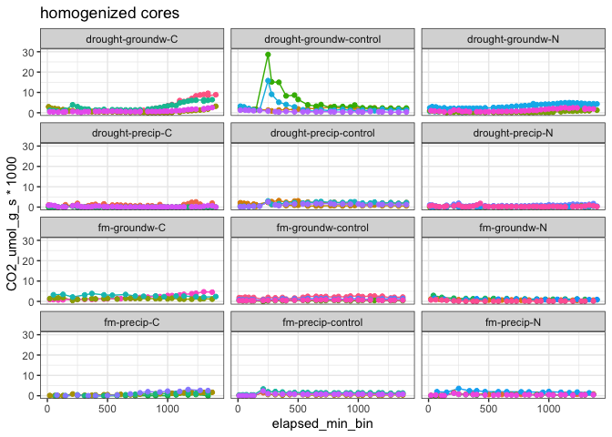
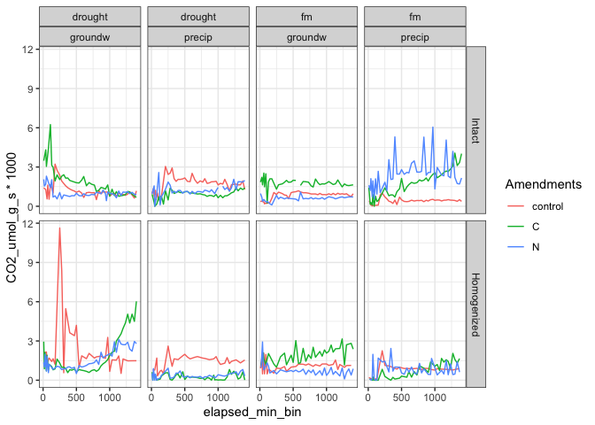
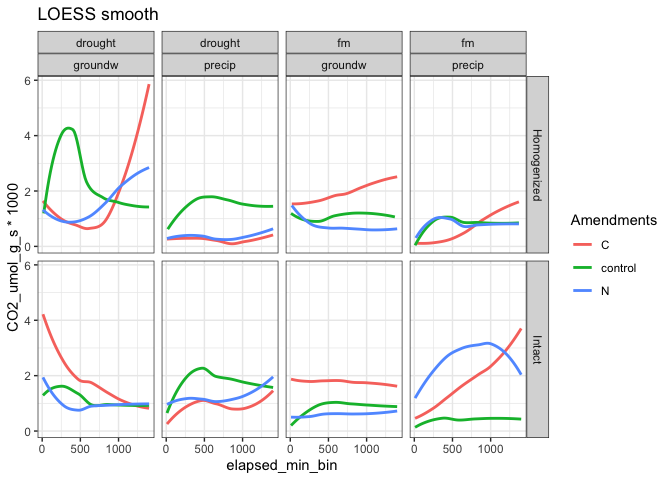
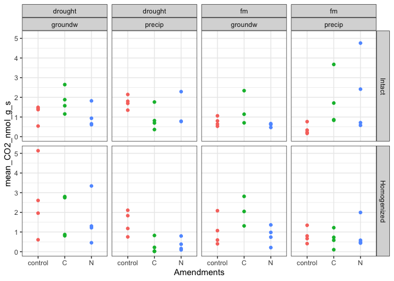

Spatial Access – Gas Fluxes
================

### time series of fluxes

<!-- --><!-- -->

<!-- --><!-- -->

-----

## FLUX – summaries

### MEAN FLUX

| Homogenization | Moisture | Wetting |   control   |      C      |      N      |
| :------------: | :------: | :-----: | :---------: | :---------: | :---------: |
|     Intact     | drought  | groundw | 1.21 ± 0.22 | 1.81 ± 0.32 | 1.01 ± 0.28 |
|     Intact     | drought  | precip  | 1.75 ± 0.16 | 0.91 ± 0.3  | 1.28 ± 0.44 |
|     Intact     |    fm    | groundw | 0.76 ± 0.12 | 1.4 ± 0.42  | 0.6 ± 0.04  |
|     Intact     |    fm    | precip  | 0.37 ± 0.14 | 1.77 ± 0.67 | 2.12 ± 0.98 |
|  Homogenized   | drought  | groundw | 2.58 ± 0.95 | 1.81 ± 0.56 | 1.58 ± 0.62 |
|  Homogenized   | drought  | precip  | 1.47 ± 0.31 | 0.27 ± 0.19 | 0.36 ± 0.16 |
|  Homogenized   |    fm    | groundw | 1.04 ± 0.38 | 2.06 ± 0.43 | 0.82 ± 0.24 |
|  Homogenized   |    fm    | precip  |  0.8 ± 0.2  | 0.66 ± 0.23 | 0.87 ± 0.37 |

#### Dunnett’s Test - effect of amendment

**different from control**

    #> [1] "log-transformed"

| Homogenization | Moisture | Wetting | C  | N  |
| :------------- | :------- | :------ | :- | :- |
| Intact         | drought  | groundw |    |    |
| Intact         | drought  | precip  |    |    |
| Intact         | fm       | groundw |    |    |
| Intact         | fm       | precip  | \* | \* |
| Homogenized    | drought  | groundw |    |    |
| Homogenized    | drought  | precip  | \* |    |
| Homogenized    | fm       | groundw |    |    |
| Homogenized    | fm       | precip  |    |    |

<!-- -->

-----

#### Session Info

Date run: 2020-07-06

    #> R version 4.0.1 (2020-06-06)
    #> Platform: x86_64-apple-darwin17.0 (64-bit)
    #> Running under: macOS Mojave 10.14.6
    #> 
    #> Matrix products: default
    #> BLAS:   /Library/Frameworks/R.framework/Versions/4.0/Resources/lib/libRblas.dylib
    #> LAPACK: /Library/Frameworks/R.framework/Versions/4.0/Resources/lib/libRlapack.dylib
    #> 
    #> locale:
    #> [1] en_US.UTF-8/en_US.UTF-8/en_US.UTF-8/C/en_US.UTF-8/en_US.UTF-8
    #> 
    #> attached base packages:
    #> [1] stats     graphics  grDevices utils     datasets  methods   base     
    #> 
    #> other attached packages:
    #> [1] forcats_0.5.0   stringr_1.4.0   dplyr_1.0.0     purrr_0.3.4    
    #> [5] readr_1.3.1     tidyr_1.1.0     tibble_3.0.1    ggplot2_3.3.2  
    #> [9] tidyverse_1.3.0
    #> 
    #> loaded via a namespace (and not attached):
    #>  [1] Rcpp_1.0.4.6      lubridate_1.7.9   mvtnorm_1.1-1     lattice_0.20-41  
    #>  [5] assertthat_0.2.1  digest_0.6.25     R6_2.4.1          cellranger_1.1.0 
    #>  [9] backports_1.1.8   reprex_0.3.0      evaluate_0.14     httr_1.4.1       
    #> [13] highr_0.8         pillar_1.4.4      rlang_0.4.6       readxl_1.3.1     
    #> [17] rstudioapi_0.11   blob_1.2.1        Matrix_1.2-18     rmarkdown_2.3    
    #> [21] labeling_0.3      splines_4.0.1     munsell_0.5.0     broom_0.5.6      
    #> [25] compiler_4.0.1    modelr_0.1.8      xfun_0.15         pkgconfig_2.0.3  
    #> [29] mgcv_1.8-31       DescTools_0.99.36 htmltools_0.5.0   tidyselect_1.1.0 
    #> [33] expm_0.999-4      fansi_0.4.1       crayon_1.3.4      dbplyr_1.4.4     
    #> [37] withr_2.2.0       MASS_7.3-51.6     grid_4.0.1        nlme_3.1-148     
    #> [41] jsonlite_1.6.1    gtable_0.3.0      lifecycle_0.2.0   DBI_1.1.0        
    #> [45] magrittr_1.5      scales_1.1.1      cli_2.0.2         stringi_1.4.6    
    #> [49] farver_2.0.3      fs_1.4.1          xml2_1.3.2        ellipsis_0.3.1   
    #> [53] generics_0.0.2    vctrs_0.3.1       boot_1.3-25       tools_4.0.1      
    #> [57] glue_1.4.1        hms_0.5.3         yaml_2.2.1        colorspace_1.4-1 
    #> [61] rvest_0.3.5       knitr_1.28        haven_2.3.1
