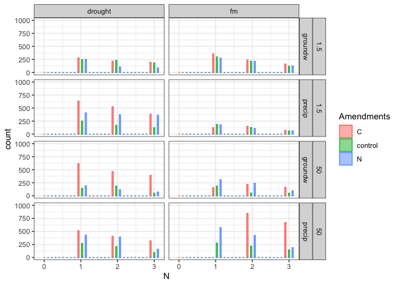

fticr
================

## HYPOTHESES

  - C amendments will increase diversity of SOM molecules
  - C amendments will cause a depletion of aromatic molecules,
    especially in fine pores
  - Homogenization will increase (a) total peaks, (b) diversity of
    peaks, (c) aromatic peaks

We selected only peaks seen in \>1 of the 4 replicates (i.e. n = 2 or 3
or 4)

-----

### fticr domains

<!-- --><!-- -->

-----

### van krevelens

<!-- -->

<!-- --><!-- -->

-----

### relative abundances

<!-- -->

<!-- -->

-----

### PEAKS

distinct peaks seen in each treatment type

click to expand

    #> [1] "1.5 kPa -- INTACT"

| Moisture | Wetting | class              | control |    C |    N |
| :------- | :------ | :----------------- | ------: | ---: | ---: |
| drought  | groundw | aliphatic          |     301 |  547 |  474 |
| drought  | groundw | unsaturated/lignin |     466 | 1014 |  553 |
| drought  | groundw | aromatic           |      90 |  281 |  138 |
| drought  | groundw | condensed\_arom    |     285 |  176 |  140 |
| drought  | groundw | other              |       2 |    2 |    2 |
| drought  | groundw | total              |    1144 | 2020 | 1307 |
| drought  | precip  | aliphatic          |     401 |  825 |  471 |
| drought  | precip  | unsaturated/lignin |     812 | 1080 |  872 |
| drought  | precip  | aromatic           |     106 |  236 |  211 |
| drought  | precip  | condensed\_arom    |     189 |  356 |  267 |
| drought  | precip  | other              |       2 |    2 |    2 |
| drought  | precip  | total              |    1510 | 2499 | 1823 |
| fm       | groundw | aliphatic          |     431 |  426 |  679 |
| fm       | groundw | unsaturated/lignin |     586 |  410 |  449 |
| fm       | groundw | aromatic           |      82 |   78 |  118 |
| fm       | groundw | condensed\_arom    |     241 |  242 |  197 |
| fm       | groundw | other              |       2 |    4 |    3 |
| fm       | groundw | total              |    1342 | 1160 | 1446 |
| fm       | precip  | aliphatic          |     309 |  227 |  213 |
| fm       | precip  | unsaturated/lignin |     383 |  394 |  332 |
| fm       | precip  | aromatic           |      78 |   23 |   51 |
| fm       | precip  | condensed\_arom    |     131 |  149 |  139 |
| fm       | precip  | other              |       4 |    4 |    3 |
| fm       | precip  | total              |     905 |  797 |  738 |

    #> [1] "15 kPa -- INTACT"

| Moisture | Wetting | class              | control |    C |    N |
| :------- | :------ | :----------------- | ------: | ---: | ---: |
| drought  | groundw | aliphatic          |    1247 | 1141 |  421 |
| drought  | groundw | unsaturated/lignin |    1932 | 1491 |  522 |
| drought  | groundw | aromatic           |     699 |  440 |   51 |
| drought  | groundw | condensed\_arom    |     317 |  226 |  269 |
| drought  | groundw | other              |      NA |    2 |    2 |
| drought  | groundw | total              |    4195 | 3300 | 1265 |
| drought  | precip  | aliphatic          |     270 |  772 |  476 |
| drought  | precip  | unsaturated/lignin |     685 | 1526 |  846 |
| drought  | precip  | aromatic           |      71 |  541 |  213 |
| drought  | precip  | condensed\_arom    |     137 |  337 |  158 |
| drought  | precip  | other              |       2 |    3 |    4 |
| drought  | precip  | total              |    1165 | 3179 | 1697 |
| fm       | groundw | aliphatic          |     504 |  751 |  281 |
| fm       | groundw | unsaturated/lignin |     853 | 1103 |  442 |
| fm       | groundw | aromatic           |     255 |  270 |   85 |
| fm       | groundw | condensed\_arom    |     249 |  247 |  128 |
| fm       | groundw | other              |       4 |    2 |    2 |
| fm       | groundw | total              |    1865 | 2373 |  938 |
| fm       | precip  | aliphatic          |     312 | 1131 |  394 |
| fm       | precip  | unsaturated/lignin |     803 | 2022 |  762 |
| fm       | precip  | aromatic           |     210 |  541 |  172 |
| fm       | precip  | condensed\_arom    |     170 |  354 |  244 |
| fm       | precip  | other              |       2 |    4 |    2 |
| fm       | precip  | total              |    1497 | 4052 | 1574 |

    #> [1] "50 kPa -- INTACT"

| Moisture | Wetting | class              | control |    C |    N |
| :------- | :------ | :----------------- | ------: | ---: | ---: |
| drought  | groundw | aliphatic          |     106 |  828 |  250 |
| drought  | groundw | unsaturated/lignin |     506 | 1552 |  509 |
| drought  | groundw | aromatic           |      80 |  580 |   83 |
| drought  | groundw | condensed\_arom    |     192 |  318 |  152 |
| drought  | groundw | other              |       2 |    4 |    1 |
| drought  | groundw | total              |     886 | 3282 |  995 |
| drought  | precip  | aliphatic          |     424 |  714 |  603 |
| drought  | precip  | unsaturated/lignin |    1251 | 1519 | 1103 |
| drought  | precip  | aromatic           |     456 |  349 |  240 |
| drought  | precip  | condensed\_arom    |     295 |  241 |  277 |
| drought  | precip  | other              |       4 |    2 |    4 |
| drought  | precip  | total              |    2430 | 2825 | 2227 |
| fm       | groundw | aliphatic          |     307 |  509 |  399 |
| fm       | groundw | unsaturated/lignin |     791 |  721 |  724 |
| fm       | groundw | aromatic           |     248 |   70 |  204 |
| fm       | groundw | condensed\_arom    |     113 |  113 |  230 |
| fm       | groundw | other              |       3 |    4 |    4 |
| fm       | groundw | total              |    1462 | 1417 | 1561 |
| fm       | precip  | aliphatic          |     432 | 1059 |  517 |
| fm       | precip  | unsaturated/lignin |     849 | 2003 |  870 |
| fm       | precip  | aromatic           |     280 |  546 |  183 |
| fm       | precip  | condensed\_arom    |     301 |  398 |  329 |
| fm       | precip  | other              |       2 |    4 |    2 |
| fm       | precip  | total              |    1864 | 4010 | 1901 |

    #> [1] "1.5 kPa -- HOMOGENIZED"

| Moisture | Wetting | class              | control |    C |    N |
| :------- | :------ | :----------------- | ------: | ---: | ---: |
| drought  | groundw | aliphatic          |     285 |  395 |  533 |
| drought  | groundw | unsaturated/lignin |    1337 | 1081 | 1004 |
| drought  | groundw | aromatic           |     638 |  462 |  264 |
| drought  | groundw | condensed\_arom    |     531 |  434 |  259 |
| drought  | groundw | other              |       4 |    1 |    3 |
| drought  | groundw | total              |    2795 | 2373 | 2063 |
| drought  | precip  | aliphatic          |     379 |  313 |  295 |
| drought  | precip  | unsaturated/lignin |    1012 |  506 |  746 |
| drought  | precip  | aromatic           |     267 |  165 |  250 |
| drought  | precip  | condensed\_arom    |     208 |  379 |  245 |
| drought  | precip  | other              |       3 |    3 |    2 |
| drought  | precip  | total              |    1869 | 1366 | 1538 |
| fm       | groundw | aliphatic          |     377 |  483 |  256 |
| fm       | groundw | unsaturated/lignin |     657 |  552 |  329 |
| fm       | groundw | aromatic           |     123 |  127 |   57 |
| fm       | groundw | condensed\_arom    |     235 |  227 |  190 |
| fm       | groundw | other              |       2 |    4 |    3 |
| fm       | groundw | total              |    1394 | 1393 |  835 |
| fm       | precip  | aliphatic          |     715 |  352 |  310 |
| fm       | precip  | unsaturated/lignin |     866 |  394 |  523 |
| fm       | precip  | aromatic           |     259 |   96 |   40 |
| fm       | precip  | condensed\_arom    |     316 |  170 |  188 |
| fm       | precip  | other              |       4 |    4 |    2 |
| fm       | precip  | total              |    2160 | 1016 | 1063 |

    #> [1] "15 kPa -- HOMOGENIZED"

| Moisture | Wetting | class              | control |    C |    N |
| :------- | :------ | :----------------- | ------: | ---: | ---: |
| drought  | groundw | aliphatic          |     349 |  669 |  328 |
| drought  | groundw | unsaturated/lignin |     560 | 1766 |  939 |
| drought  | groundw | aromatic           |     197 |  762 |  214 |
| drought  | groundw | condensed\_arom    |      99 |  664 |  225 |
| drought  | groundw | other              |       1 |   NA |    2 |
| drought  | groundw | total              |    1206 | 3861 | 1708 |
| drought  | precip  | aliphatic          |     294 |  296 |  500 |
| drought  | precip  | unsaturated/lignin |    1702 |  783 | 1597 |
| drought  | precip  | aromatic           |     829 |  460 |  709 |
| drought  | precip  | condensed\_arom    |     484 |  631 |  525 |
| drought  | precip  | other              |       2 |   NA |    1 |
| drought  | precip  | total              |    3311 | 2170 | 3332 |
| fm       | groundw | aliphatic          |     379 |  274 |  448 |
| fm       | groundw | unsaturated/lignin |    1117 |  247 | 1145 |
| fm       | groundw | aromatic           |     472 |   44 |  389 |
| fm       | groundw | condensed\_arom    |     353 |  198 |  268 |
| fm       | groundw | other              |       5 |    2 |    3 |
| fm       | groundw | total              |    2326 |  765 | 2253 |
| fm       | precip  | aliphatic          |     702 |  167 |  441 |
| fm       | precip  | unsaturated/lignin |     945 |  593 | 1094 |
| fm       | precip  | aromatic           |     218 |  266 |  466 |
| fm       | precip  | condensed\_arom    |     355 |  183 |  250 |
| fm       | precip  | other              |       4 |    1 |    4 |
| fm       | precip  | total              |    2224 | 1210 | 2255 |

    #> [1] "50 kPa -- HOMOGENIZED"

| Moisture | Wetting | class              | control |    C |    N |
| :------- | :------ | :----------------- | ------: | ---: | ---: |
| drought  | groundw | aliphatic          |     471 |  620 |  312 |
| drought  | groundw | unsaturated/lignin |    1434 | 1798 |  841 |
| drought  | groundw | aromatic           |     522 |  875 |  186 |
| drought  | groundw | condensed\_arom    |     248 |  763 |  188 |
| drought  | groundw | other              |      NA |   NA |    2 |
| drought  | groundw | total              |    2675 | 4056 | 1529 |
| drought  | precip  | aliphatic          |     259 |  284 |  510 |
| drought  | precip  | unsaturated/lignin |     865 | 1232 | 1398 |
| drought  | precip  | aromatic           |     264 |  734 |  654 |
| drought  | precip  | condensed\_arom    |     148 |  718 |  438 |
| drought  | precip  | other              |       2 |    1 |    1 |
| drought  | precip  | total              |    1538 | 2969 | 3001 |
| fm       | groundw | aliphatic          |     516 |  465 |  187 |
| fm       | groundw | unsaturated/lignin |    1602 |  875 |  390 |
| fm       | groundw | aromatic           |     780 |  335 |   29 |
| fm       | groundw | condensed\_arom    |     596 |  337 |  113 |
| fm       | groundw | other              |       3 |    2 |    1 |
| fm       | groundw | total              |    3497 | 2014 |  720 |
| fm       | precip  | aliphatic          |     712 |  599 |  206 |
| fm       | precip  | unsaturated/lignin |    1077 | 2020 |  706 |
| fm       | precip  | aromatic           |     409 |  981 |  128 |
| fm       | precip  | condensed\_arom    |     395 | 1029 |  146 |
| fm       | precip  | other              |       2 |   NA |    2 |
| fm       | precip  | total              |    2595 | 4629 | 1188 |

**Peak counts**

<!--html_preserve-->

<table class="gt_table">

<thead class="gt_header">

<tr>

<th colspan="8" class="gt_heading gt_title gt_font_normal" style>

Total Peaks Present

</th>

</tr>

<tr>

<th colspan="8" class="gt_heading gt_subtitle gt_font_normal gt_bottom_border" style>

</th>

</tr>

</thead>

<thead class="gt_col_headings">

<tr>

<th class="gt_col_heading gt_center gt_columns_bottom_border" rowspan="2" colspan="1">

Moisture

</th>

<th class="gt_col_heading gt_center gt_columns_bottom_border" rowspan="2" colspan="1">

Wetting

</th>

<th class="gt_center gt_columns_top_border gt_column_spanner_outer" rowspan="1" colspan="3">

1.5 kPa

</th>

<th class="gt_center gt_columns_top_border gt_column_spanner_outer" rowspan="1" colspan="3">

50 kPa

</th>

</tr>

<tr>

<th class="gt_col_heading gt_columns_bottom_border gt_center" rowspan="1" colspan="1">

1.5-control

</th>

<th class="gt_col_heading gt_columns_bottom_border gt_center" rowspan="1" colspan="1">

1.5-C

</th>

<th class="gt_col_heading gt_columns_bottom_border gt_center" rowspan="1" colspan="1">

1.5-N

</th>

<th class="gt_col_heading gt_columns_bottom_border gt_center" rowspan="1" colspan="1">

50-control

</th>

<th class="gt_col_heading gt_columns_bottom_border gt_center" rowspan="1" colspan="1">

50-C

</th>

<th class="gt_col_heading gt_columns_bottom_border gt_center" rowspan="1" colspan="1">

50-N

</th>

</tr>

</thead>

<tbody class="gt_table_body">

<tr class="gt_group_heading_row">

<td colspan="8" class="gt_group_heading">

Intact

</td>

</tr>

<tr>

<td class="gt_row gt_left">

drought

</td>

<td class="gt_row gt_left">

groundw

</td>

<td class="gt_row gt_center">

1144

</td>

<td class="gt_row gt_center">

2020

</td>

<td class="gt_row gt_center">

1307

</td>

<td class="gt_row gt_center">

886

</td>

<td class="gt_row gt_center">

3282

</td>

<td class="gt_row gt_center">

995

</td>

</tr>

<tr>

<td class="gt_row gt_left">

drought

</td>

<td class="gt_row gt_left">

precip

</td>

<td class="gt_row gt_center">

1510

</td>

<td class="gt_row gt_center">

2499

</td>

<td class="gt_row gt_center">

1823

</td>

<td class="gt_row gt_center">

2430

</td>

<td class="gt_row gt_center">

2825

</td>

<td class="gt_row gt_center">

2227

</td>

</tr>

<tr>

<td class="gt_row gt_left">

fm

</td>

<td class="gt_row gt_left">

groundw

</td>

<td class="gt_row gt_center">

1342

</td>

<td class="gt_row gt_center">

1160

</td>

<td class="gt_row gt_center">

1446

</td>

<td class="gt_row gt_center">

1462

</td>

<td class="gt_row gt_center">

1417

</td>

<td class="gt_row gt_center">

1561

</td>

</tr>

<tr>

<td class="gt_row gt_left">

fm

</td>

<td class="gt_row gt_left">

precip

</td>

<td class="gt_row gt_center">

905

</td>

<td class="gt_row gt_center">

797

</td>

<td class="gt_row gt_center">

738

</td>

<td class="gt_row gt_center">

1864

</td>

<td class="gt_row gt_center">

4010

</td>

<td class="gt_row gt_center">

1901

</td>

</tr>

<tr class="gt_group_heading_row">

<td colspan="8" class="gt_group_heading">

Homogenized

</td>

</tr>

<tr>

<td class="gt_row gt_left">

drought

</td>

<td class="gt_row gt_left">

groundw

</td>

<td class="gt_row gt_center">

2795

</td>

<td class="gt_row gt_center">

2373

</td>

<td class="gt_row gt_center">

2063

</td>

<td class="gt_row gt_center">

2675

</td>

<td class="gt_row gt_center">

4056

</td>

<td class="gt_row gt_center">

1529

</td>

</tr>

<tr>

<td class="gt_row gt_left">

drought

</td>

<td class="gt_row gt_left">

precip

</td>

<td class="gt_row gt_center">

1869

</td>

<td class="gt_row gt_center">

1366

</td>

<td class="gt_row gt_center">

1538

</td>

<td class="gt_row gt_center">

1538

</td>

<td class="gt_row gt_center">

2969

</td>

<td class="gt_row gt_center">

3001

</td>

</tr>

<tr>

<td class="gt_row gt_left">

fm

</td>

<td class="gt_row gt_left">

groundw

</td>

<td class="gt_row gt_center">

1394

</td>

<td class="gt_row gt_center">

1393

</td>

<td class="gt_row gt_center">

835

</td>

<td class="gt_row gt_center">

3497

</td>

<td class="gt_row gt_center">

2014

</td>

<td class="gt_row gt_center">

720

</td>

</tr>

<tr>

<td class="gt_row gt_left">

fm

</td>

<td class="gt_row gt_left">

precip

</td>

<td class="gt_row gt_center">

2160

</td>

<td class="gt_row gt_center">

1016

</td>

<td class="gt_row gt_center">

1063

</td>

<td class="gt_row gt_center">

2595

</td>

<td class="gt_row gt_center">

4629

</td>

<td class="gt_row gt_center">

1188

</td>

</tr>

</tbody>

</table>

<!--/html_preserve-->

<!--html_preserve-->

<table class="gt_table">

<thead class="gt_header">

<tr>

<th colspan="8" class="gt_heading gt_title gt_font_normal" style>

Aromatic Peaks Present

</th>

</tr>

<tr>

<th colspan="8" class="gt_heading gt_subtitle gt_font_normal gt_bottom_border" style>

</th>

</tr>

</thead>

<thead class="gt_col_headings">

<tr>

<th class="gt_col_heading gt_center gt_columns_bottom_border" rowspan="2" colspan="1">

Moisture

</th>

<th class="gt_col_heading gt_center gt_columns_bottom_border" rowspan="2" colspan="1">

Wetting

</th>

<th class="gt_center gt_columns_top_border gt_column_spanner_outer" rowspan="1" colspan="3">

1.5 kPa

</th>

<th class="gt_center gt_columns_top_border gt_column_spanner_outer" rowspan="1" colspan="3">

50 kPa

</th>

</tr>

<tr>

<th class="gt_col_heading gt_columns_bottom_border gt_center" rowspan="1" colspan="1">

1.5-control

</th>

<th class="gt_col_heading gt_columns_bottom_border gt_center" rowspan="1" colspan="1">

1.5-C

</th>

<th class="gt_col_heading gt_columns_bottom_border gt_center" rowspan="1" colspan="1">

1.5-N

</th>

<th class="gt_col_heading gt_columns_bottom_border gt_center" rowspan="1" colspan="1">

50-control

</th>

<th class="gt_col_heading gt_columns_bottom_border gt_center" rowspan="1" colspan="1">

50-C

</th>

<th class="gt_col_heading gt_columns_bottom_border gt_center" rowspan="1" colspan="1">

50-N

</th>

</tr>

</thead>

<tbody class="gt_table_body">

<tr class="gt_group_heading_row">

<td colspan="8" class="gt_group_heading">

Intact

</td>

</tr>

<tr>

<td class="gt_row gt_left">

drought

</td>

<td class="gt_row gt_left">

groundw

</td>

<td class="gt_row gt_center">

375

</td>

<td class="gt_row gt_center">

457

</td>

<td class="gt_row gt_center">

278

</td>

<td class="gt_row gt_center">

272

</td>

<td class="gt_row gt_center">

898

</td>

<td class="gt_row gt_center">

235

</td>

</tr>

<tr>

<td class="gt_row gt_left">

drought

</td>

<td class="gt_row gt_left">

precip

</td>

<td class="gt_row gt_center">

295

</td>

<td class="gt_row gt_center">

592

</td>

<td class="gt_row gt_center">

478

</td>

<td class="gt_row gt_center">

751

</td>

<td class="gt_row gt_center">

590

</td>

<td class="gt_row gt_center">

517

</td>

</tr>

<tr>

<td class="gt_row gt_left">

fm

</td>

<td class="gt_row gt_left">

groundw

</td>

<td class="gt_row gt_center">

323

</td>

<td class="gt_row gt_center">

320

</td>

<td class="gt_row gt_center">

315

</td>

<td class="gt_row gt_center">

361

</td>

<td class="gt_row gt_center">

183

</td>

<td class="gt_row gt_center">

434

</td>

</tr>

<tr>

<td class="gt_row gt_left">

fm

</td>

<td class="gt_row gt_left">

precip

</td>

<td class="gt_row gt_center">

209

</td>

<td class="gt_row gt_center">

172

</td>

<td class="gt_row gt_center">

190

</td>

<td class="gt_row gt_center">

581

</td>

<td class="gt_row gt_center">

944

</td>

<td class="gt_row gt_center">

512

</td>

</tr>

<tr class="gt_group_heading_row">

<td colspan="8" class="gt_group_heading">

Homogenized

</td>

</tr>

<tr>

<td class="gt_row gt_left">

drought

</td>

<td class="gt_row gt_left">

groundw

</td>

<td class="gt_row gt_center">

1169

</td>

<td class="gt_row gt_center">

896

</td>

<td class="gt_row gt_center">

523

</td>

<td class="gt_row gt_center">

770

</td>

<td class="gt_row gt_center">

1638

</td>

<td class="gt_row gt_center">

374

</td>

</tr>

<tr>

<td class="gt_row gt_left">

drought

</td>

<td class="gt_row gt_left">

precip

</td>

<td class="gt_row gt_center">

475

</td>

<td class="gt_row gt_center">

544

</td>

<td class="gt_row gt_center">

495

</td>

<td class="gt_row gt_center">

412

</td>

<td class="gt_row gt_center">

1452

</td>

<td class="gt_row gt_center">

1092

</td>

</tr>

<tr>

<td class="gt_row gt_left">

fm

</td>

<td class="gt_row gt_left">

groundw

</td>

<td class="gt_row gt_center">

358

</td>

<td class="gt_row gt_center">

354

</td>

<td class="gt_row gt_center">

247

</td>

<td class="gt_row gt_center">

1376

</td>

<td class="gt_row gt_center">

672

</td>

<td class="gt_row gt_center">

142

</td>

</tr>

<tr>

<td class="gt_row gt_left">

fm

</td>

<td class="gt_row gt_left">

precip

</td>

<td class="gt_row gt_center">

575

</td>

<td class="gt_row gt_center">

266

</td>

<td class="gt_row gt_center">

228

</td>

<td class="gt_row gt_center">

804

</td>

<td class="gt_row gt_center">

2010

</td>

<td class="gt_row gt_center">

274

</td>

</tr>

</tbody>

</table>

<!--/html_preserve-->

### STATS –

#### PERMANOVA

**overall, all variables**

    #> Permutation test for adonis under reduced model
    #> Terms added sequentially (first to last)
    #> Permutation: free
    #> Number of permutations: 999
    #> 
    #> adonis2(formula = relabund_wide$DV ~ Amendments * Moisture * Wetting * Suction * Homogenization, data = relabund_wide)
    #>                                                     Df SumOfSqs      R2       F
    #> Amendments                                           2   0.2037 0.04500  9.4081
    #> Moisture                                             1   0.2220 0.04904 20.5054
    #> Wetting                                              1   0.0496 0.01095  4.5778
    #> Suction                                              1   0.3233 0.07143 29.8641
    #> Homogenization                                       1   0.2968 0.06557 27.4148
    #> Amendments:Moisture                                  2   0.0336 0.00742  1.5515
    #> Amendments:Wetting                                   2   0.0376 0.00831  1.7378
    #> Moisture:Wetting                                     1   0.0135 0.00298  1.2470
    #> Amendments:Suction                                   2   0.0366 0.00808  1.6888
    #> Moisture:Suction                                     1   0.0387 0.00856  3.5773
    #> Wetting:Suction                                      1   0.0459 0.01013  4.2374
    #> Amendments:Homogenization                            2   0.2071 0.04577  9.5678
    #> Moisture:Homogenization                              1   0.0381 0.00842  3.5189
    #> Wetting:Homogenization                               1   0.0753 0.01664  6.9555
    #> Suction:Homogenization                               1   0.0198 0.00437  1.8265
    #> Amendments:Moisture:Wetting                          2   0.1517 0.03351  7.0048
    #> Amendments:Moisture:Suction                          2   0.0336 0.00742  1.5509
    #> Amendments:Wetting:Suction                           2   0.0283 0.00625  1.3072
    #> Moisture:Wetting:Suction                             1   0.0237 0.00524  2.1892
    #> Amendments:Moisture:Homogenization                   2   0.0366 0.00809  1.6905
    #> Amendments:Wetting:Homogenization                    2   0.0006 0.00014  0.0291
    #> Moisture:Wetting:Homogenization                      1   0.0108 0.00238  0.9959
    #> Amendments:Suction:Homogenization                    2   0.0867 0.01916  4.0059
    #> Moisture:Suction:Homogenization                      1   0.0335 0.00740  3.0937
    #> Wetting:Suction:Homogenization                       1   0.0090 0.00199  0.8300
    #> Amendments:Moisture:Wetting:Suction                  2   0.0322 0.00712  1.4879
    #> Amendments:Moisture:Wetting:Homogenization           2   0.0767 0.01695  3.5424
    #> Amendments:Moisture:Suction:Homogenization           2   0.0505 0.01115  2.3312
    #> Amendments:Wetting:Suction:Homogenization            2   0.0208 0.00460  0.9615
    #> Moisture:Wetting:Suction:Homogenization              1   0.0112 0.00247  1.0311
    #> Amendments:Moisture:Wetting:Suction:Homogenization   2   0.0162 0.00359  0.7499
    #> Residual                                           209   2.2625 0.49989        
    #> Total                                              256   4.5260 1.00000        
    #>                                                    Pr(>F)    
    #> Amendments                                          0.001 ***
    #> Moisture                                            0.001 ***
    #> Wetting                                             0.014 *  
    #> Suction                                             0.001 ***
    #> Homogenization                                      0.001 ***
    #> Amendments:Moisture                                 0.170    
    #> Amendments:Wetting                                  0.145    
    #> Moisture:Wetting                                    0.285    
    #> Amendments:Suction                                  0.147    
    #> Moisture:Suction                                    0.037 *  
    #> Wetting:Suction                                     0.023 *  
    #> Amendments:Homogenization                           0.001 ***
    #> Moisture:Homogenization                             0.043 *  
    #> Wetting:Homogenization                              0.003 ** 
    #> Suction:Homogenization                              0.157    
    #> Amendments:Moisture:Wetting                         0.001 ***
    #> Amendments:Moisture:Suction                         0.172    
    #> Amendments:Wetting:Suction                          0.259    
    #> Moisture:Wetting:Suction                            0.111    
    #> Amendments:Moisture:Homogenization                  0.153    
    #> Amendments:Wetting:Homogenization                   0.985    
    #> Moisture:Wetting:Homogenization                     0.376    
    #> Amendments:Suction:Homogenization                   0.005 ** 
    #> Moisture:Suction:Homogenization                     0.039 *  
    #> Wetting:Suction:Homogenization                      0.451    
    #> Amendments:Moisture:Wetting:Suction                 0.211    
    #> Amendments:Moisture:Wetting:Homogenization          0.010 ** 
    #> Amendments:Moisture:Suction:Homogenization          0.060 .  
    #> Amendments:Wetting:Suction:Homogenization           0.456    
    #> Moisture:Wetting:Suction:Homogenization             0.363    
    #> Amendments:Moisture:Wetting:Suction:Homogenization  0.561    
    #> Residual                                                     
    #> Total                                                        
    #> ---
    #> Signif. codes:  0 '***' 0.001 '**' 0.01 '*' 0.05 '.' 0.1 ' ' 1

**subsets**

    #> [1] "Intact-1.5 kPa"
    #> Permutation test for adonis under reduced model
    #> Terms added sequentially (first to last)
    #> Permutation: free
    #> Number of permutations: 999
    #> 
    #> adonis2(formula = relabund_wide %>% filter(Homogenization == "Intact" & Suction == 1.5) %>% select(DV) ~ Amendments * Moisture * Wetting, data = relabund_wide %>% filter(Homogenization == "Intact" & Suction == 1.5))
    #>                             Df SumOfSqs      R2       F Pr(>F)    
    #> Amendments                   2  0.00598 0.01265  0.4876  0.777    
    #> Moisture                     1  0.07655 0.16179 12.4747  0.001 ***
    #> Wetting                      1  0.05513 0.11653  8.9847  0.001 ***
    #> Amendments:Moisture          2  0.02610 0.05517  2.1268  0.078 .  
    #> Amendments:Wetting           2  0.04201 0.08880  3.4232  0.015 *  
    #> Moisture:Wetting             1  0.01159 0.02450  1.8888  0.165    
    #> Amendments:Moisture:Wetting  2  0.05326 0.11257  4.3398  0.007 ** 
    #> Residual                    33  0.20249 0.42800                   
    #> Total                       44  0.47311 1.00000                   
    #> ---
    #> Signif. codes:  0 '***' 0.001 '**' 0.01 '*' 0.05 '.' 0.1 ' ' 1
    #> [1] "Intact-50 kPa"
    #> Permutation test for adonis under reduced model
    #> Terms added sequentially (first to last)
    #> Permutation: free
    #> Number of permutations: 999
    #> 
    #> adonis2(formula = relabund_wide %>% filter(Homogenization == "Intact" & Suction == 50) %>% select(DV) ~ Amendments * Moisture * Wetting, data = relabund_wide %>% filter(Homogenization == "Intact" & Suction == 50))
    #>                             Df SumOfSqs      R2      F Pr(>F)    
    #> Amendments                   2  0.08911 0.19613 5.8120  0.001 ***
    #> Moisture                     1  0.01105 0.02432 1.4416  0.247    
    #> Wetting                      1  0.01364 0.03003 1.7798  0.185    
    #> Amendments:Moisture          2  0.03580 0.07880 2.3352  0.059 .  
    #> Amendments:Wetting           2  0.02310 0.05084 1.5064  0.183    
    #> Moisture:Wetting             1  0.02864 0.06303 3.7355  0.024 *  
    #> Amendments:Moisture:Wetting  2  0.02301 0.05065 1.5008  0.200    
    #> Residual                    30  0.22999 0.50620                  
    #> Total                       41  0.45436 1.00000                  
    #> ---
    #> Signif. codes:  0 '***' 0.001 '**' 0.01 '*' 0.05 '.' 0.1 ' ' 1
    #> [1] "Homogenized-1.5 kPa"
    #> Permutation test for adonis under reduced model
    #> Terms added sequentially (first to last)
    #> Permutation: free
    #> Number of permutations: 999
    #> 
    #> adonis2(formula = relabund_wide %>% filter(Homogenization == "Homogenized" & Suction == 1.5) %>% select(DV) ~ Amendments * Moisture * Wetting, data = relabund_wide %>% filter(Homogenization == "Homogenized" & Suction == 1.5))
    #>                             Df SumOfSqs      R2       F Pr(>F)    
    #> Amendments                   2  0.11836 0.16732  7.8805  0.001 ***
    #> Moisture                     1  0.20554 0.29057 27.3701  0.001 ***
    #> Wetting                      1  0.01826 0.02581  2.4313  0.088 .  
    #> Amendments:Moisture          2  0.02901 0.04102  1.9317  0.105    
    #> Amendments:Wetting           2  0.04013 0.05673  2.6719  0.043 *  
    #> Moisture:Wetting             1  0.01276 0.01804  1.6995  0.150    
    #> Amendments:Moisture:Wetting  2  0.05051 0.07140  3.3630  0.016 *  
    #> Residual                    31  0.23280 0.32910                   
    #> Total                       42  0.70737 1.00000                   
    #> ---
    #> Signif. codes:  0 '***' 0.001 '**' 0.01 '*' 0.05 '.' 0.1 ' ' 1
    #> [1] "Homogenized-50 kPa"
    #> Permutation test for adonis under reduced model
    #> Terms added sequentially (first to last)
    #> Permutation: free
    #> Number of permutations: 999
    #> 
    #> adonis2(formula = relabund_wide %>% filter(Homogenization == "Homogenized" & Suction == 50) %>% select(DV) ~ Amendments * Moisture * Wetting, data = relabund_wide %>% filter(Homogenization == "Homogenized" & Suction == 50))
    #>                             Df SumOfSqs      R2      F Pr(>F)    
    #> Amendments                   2  0.19043 0.22699 6.6889  0.001 ***
    #> Moisture                     1  0.00609 0.00726 0.4277  0.712    
    #> Wetting                      1  0.03251 0.03875 2.2839  0.119    
    #> Amendments:Moisture          2  0.07283 0.08681 2.5582  0.031 *  
    #> Amendments:Wetting           2  0.03047 0.03632 1.0703  0.388    
    #> Moisture:Wetting             1  0.00969 0.01155 0.6805  0.546    
    #> Amendments:Moisture:Wetting  2  0.05565 0.06634 1.9548  0.119    
    #> Residual                    31  0.44127 0.52599                  
    #> Total                       42  0.83893 1.00000                  
    #> ---
    #> Signif. codes:  0 '***' 0.001 '**' 0.01 '*' 0.05 '.' 0.1 ' ' 1

#### PCA

**intact cores**

<!-- -->

**homogenized cores**

<!-- -->

<!-- --><!-- -->

## Elements

<!-- --><!-- -->

-----

## Session Info

click to expand

Date run: 2020-08-10

    #> R version 4.0.2 (2020-06-22)
    #> Platform: x86_64-apple-darwin17.0 (64-bit)
    #> Running under: macOS Catalina 10.15.6
    #> 
    #> Matrix products: default
    #> BLAS:   /Library/Frameworks/R.framework/Versions/4.0/Resources/lib/libRblas.dylib
    #> LAPACK: /Library/Frameworks/R.framework/Versions/4.0/Resources/lib/libRlapack.dylib
    #> 
    #> locale:
    #> [1] en_US.UTF-8/en_US.UTF-8/en_US.UTF-8/C/en_US.UTF-8/en_US.UTF-8
    #> 
    #> attached base packages:
    #> [1] stats     graphics  grDevices utils     datasets  methods   base     
    #> 
    #> other attached packages:
    #>  [1] patchwork_1.0.1 vegan_2.5-6     lattice_0.20-41 permute_0.9-5  
    #>  [5] gt_0.2.2        ggbiplot_0.55   PNWColors_0.1.0 forcats_0.5.0  
    #>  [9] stringr_1.4.0   dplyr_1.0.1     purrr_0.3.4     readr_1.3.1    
    #> [13] tidyr_1.1.1     tibble_3.0.3    ggplot2_3.3.2   tidyverse_1.3.0
    #> [17] here_0.1       
    #> 
    #> loaded via a namespace (and not attached):
    #>  [1] Rcpp_1.0.5       lubridate_1.7.9  assertthat_0.2.1 rprojroot_1.3-2 
    #>  [5] digest_0.6.25    R6_2.4.1         cellranger_1.1.0 plyr_1.8.6      
    #>  [9] backports_1.1.8  reprex_0.3.0     evaluate_0.14    httr_1.4.2      
    #> [13] highr_0.8        pillar_1.4.6     rlang_0.4.7      readxl_1.3.1    
    #> [17] rstudioapi_0.11  blob_1.2.1       Matrix_1.2-18    checkmate_2.0.0 
    #> [21] rmarkdown_2.3    splines_4.0.2    labeling_0.3     munsell_0.5.0   
    #> [25] broom_0.7.0      compiler_4.0.2   modelr_0.1.8     xfun_0.16       
    #> [29] pkgconfig_2.0.3  mgcv_1.8-31      htmltools_0.5.0  tidyselect_1.1.0
    #> [33] fansi_0.4.1      crayon_1.3.4     dbplyr_1.4.4     withr_2.2.0     
    #> [37] MASS_7.3-51.6    commonmark_1.7   grid_4.0.2       nlme_3.1-148    
    #> [41] jsonlite_1.7.0   gtable_0.3.0     lifecycle_0.2.0  DBI_1.1.0       
    #> [45] magrittr_1.5     scales_1.1.1     cli_2.0.2        stringi_1.4.6   
    #> [49] farver_2.0.3     fs_1.5.0         xml2_1.3.2       ellipsis_0.3.1  
    #> [53] generics_0.0.2   vctrs_0.3.2      tools_4.0.2      glue_1.4.1      
    #> [57] hms_0.5.3        parallel_4.0.2   yaml_2.2.1       colorspace_1.4-1
    #> [61] cluster_2.1.0    rvest_0.3.6      knitr_1.29       haven_2.3.1     
    #> [65] sass_0.2.0

