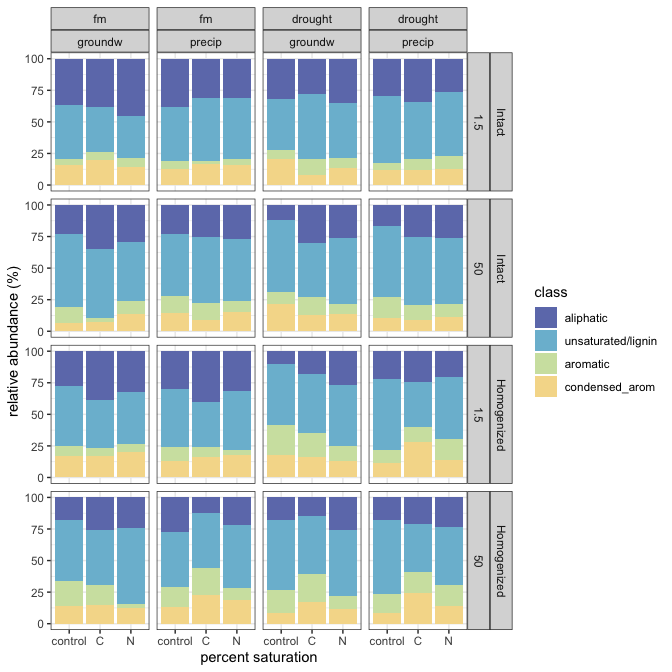

fticr
================

## HYPOTHESES

  - C amendments will increase diversity of SOM molecules
  - C amendments will cause a depletion of aromatic molecules,
    especially in fine pores
  - Homogenization will increase (a) total peaks, (b) diversity of
    peaks, (c) aromatic peaks

We selected only peaks seen in \>1 of the 4 replicates (i.e. n = 2 or 3
or 4)

-----

### fticr domains

<!-- --><!-- -->

**aromatic peaks**

<!-- -->

-----

### van krevelens

<!-- -->

<!-- --><!-- --><!-- -->

-----

### relative abundances

<!-- --><!-- --><!-- -->

<!-- -->

-----

### PEAKS

distinct peaks seen in each treatment type

click to expand

    #> [1] "1.5 kPa -- INTACT"

| Moisture | Wetting | class           | control |    C |    N |
| :------- | :------ | :-------------- | ------: | ---: | ---: |
| drought  | groundw | aliphatic       |     267 |  412 |  406 |
| drought  | groundw | aliphatic+N     |      34 |  135 |   68 |
| drought  | groundw | unsaturated     |     466 | 1014 |  553 |
| drought  | groundw | aromatic        |      90 |  281 |  138 |
| drought  | groundw | condensed\_arom |     285 |  176 |  140 |
| drought  | groundw | other           |       2 |    2 |    2 |
| drought  | groundw | total           |    1144 | 2020 | 1307 |
| drought  | precip  | aliphatic       |     354 |  607 |  301 |
| drought  | precip  | aliphatic+N     |      47 |  218 |  170 |
| drought  | precip  | unsaturated     |     812 | 1080 |  872 |
| drought  | precip  | aromatic        |     106 |  236 |  211 |
| drought  | precip  | condensed\_arom |     189 |  356 |  267 |
| drought  | precip  | other           |       2 |    2 |    2 |
| drought  | precip  | total           |    1510 | 2499 | 1823 |
| fm       | groundw | aliphatic       |     397 |  316 |  583 |
| fm       | groundw | aliphatic+N     |      34 |  110 |   96 |
| fm       | groundw | unsaturated     |     586 |  410 |  449 |
| fm       | groundw | aromatic        |      82 |   78 |  118 |
| fm       | groundw | condensed\_arom |     241 |  242 |  197 |
| fm       | groundw | other           |       2 |    4 |    3 |
| fm       | groundw | total           |    1342 | 1160 | 1446 |
| fm       | precip  | aliphatic       |     280 |  195 |  193 |
| fm       | precip  | aliphatic+N     |      29 |   32 |   20 |
| fm       | precip  | unsaturated     |     383 |  394 |  332 |
| fm       | precip  | aromatic        |      78 |   23 |   51 |
| fm       | precip  | condensed\_arom |     131 |  149 |  139 |
| fm       | precip  | other           |       4 |    4 |    3 |
| fm       | precip  | total           |     905 |  797 |  738 |

    #> [1] "15 kPa -- INTACT"

| Moisture | Wetting | class           | control |    C |    N |
| :------- | :------ | :-------------- | ------: | ---: | ---: |
| drought  | groundw | aliphatic       |     870 |  844 |  365 |
| drought  | groundw | aliphatic+N     |     377 |  297 |   56 |
| drought  | groundw | unsaturated     |    1932 | 1491 |  522 |
| drought  | groundw | aromatic        |     699 |  440 |   51 |
| drought  | groundw | condensed\_arom |     317 |  226 |  269 |
| drought  | groundw | other           |      NA |    2 |    2 |
| drought  | groundw | total           |    4195 | 3300 | 1265 |
| drought  | precip  | aliphatic       |     239 |  516 |  272 |
| drought  | precip  | aliphatic+N     |      31 |  256 |  204 |
| drought  | precip  | unsaturated     |     685 | 1526 |  846 |
| drought  | precip  | aromatic        |      71 |  541 |  213 |
| drought  | precip  | condensed\_arom |     137 |  337 |  158 |
| drought  | precip  | other           |       2 |    3 |    4 |
| drought  | precip  | total           |    1165 | 3179 | 1697 |
| fm       | groundw | aliphatic       |     457 |  491 |  248 |
| fm       | groundw | aliphatic+N     |      47 |  260 |   33 |
| fm       | groundw | unsaturated     |     853 | 1103 |  442 |
| fm       | groundw | aromatic        |     255 |  270 |   85 |
| fm       | groundw | condensed\_arom |     249 |  247 |  128 |
| fm       | groundw | other           |       4 |    2 |    2 |
| fm       | groundw | total           |    1865 | 2373 |  938 |
| fm       | precip  | aliphatic       |     279 |  783 |  314 |
| fm       | precip  | aliphatic+N     |      33 |  348 |   80 |
| fm       | precip  | unsaturated     |     803 | 2022 |  762 |
| fm       | precip  | aromatic        |     210 |  541 |  172 |
| fm       | precip  | condensed\_arom |     170 |  354 |  244 |
| fm       | precip  | other           |       2 |    4 |    2 |
| fm       | precip  | total           |    1497 | 4052 | 1574 |

    #> [1] "50 kPa -- INTACT"

| Moisture | Wetting | class           | control |    C |    N |
| :------- | :------ | :-------------- | ------: | ---: | ---: |
| drought  | groundw | aliphatic       |      84 |  556 |  213 |
| drought  | groundw | aliphatic+N     |      22 |  272 |   37 |
| drought  | groundw | unsaturated     |     506 | 1552 |  509 |
| drought  | groundw | aromatic        |      80 |  580 |   83 |
| drought  | groundw | condensed\_arom |     192 |  318 |  152 |
| drought  | groundw | other           |       2 |    4 |    1 |
| drought  | groundw | total           |     886 | 3282 |  995 |
| drought  | precip  | aliphatic       |     375 |  496 |  493 |
| drought  | precip  | aliphatic+N     |      49 |  218 |  110 |
| drought  | precip  | unsaturated     |    1251 | 1519 | 1103 |
| drought  | precip  | aromatic        |     456 |  349 |  240 |
| drought  | precip  | condensed\_arom |     295 |  241 |  277 |
| drought  | precip  | other           |       4 |    2 |    4 |
| drought  | precip  | total           |    2430 | 2825 | 2227 |
| fm       | groundw | aliphatic       |     267 |  418 |  332 |
| fm       | groundw | aliphatic+N     |      40 |   91 |   67 |
| fm       | groundw | unsaturated     |     791 |  721 |  724 |
| fm       | groundw | aromatic        |     248 |   70 |  204 |
| fm       | groundw | condensed\_arom |     113 |  113 |  230 |
| fm       | groundw | other           |       3 |    4 |    4 |
| fm       | groundw | total           |    1462 | 1417 | 1561 |
| fm       | precip  | aliphatic       |     388 |  726 |  390 |
| fm       | precip  | aliphatic+N     |      44 |  333 |  127 |
| fm       | precip  | unsaturated     |     849 | 2003 |  870 |
| fm       | precip  | aromatic        |     280 |  546 |  183 |
| fm       | precip  | condensed\_arom |     301 |  398 |  329 |
| fm       | precip  | other           |       2 |    4 |    2 |
| fm       | precip  | total           |    1864 | 4010 | 1901 |

    #> [1] "1.5 kPa -- HOMOGENIZED"

| Moisture | Wetting | class           | control |    C |    N |
| :------- | :------ | :-------------- | ------: | ---: | ---: |
| drought  | groundw | aliphatic       |     239 |  291 |  338 |
| drought  | groundw | aliphatic+N     |      46 |  104 |  195 |
| drought  | groundw | unsaturated     |    1337 | 1081 | 1004 |
| drought  | groundw | aromatic        |     638 |  462 |  264 |
| drought  | groundw | condensed\_arom |     531 |  434 |  259 |
| drought  | groundw | other           |       4 |    1 |    3 |
| drought  | groundw | total           |    2795 | 2373 | 2063 |
| drought  | precip  | aliphatic       |     348 |  268 |  250 |
| drought  | precip  | aliphatic+N     |      31 |   45 |   45 |
| drought  | precip  | unsaturated     |    1012 |  506 |  746 |
| drought  | precip  | aromatic        |     267 |  165 |  250 |
| drought  | precip  | condensed\_arom |     208 |  379 |  245 |
| drought  | precip  | other           |       3 |    3 |    2 |
| drought  | precip  | total           |    1869 | 1366 | 1538 |
| fm       | groundw | aliphatic       |     328 |  432 |  176 |
| fm       | groundw | aliphatic+N     |      49 |   51 |   80 |
| fm       | groundw | unsaturated     |     657 |  552 |  329 |
| fm       | groundw | aromatic        |     123 |  127 |   57 |
| fm       | groundw | condensed\_arom |     235 |  227 |  190 |
| fm       | groundw | other           |       2 |    4 |    3 |
| fm       | groundw | total           |    1394 | 1393 |  835 |
| fm       | precip  | aliphatic       |     643 |  316 |  282 |
| fm       | precip  | aliphatic+N     |      72 |   36 |   28 |
| fm       | precip  | unsaturated     |     866 |  394 |  523 |
| fm       | precip  | aromatic        |     259 |   96 |   40 |
| fm       | precip  | condensed\_arom |     316 |  170 |  188 |
| fm       | precip  | other           |       4 |    4 |    2 |
| fm       | precip  | total           |    2160 | 1016 | 1063 |

    #> [1] "15 kPa -- HOMOGENIZED"

| Moisture | Wetting | class           | control |    C |    N |
| :------- | :------ | :-------------- | ------: | ---: | ---: |
| drought  | groundw | aliphatic       |     300 |  477 |  235 |
| drought  | groundw | aliphatic+N     |      49 |  192 |   93 |
| drought  | groundw | unsaturated     |     560 | 1766 |  939 |
| drought  | groundw | aromatic        |     197 |  762 |  214 |
| drought  | groundw | condensed\_arom |      99 |  664 |  225 |
| drought  | groundw | other           |       1 |   NA |    2 |
| drought  | groundw | total           |    1206 | 3861 | 1708 |
| drought  | precip  | aliphatic       |     250 |  244 |  379 |
| drought  | precip  | aliphatic+N     |      44 |   52 |  121 |
| drought  | precip  | unsaturated     |    1702 |  783 | 1597 |
| drought  | precip  | aromatic        |     829 |  460 |  709 |
| drought  | precip  | condensed\_arom |     484 |  631 |  525 |
| drought  | precip  | other           |       2 |   NA |    1 |
| drought  | precip  | total           |    3311 | 2170 | 3332 |
| fm       | groundw | aliphatic       |     338 |  246 |  381 |
| fm       | groundw | aliphatic+N     |      41 |   28 |   67 |
| fm       | groundw | unsaturated     |    1117 |  247 | 1145 |
| fm       | groundw | aromatic        |     472 |   44 |  389 |
| fm       | groundw | condensed\_arom |     353 |  198 |  268 |
| fm       | groundw | other           |       5 |    2 |    3 |
| fm       | groundw | total           |    2326 |  765 | 2253 |
| fm       | precip  | aliphatic       |     610 |  151 |  396 |
| fm       | precip  | aliphatic+N     |      92 |   16 |   45 |
| fm       | precip  | unsaturated     |     945 |  593 | 1094 |
| fm       | precip  | aromatic        |     218 |  266 |  466 |
| fm       | precip  | condensed\_arom |     355 |  183 |  250 |
| fm       | precip  | other           |       4 |    1 |    4 |
| fm       | precip  | total           |    2224 | 1210 | 2255 |

    #> [1] "50 kPa -- HOMOGENIZED"

| Moisture | Wetting | class           | control |    C |    N |
| :------- | :------ | :-------------- | ------: | ---: | ---: |
| drought  | groundw | aliphatic       |     394 |  458 |  250 |
| drought  | groundw | aliphatic+N     |      77 |  162 |   62 |
| drought  | groundw | unsaturated     |    1434 | 1798 |  841 |
| drought  | groundw | aromatic        |     522 |  875 |  186 |
| drought  | groundw | condensed\_arom |     248 |  763 |  188 |
| drought  | groundw | other           |      NA |   NA |    2 |
| drought  | groundw | total           |    2675 | 4056 | 1529 |
| drought  | precip  | aliphatic       |     229 |  255 |  400 |
| drought  | precip  | aliphatic+N     |      30 |   29 |  110 |
| drought  | precip  | unsaturated     |     865 | 1232 | 1398 |
| drought  | precip  | aromatic        |     264 |  734 |  654 |
| drought  | precip  | condensed\_arom |     148 |  718 |  438 |
| drought  | precip  | other           |       2 |    1 |    1 |
| drought  | precip  | total           |    1538 | 2969 | 3001 |
| fm       | groundw | aliphatic       |     424 |  340 |  154 |
| fm       | groundw | aliphatic+N     |      92 |  125 |   33 |
| fm       | groundw | unsaturated     |    1602 |  875 |  390 |
| fm       | groundw | aromatic        |     780 |  335 |   29 |
| fm       | groundw | condensed\_arom |     596 |  337 |  113 |
| fm       | groundw | other           |       3 |    2 |    1 |
| fm       | groundw | total           |    3497 | 2014 |  720 |
| fm       | precip  | aliphatic       |     621 |  503 |  178 |
| fm       | precip  | aliphatic+N     |      91 |   96 |   28 |
| fm       | precip  | unsaturated     |    1077 | 2020 |  706 |
| fm       | precip  | aromatic        |     409 |  981 |  128 |
| fm       | precip  | condensed\_arom |     395 | 1029 |  146 |
| fm       | precip  | other           |       2 |   NA |    2 |
| fm       | precip  | total           |    2595 | 4629 | 1188 |

### STATS –

#### MANOVA

#### PCA

**intact cores**

click to expand

<!-- --><!-- -->

**homogenized cores**

click to expand

<!-- --><!-- -->

<!-- --><!-- --><!-- --><!-- --><!-- --><!-- -->

-----

## Session Info

click to expand

Date run: 2020-07-24

    #> R version 4.0.2 (2020-06-22)
    #> Platform: x86_64-apple-darwin17.0 (64-bit)
    #> Running under: macOS Catalina 10.15.6
    #> 
    #> Matrix products: default
    #> BLAS:   /Library/Frameworks/R.framework/Versions/4.0/Resources/lib/libRblas.dylib
    #> LAPACK: /Library/Frameworks/R.framework/Versions/4.0/Resources/lib/libRlapack.dylib
    #> 
    #> locale:
    #> [1] en_US.UTF-8/en_US.UTF-8/en_US.UTF-8/C/en_US.UTF-8/en_US.UTF-8
    #> 
    #> attached base packages:
    #> [1] stats     graphics  grDevices utils     datasets  methods   base     
    #> 
    #> other attached packages:
    #>  [1] ggbiplot_0.55   PNWColors_0.1.0 forcats_0.5.0   stringr_1.4.0  
    #>  [5] dplyr_1.0.0     purrr_0.3.4     readr_1.3.1     tidyr_1.1.0    
    #>  [9] tibble_3.0.3    ggplot2_3.3.2   tidyverse_1.3.0 here_0.1       
    #> 
    #> loaded via a namespace (and not attached):
    #>  [1] tidyselect_1.1.0  xfun_0.15         haven_2.3.1       colorspace_1.4-1 
    #>  [5] vctrs_0.3.2       generics_0.0.2    viridisLite_0.3.0 htmltools_0.5.0  
    #>  [9] yaml_2.2.1        blob_1.2.1        rlang_0.4.7       pillar_1.4.6     
    #> [13] glue_1.4.1        withr_2.2.0       DBI_1.1.0         dbplyr_1.4.4     
    #> [17] modelr_0.1.8      readxl_1.3.1      plyr_1.8.6        lifecycle_0.2.0  
    #> [21] munsell_0.5.0     gtable_0.3.0      cellranger_1.1.0  rvest_0.3.5      
    #> [25] evaluate_0.14     labeling_0.3      knitr_1.29        fansi_0.4.1      
    #> [29] highr_0.8         broom_0.7.0       Rcpp_1.0.5        scales_1.1.1     
    #> [33] backports_1.1.8   jsonlite_1.7.0    farver_2.0.3      fs_1.4.2         
    #> [37] hms_0.5.3         digest_0.6.25     stringi_1.4.6     grid_4.0.2       
    #> [41] rprojroot_1.3-2   cli_2.0.2         tools_4.0.2       magrittr_1.5     
    #> [45] crayon_1.3.4      pkgconfig_2.0.3   MASS_7.3-51.6     ellipsis_0.3.1   
    #> [49] xml2_1.3.2        reprex_0.3.0      lubridate_1.7.9   assertthat_0.2.1 
    #> [53] rmarkdown_2.3     httr_1.4.2        rstudioapi_0.11   R6_2.4.1         
    #> [57] compiler_4.0.2

