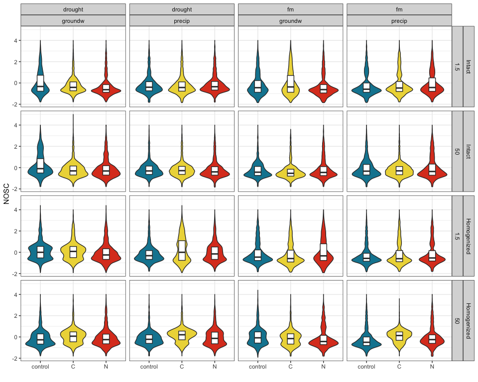
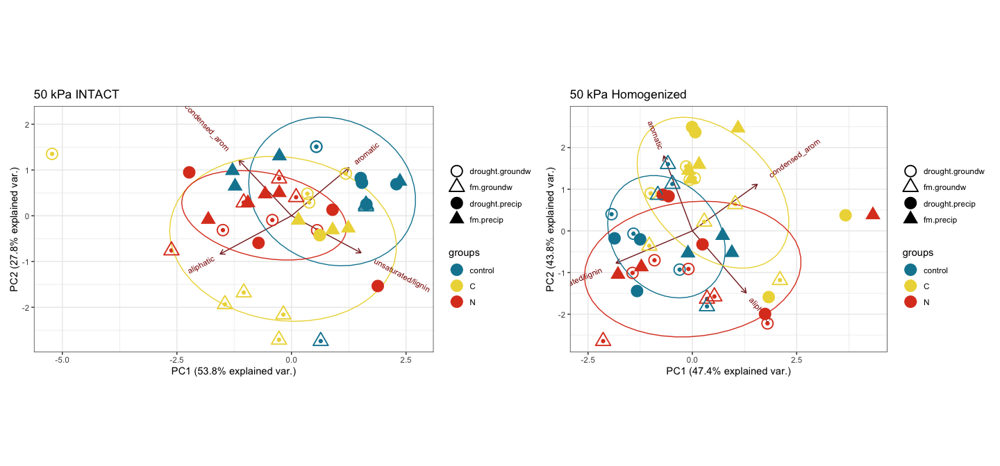

fticr
================

## HYPOTHESES

  - C amendments will increase diversity of SOM molecules
  - C amendments will cause a depletion of aromatic molecules,
    especially in fine pores
  - Homogenization will increase (a) total peaks, (b) diversity of
    peaks, (c) aromatic peaks

We selected only peaks seen in \>1 of the 4 replicates (i.e. n = 2 or 3
or 4)

-----

### fticr domains

<!-- --><!-- -->

**aromatic peaks**

<!-- -->

-----

### van krevelens

<!-- -->

<!-- --><!-- --><!-- -->

-----

### relative abundances

<!-- --><!-- --><!-- -->

<!-- -->

-----

### PEAKS

distinct peaks seen in each treatment type

click to expand

    #> [1] "1.5 kPa -- INTACT"

| Moisture | Wetting | class           | control |    C |    N |
| :------- | :------ | :-------------- | ------: | ---: | ---: |
| drought  | groundw | aliphatic       |     267 |  412 |  406 |
| drought  | groundw | aliphatic+N     |      34 |  135 |   68 |
| drought  | groundw | unsaturated     |     466 | 1014 |  553 |
| drought  | groundw | aromatic        |      90 |  281 |  138 |
| drought  | groundw | condensed\_arom |     285 |  176 |  140 |
| drought  | groundw | other           |       2 |    2 |    2 |
| drought  | groundw | total           |    1144 | 2020 | 1307 |
| drought  | precip  | aliphatic       |     354 |  607 |  301 |
| drought  | precip  | aliphatic+N     |      47 |  218 |  170 |
| drought  | precip  | unsaturated     |     812 | 1080 |  872 |
| drought  | precip  | aromatic        |     106 |  236 |  211 |
| drought  | precip  | condensed\_arom |     189 |  356 |  267 |
| drought  | precip  | other           |       2 |    2 |    2 |
| drought  | precip  | total           |    1510 | 2499 | 1823 |
| fm       | groundw | aliphatic       |     397 |  316 |  583 |
| fm       | groundw | aliphatic+N     |      34 |  110 |   96 |
| fm       | groundw | unsaturated     |     586 |  410 |  449 |
| fm       | groundw | aromatic        |      82 |   78 |  118 |
| fm       | groundw | condensed\_arom |     241 |  242 |  197 |
| fm       | groundw | other           |       2 |    4 |    3 |
| fm       | groundw | total           |    1342 | 1160 | 1446 |
| fm       | precip  | aliphatic       |     280 |  195 |  193 |
| fm       | precip  | aliphatic+N     |      29 |   32 |   20 |
| fm       | precip  | unsaturated     |     383 |  394 |  332 |
| fm       | precip  | aromatic        |      78 |   23 |   51 |
| fm       | precip  | condensed\_arom |     131 |  149 |  139 |
| fm       | precip  | other           |       4 |    4 |    3 |
| fm       | precip  | total           |     905 |  797 |  738 |

    #> [1] "15 kPa -- INTACT"

| Moisture | Wetting | class           | control |    C |    N |
| :------- | :------ | :-------------- | ------: | ---: | ---: |
| drought  | groundw | aliphatic       |     870 |  844 |  365 |
| drought  | groundw | aliphatic+N     |     377 |  297 |   56 |
| drought  | groundw | unsaturated     |    1932 | 1491 |  522 |
| drought  | groundw | aromatic        |     699 |  440 |   51 |
| drought  | groundw | condensed\_arom |     317 |  226 |  269 |
| drought  | groundw | other           |      NA |    2 |    2 |
| drought  | groundw | total           |    4195 | 3300 | 1265 |
| drought  | precip  | aliphatic       |     239 |  516 |  272 |
| drought  | precip  | aliphatic+N     |      31 |  256 |  204 |
| drought  | precip  | unsaturated     |     685 | 1526 |  846 |
| drought  | precip  | aromatic        |      71 |  541 |  213 |
| drought  | precip  | condensed\_arom |     137 |  337 |  158 |
| drought  | precip  | other           |       2 |    3 |    4 |
| drought  | precip  | total           |    1165 | 3179 | 1697 |
| fm       | groundw | aliphatic       |     457 |  491 |  248 |
| fm       | groundw | aliphatic+N     |      47 |  260 |   33 |
| fm       | groundw | unsaturated     |     853 | 1103 |  442 |
| fm       | groundw | aromatic        |     255 |  270 |   85 |
| fm       | groundw | condensed\_arom |     249 |  247 |  128 |
| fm       | groundw | other           |       4 |    2 |    2 |
| fm       | groundw | total           |    1865 | 2373 |  938 |
| fm       | precip  | aliphatic       |     279 |  783 |  314 |
| fm       | precip  | aliphatic+N     |      33 |  348 |   80 |
| fm       | precip  | unsaturated     |     803 | 2022 |  762 |
| fm       | precip  | aromatic        |     210 |  541 |  172 |
| fm       | precip  | condensed\_arom |     170 |  354 |  244 |
| fm       | precip  | other           |       2 |    4 |    2 |
| fm       | precip  | total           |    1497 | 4052 | 1574 |

    #> [1] "50 kPa -- INTACT"

| Moisture | Wetting | class           | control |    C |    N |
| :------- | :------ | :-------------- | ------: | ---: | ---: |
| drought  | groundw | aliphatic       |      84 |  556 |  213 |
| drought  | groundw | aliphatic+N     |      22 |  272 |   37 |
| drought  | groundw | unsaturated     |     506 | 1552 |  509 |
| drought  | groundw | aromatic        |      80 |  580 |   83 |
| drought  | groundw | condensed\_arom |     192 |  318 |  152 |
| drought  | groundw | other           |       2 |    4 |    1 |
| drought  | groundw | total           |     886 | 3282 |  995 |
| drought  | precip  | aliphatic       |     375 |  496 |  493 |
| drought  | precip  | aliphatic+N     |      49 |  218 |  110 |
| drought  | precip  | unsaturated     |    1251 | 1519 | 1103 |
| drought  | precip  | aromatic        |     456 |  349 |  240 |
| drought  | precip  | condensed\_arom |     295 |  241 |  277 |
| drought  | precip  | other           |       4 |    2 |    4 |
| drought  | precip  | total           |    2430 | 2825 | 2227 |
| fm       | groundw | aliphatic       |     267 |  418 |  332 |
| fm       | groundw | aliphatic+N     |      40 |   91 |   67 |
| fm       | groundw | unsaturated     |     791 |  721 |  724 |
| fm       | groundw | aromatic        |     248 |   70 |  204 |
| fm       | groundw | condensed\_arom |     113 |  113 |  230 |
| fm       | groundw | other           |       3 |    4 |    4 |
| fm       | groundw | total           |    1462 | 1417 | 1561 |
| fm       | precip  | aliphatic       |     388 |  726 |  390 |
| fm       | precip  | aliphatic+N     |      44 |  333 |  127 |
| fm       | precip  | unsaturated     |     849 | 2003 |  870 |
| fm       | precip  | aromatic        |     280 |  546 |  183 |
| fm       | precip  | condensed\_arom |     301 |  398 |  329 |
| fm       | precip  | other           |       2 |    4 |    2 |
| fm       | precip  | total           |    1864 | 4010 | 1901 |

    #> [1] "1.5 kPa -- HOMOGENIZED"

| Moisture | Wetting | class           | control |    C |    N |
| :------- | :------ | :-------------- | ------: | ---: | ---: |
| drought  | groundw | aliphatic       |     239 |  291 |  338 |
| drought  | groundw | aliphatic+N     |      46 |  104 |  195 |
| drought  | groundw | unsaturated     |    1337 | 1081 | 1004 |
| drought  | groundw | aromatic        |     638 |  462 |  264 |
| drought  | groundw | condensed\_arom |     531 |  434 |  259 |
| drought  | groundw | other           |       4 |    1 |    3 |
| drought  | groundw | total           |    2795 | 2373 | 2063 |
| drought  | precip  | aliphatic       |     348 |  268 |  250 |
| drought  | precip  | aliphatic+N     |      31 |   45 |   45 |
| drought  | precip  | unsaturated     |    1012 |  506 |  746 |
| drought  | precip  | aromatic        |     267 |  165 |  250 |
| drought  | precip  | condensed\_arom |     208 |  379 |  245 |
| drought  | precip  | other           |       3 |    3 |    2 |
| drought  | precip  | total           |    1869 | 1366 | 1538 |
| fm       | groundw | aliphatic       |     328 |  432 |  176 |
| fm       | groundw | aliphatic+N     |      49 |   51 |   80 |
| fm       | groundw | unsaturated     |     657 |  552 |  329 |
| fm       | groundw | aromatic        |     123 |  127 |   57 |
| fm       | groundw | condensed\_arom |     235 |  227 |  190 |
| fm       | groundw | other           |       2 |    4 |    3 |
| fm       | groundw | total           |    1394 | 1393 |  835 |
| fm       | precip  | aliphatic       |     643 |  316 |  282 |
| fm       | precip  | aliphatic+N     |      72 |   36 |   28 |
| fm       | precip  | unsaturated     |     866 |  394 |  523 |
| fm       | precip  | aromatic        |     259 |   96 |   40 |
| fm       | precip  | condensed\_arom |     316 |  170 |  188 |
| fm       | precip  | other           |       4 |    4 |    2 |
| fm       | precip  | total           |    2160 | 1016 | 1063 |

    #> [1] "15 kPa -- HOMOGENIZED"

| Moisture | Wetting | class           | control |    C |    N |
| :------- | :------ | :-------------- | ------: | ---: | ---: |
| drought  | groundw | aliphatic       |     300 |  477 |  235 |
| drought  | groundw | aliphatic+N     |      49 |  192 |   93 |
| drought  | groundw | unsaturated     |     560 | 1766 |  939 |
| drought  | groundw | aromatic        |     197 |  762 |  214 |
| drought  | groundw | condensed\_arom |      99 |  664 |  225 |
| drought  | groundw | other           |       1 |   NA |    2 |
| drought  | groundw | total           |    1206 | 3861 | 1708 |
| drought  | precip  | aliphatic       |     250 |  244 |  379 |
| drought  | precip  | aliphatic+N     |      44 |   52 |  121 |
| drought  | precip  | unsaturated     |    1702 |  783 | 1597 |
| drought  | precip  | aromatic        |     829 |  460 |  709 |
| drought  | precip  | condensed\_arom |     484 |  631 |  525 |
| drought  | precip  | other           |       2 |   NA |    1 |
| drought  | precip  | total           |    3311 | 2170 | 3332 |
| fm       | groundw | aliphatic       |     338 |  246 |  381 |
| fm       | groundw | aliphatic+N     |      41 |   28 |   67 |
| fm       | groundw | unsaturated     |    1117 |  247 | 1145 |
| fm       | groundw | aromatic        |     472 |   44 |  389 |
| fm       | groundw | condensed\_arom |     353 |  198 |  268 |
| fm       | groundw | other           |       5 |    2 |    3 |
| fm       | groundw | total           |    2326 |  765 | 2253 |
| fm       | precip  | aliphatic       |     610 |  151 |  396 |
| fm       | precip  | aliphatic+N     |      92 |   16 |   45 |
| fm       | precip  | unsaturated     |     945 |  593 | 1094 |
| fm       | precip  | aromatic        |     218 |  266 |  466 |
| fm       | precip  | condensed\_arom |     355 |  183 |  250 |
| fm       | precip  | other           |       4 |    1 |    4 |
| fm       | precip  | total           |    2224 | 1210 | 2255 |

    #> [1] "50 kPa -- HOMOGENIZED"

| Moisture | Wetting | class           | control |    C |    N |
| :------- | :------ | :-------------- | ------: | ---: | ---: |
| drought  | groundw | aliphatic       |     394 |  458 |  250 |
| drought  | groundw | aliphatic+N     |      77 |  162 |   62 |
| drought  | groundw | unsaturated     |    1434 | 1798 |  841 |
| drought  | groundw | aromatic        |     522 |  875 |  186 |
| drought  | groundw | condensed\_arom |     248 |  763 |  188 |
| drought  | groundw | other           |      NA |   NA |    2 |
| drought  | groundw | total           |    2675 | 4056 | 1529 |
| drought  | precip  | aliphatic       |     229 |  255 |  400 |
| drought  | precip  | aliphatic+N     |      30 |   29 |  110 |
| drought  | precip  | unsaturated     |     865 | 1232 | 1398 |
| drought  | precip  | aromatic        |     264 |  734 |  654 |
| drought  | precip  | condensed\_arom |     148 |  718 |  438 |
| drought  | precip  | other           |       2 |    1 |    1 |
| drought  | precip  | total           |    1538 | 2969 | 3001 |
| fm       | groundw | aliphatic       |     424 |  340 |  154 |
| fm       | groundw | aliphatic+N     |      92 |  125 |   33 |
| fm       | groundw | unsaturated     |    1602 |  875 |  390 |
| fm       | groundw | aromatic        |     780 |  335 |   29 |
| fm       | groundw | condensed\_arom |     596 |  337 |  113 |
| fm       | groundw | other           |       3 |    2 |    1 |
| fm       | groundw | total           |    3497 | 2014 |  720 |
| fm       | precip  | aliphatic       |     621 |  503 |  178 |
| fm       | precip  | aliphatic+N     |      91 |   96 |   28 |
| fm       | precip  | unsaturated     |    1077 | 2020 |  706 |
| fm       | precip  | aromatic        |     409 |  981 |  128 |
| fm       | precip  | condensed\_arom |     395 | 1029 |  146 |
| fm       | precip  | other           |       2 |   NA |    2 |
| fm       | precip  | total           |    2595 | 4629 | 1188 |

<!--html_preserve-->

<table class="gt_table">

<thead class="gt_header">

<tr>

<th colspan="5" class="gt_heading gt_title gt_font_normal" style>

Peaks Present

</th>

</tr>

<tr>

<th colspan="5" class="gt_heading gt_subtitle gt_font_normal gt_bottom_border" style>

Intact - 1.5 kPa

</th>

</tr>

</thead>

<thead class="gt_col_headings">

<tr>

<th class="gt_col_heading gt_center gt_columns_bottom_border" rowspan="2" colspan="1">

Wetting

</th>

<th class="gt_col_heading gt_center gt_columns_bottom_border" rowspan="2" colspan="1">

class

</th>

<th class="gt_center gt_columns_top_border gt_column_spanner_outer" rowspan="1" colspan="3">

Amendments

</th>

</tr>

<tr>

<th class="gt_col_heading gt_columns_bottom_border gt_center" rowspan="1" colspan="1">

control

</th>

<th class="gt_col_heading gt_columns_bottom_border gt_center" rowspan="1" colspan="1">

C

</th>

<th class="gt_col_heading gt_columns_bottom_border gt_center" rowspan="1" colspan="1">

N

</th>

</tr>

</thead>

<tbody class="gt_table_body">

<tr class="gt_group_heading_row">

<td colspan="5" class="gt_group_heading">

drought

</td>

</tr>

<tr>

<td class="gt_row gt_left">

groundw

</td>

<td class="gt_row gt_center">

aliphatic

</td>

<td class="gt_row gt_center">

267

</td>

<td class="gt_row gt_center">

412

</td>

<td class="gt_row gt_center">

406

</td>

</tr>

<tr>

<td class="gt_row gt_left">

groundw

</td>

<td class="gt_row gt_center">

aliphatic+N

</td>

<td class="gt_row gt_center">

34

</td>

<td class="gt_row gt_center">

135

</td>

<td class="gt_row gt_center">

68

</td>

</tr>

<tr>

<td class="gt_row gt_left">

groundw

</td>

<td class="gt_row gt_center">

unsaturated

</td>

<td class="gt_row gt_center">

466

</td>

<td class="gt_row gt_center">

1014

</td>

<td class="gt_row gt_center">

553

</td>

</tr>

<tr>

<td class="gt_row gt_left">

groundw

</td>

<td class="gt_row gt_center">

aromatic

</td>

<td class="gt_row gt_center">

90

</td>

<td class="gt_row gt_center">

281

</td>

<td class="gt_row gt_center">

138

</td>

</tr>

<tr>

<td class="gt_row gt_left">

groundw

</td>

<td class="gt_row gt_center">

condensed\_arom

</td>

<td class="gt_row gt_center">

285

</td>

<td class="gt_row gt_center">

176

</td>

<td class="gt_row gt_center">

140

</td>

</tr>

<tr>

<td class="gt_row gt_left">

groundw

</td>

<td class="gt_row gt_center">

other

</td>

<td class="gt_row gt_center">

2

</td>

<td class="gt_row gt_center">

2

</td>

<td class="gt_row gt_center">

2

</td>

</tr>

<tr>

<td class="gt_row gt_left">

groundw

</td>

<td class="gt_row gt_center">

total

</td>

<td class="gt_row gt_center">

1144

</td>

<td class="gt_row gt_center">

2020

</td>

<td class="gt_row gt_center">

1307

</td>

</tr>

<tr>

<td class="gt_row gt_left">

precip

</td>

<td class="gt_row gt_center">

aliphatic

</td>

<td class="gt_row gt_center">

354

</td>

<td class="gt_row gt_center">

607

</td>

<td class="gt_row gt_center">

301

</td>

</tr>

<tr>

<td class="gt_row gt_left">

precip

</td>

<td class="gt_row gt_center">

aliphatic+N

</td>

<td class="gt_row gt_center">

47

</td>

<td class="gt_row gt_center">

218

</td>

<td class="gt_row gt_center">

170

</td>

</tr>

<tr>

<td class="gt_row gt_left">

precip

</td>

<td class="gt_row gt_center">

unsaturated

</td>

<td class="gt_row gt_center">

812

</td>

<td class="gt_row gt_center">

1080

</td>

<td class="gt_row gt_center">

872

</td>

</tr>

<tr>

<td class="gt_row gt_left">

precip

</td>

<td class="gt_row gt_center">

aromatic

</td>

<td class="gt_row gt_center">

106

</td>

<td class="gt_row gt_center">

236

</td>

<td class="gt_row gt_center">

211

</td>

</tr>

<tr>

<td class="gt_row gt_left">

precip

</td>

<td class="gt_row gt_center">

condensed\_arom

</td>

<td class="gt_row gt_center">

189

</td>

<td class="gt_row gt_center">

356

</td>

<td class="gt_row gt_center">

267

</td>

</tr>

<tr>

<td class="gt_row gt_left">

precip

</td>

<td class="gt_row gt_center">

other

</td>

<td class="gt_row gt_center">

2

</td>

<td class="gt_row gt_center">

2

</td>

<td class="gt_row gt_center">

2

</td>

</tr>

<tr>

<td class="gt_row gt_left">

precip

</td>

<td class="gt_row gt_center">

total

</td>

<td class="gt_row gt_center">

1510

</td>

<td class="gt_row gt_center">

2499

</td>

<td class="gt_row gt_center">

1823

</td>

</tr>

<tr class="gt_group_heading_row">

<td colspan="5" class="gt_group_heading">

fm

</td>

</tr>

<tr>

<td class="gt_row gt_left">

groundw

</td>

<td class="gt_row gt_center">

aliphatic

</td>

<td class="gt_row gt_center">

397

</td>

<td class="gt_row gt_center">

316

</td>

<td class="gt_row gt_center">

583

</td>

</tr>

<tr>

<td class="gt_row gt_left">

groundw

</td>

<td class="gt_row gt_center">

aliphatic+N

</td>

<td class="gt_row gt_center">

34

</td>

<td class="gt_row gt_center">

110

</td>

<td class="gt_row gt_center">

96

</td>

</tr>

<tr>

<td class="gt_row gt_left">

groundw

</td>

<td class="gt_row gt_center">

unsaturated

</td>

<td class="gt_row gt_center">

586

</td>

<td class="gt_row gt_center">

410

</td>

<td class="gt_row gt_center">

449

</td>

</tr>

<tr>

<td class="gt_row gt_left">

groundw

</td>

<td class="gt_row gt_center">

aromatic

</td>

<td class="gt_row gt_center">

82

</td>

<td class="gt_row gt_center">

78

</td>

<td class="gt_row gt_center">

118

</td>

</tr>

<tr>

<td class="gt_row gt_left">

groundw

</td>

<td class="gt_row gt_center">

condensed\_arom

</td>

<td class="gt_row gt_center">

241

</td>

<td class="gt_row gt_center">

242

</td>

<td class="gt_row gt_center">

197

</td>

</tr>

<tr>

<td class="gt_row gt_left">

groundw

</td>

<td class="gt_row gt_center">

other

</td>

<td class="gt_row gt_center">

2

</td>

<td class="gt_row gt_center">

4

</td>

<td class="gt_row gt_center">

3

</td>

</tr>

<tr>

<td class="gt_row gt_left">

groundw

</td>

<td class="gt_row gt_center">

total

</td>

<td class="gt_row gt_center">

1342

</td>

<td class="gt_row gt_center">

1160

</td>

<td class="gt_row gt_center">

1446

</td>

</tr>

<tr>

<td class="gt_row gt_left">

precip

</td>

<td class="gt_row gt_center">

aliphatic

</td>

<td class="gt_row gt_center">

280

</td>

<td class="gt_row gt_center">

195

</td>

<td class="gt_row gt_center">

193

</td>

</tr>

<tr>

<td class="gt_row gt_left">

precip

</td>

<td class="gt_row gt_center">

aliphatic+N

</td>

<td class="gt_row gt_center">

29

</td>

<td class="gt_row gt_center">

32

</td>

<td class="gt_row gt_center">

20

</td>

</tr>

<tr>

<td class="gt_row gt_left">

precip

</td>

<td class="gt_row gt_center">

unsaturated

</td>

<td class="gt_row gt_center">

383

</td>

<td class="gt_row gt_center">

394

</td>

<td class="gt_row gt_center">

332

</td>

</tr>

<tr>

<td class="gt_row gt_left">

precip

</td>

<td class="gt_row gt_center">

aromatic

</td>

<td class="gt_row gt_center">

78

</td>

<td class="gt_row gt_center">

23

</td>

<td class="gt_row gt_center">

51

</td>

</tr>

<tr>

<td class="gt_row gt_left">

precip

</td>

<td class="gt_row gt_center">

condensed\_arom

</td>

<td class="gt_row gt_center">

131

</td>

<td class="gt_row gt_center">

149

</td>

<td class="gt_row gt_center">

139

</td>

</tr>

<tr>

<td class="gt_row gt_left">

precip

</td>

<td class="gt_row gt_center">

other

</td>

<td class="gt_row gt_center">

4

</td>

<td class="gt_row gt_center">

4

</td>

<td class="gt_row gt_center">

3

</td>

</tr>

<tr>

<td class="gt_row gt_left">

precip

</td>

<td class="gt_row gt_center">

total

</td>

<td class="gt_row gt_center">

905

</td>

<td class="gt_row gt_center">

797

</td>

<td class="gt_row gt_center">

738

</td>

</tr>

</tbody>

</table>

<!--/html_preserve-->

<!--html_preserve-->

<table class="gt_table">

<thead class="gt_header">

<tr>

<th colspan="8" class="gt_heading gt_title gt_font_normal" style>

Total Peaks Present

</th>

</tr>

<tr>

<th colspan="8" class="gt_heading gt_subtitle gt_font_normal gt_bottom_border" style>

</th>

</tr>

</thead>

<thead class="gt_col_headings">

<tr>

<th class="gt_col_heading gt_center gt_columns_bottom_border" rowspan="2" colspan="1">

Moisture

</th>

<th class="gt_col_heading gt_center gt_columns_bottom_border" rowspan="2" colspan="1">

Wetting

</th>

<th class="gt_center gt_columns_top_border gt_column_spanner_outer" rowspan="1" colspan="3">

1.5 kPa

</th>

<th class="gt_center gt_columns_top_border gt_column_spanner_outer" rowspan="1" colspan="3">

50 kPa

</th>

</tr>

<tr>

<th class="gt_col_heading gt_columns_bottom_border gt_center" rowspan="1" colspan="1">

1.5-control

</th>

<th class="gt_col_heading gt_columns_bottom_border gt_center" rowspan="1" colspan="1">

1.5-C

</th>

<th class="gt_col_heading gt_columns_bottom_border gt_center" rowspan="1" colspan="1">

1.5-N

</th>

<th class="gt_col_heading gt_columns_bottom_border gt_center" rowspan="1" colspan="1">

50-control

</th>

<th class="gt_col_heading gt_columns_bottom_border gt_center" rowspan="1" colspan="1">

50-C

</th>

<th class="gt_col_heading gt_columns_bottom_border gt_center" rowspan="1" colspan="1">

50-N

</th>

</tr>

</thead>

<tbody class="gt_table_body">

<tr class="gt_group_heading_row">

<td colspan="8" class="gt_group_heading">

Intact

</td>

</tr>

<tr>

<td class="gt_row gt_left">

drought

</td>

<td class="gt_row gt_left">

groundw

</td>

<td class="gt_row gt_center">

1144

</td>

<td class="gt_row gt_center">

2020

</td>

<td class="gt_row gt_center">

1307

</td>

<td class="gt_row gt_center">

886

</td>

<td class="gt_row gt_center">

3282

</td>

<td class="gt_row gt_center">

995

</td>

</tr>

<tr>

<td class="gt_row gt_left">

drought

</td>

<td class="gt_row gt_left">

precip

</td>

<td class="gt_row gt_center">

1510

</td>

<td class="gt_row gt_center">

2499

</td>

<td class="gt_row gt_center">

1823

</td>

<td class="gt_row gt_center">

2430

</td>

<td class="gt_row gt_center">

2825

</td>

<td class="gt_row gt_center">

2227

</td>

</tr>

<tr>

<td class="gt_row gt_left">

fm

</td>

<td class="gt_row gt_left">

groundw

</td>

<td class="gt_row gt_center">

1342

</td>

<td class="gt_row gt_center">

1160

</td>

<td class="gt_row gt_center">

1446

</td>

<td class="gt_row gt_center">

1462

</td>

<td class="gt_row gt_center">

1417

</td>

<td class="gt_row gt_center">

1561

</td>

</tr>

<tr>

<td class="gt_row gt_left">

fm

</td>

<td class="gt_row gt_left">

precip

</td>

<td class="gt_row gt_center">

905

</td>

<td class="gt_row gt_center">

797

</td>

<td class="gt_row gt_center">

738

</td>

<td class="gt_row gt_center">

1864

</td>

<td class="gt_row gt_center">

4010

</td>

<td class="gt_row gt_center">

1901

</td>

</tr>

<tr class="gt_group_heading_row">

<td colspan="8" class="gt_group_heading">

Homogenized

</td>

</tr>

<tr>

<td class="gt_row gt_left">

drought

</td>

<td class="gt_row gt_left">

groundw

</td>

<td class="gt_row gt_center">

2795

</td>

<td class="gt_row gt_center">

2373

</td>

<td class="gt_row gt_center">

2063

</td>

<td class="gt_row gt_center">

2675

</td>

<td class="gt_row gt_center">

4056

</td>

<td class="gt_row gt_center">

1529

</td>

</tr>

<tr>

<td class="gt_row gt_left">

drought

</td>

<td class="gt_row gt_left">

precip

</td>

<td class="gt_row gt_center">

1869

</td>

<td class="gt_row gt_center">

1366

</td>

<td class="gt_row gt_center">

1538

</td>

<td class="gt_row gt_center">

1538

</td>

<td class="gt_row gt_center">

2969

</td>

<td class="gt_row gt_center">

3001

</td>

</tr>

<tr>

<td class="gt_row gt_left">

fm

</td>

<td class="gt_row gt_left">

groundw

</td>

<td class="gt_row gt_center">

1394

</td>

<td class="gt_row gt_center">

1393

</td>

<td class="gt_row gt_center">

835

</td>

<td class="gt_row gt_center">

3497

</td>

<td class="gt_row gt_center">

2014

</td>

<td class="gt_row gt_center">

720

</td>

</tr>

<tr>

<td class="gt_row gt_left">

fm

</td>

<td class="gt_row gt_left">

precip

</td>

<td class="gt_row gt_center">

2160

</td>

<td class="gt_row gt_center">

1016

</td>

<td class="gt_row gt_center">

1063

</td>

<td class="gt_row gt_center">

2595

</td>

<td class="gt_row gt_center">

4629

</td>

<td class="gt_row gt_center">

1188

</td>

</tr>

</tbody>

</table>

<!--/html_preserve-->

<!--html_preserve-->

<table class="gt_table">

<thead class="gt_header">

<tr>

<th colspan="8" class="gt_heading gt_title gt_font_normal" style>

Aromatic Peaks Present

</th>

</tr>

<tr>

<th colspan="8" class="gt_heading gt_subtitle gt_font_normal gt_bottom_border" style>

</th>

</tr>

</thead>

<thead class="gt_col_headings">

<tr>

<th class="gt_col_heading gt_center gt_columns_bottom_border" rowspan="2" colspan="1">

Moisture

</th>

<th class="gt_col_heading gt_center gt_columns_bottom_border" rowspan="2" colspan="1">

Wetting

</th>

<th class="gt_center gt_columns_top_border gt_column_spanner_outer" rowspan="1" colspan="3">

1.5 kPa

</th>

<th class="gt_center gt_columns_top_border gt_column_spanner_outer" rowspan="1" colspan="3">

50 kPa

</th>

</tr>

<tr>

<th class="gt_col_heading gt_columns_bottom_border gt_center" rowspan="1" colspan="1">

1.5-control

</th>

<th class="gt_col_heading gt_columns_bottom_border gt_center" rowspan="1" colspan="1">

1.5-C

</th>

<th class="gt_col_heading gt_columns_bottom_border gt_center" rowspan="1" colspan="1">

1.5-N

</th>

<th class="gt_col_heading gt_columns_bottom_border gt_center" rowspan="1" colspan="1">

50-control

</th>

<th class="gt_col_heading gt_columns_bottom_border gt_center" rowspan="1" colspan="1">

50-C

</th>

<th class="gt_col_heading gt_columns_bottom_border gt_center" rowspan="1" colspan="1">

50-N

</th>

</tr>

</thead>

<tbody class="gt_table_body">

<tr class="gt_group_heading_row">

<td colspan="8" class="gt_group_heading">

Intact

</td>

</tr>

<tr>

<td class="gt_row gt_left">

drought

</td>

<td class="gt_row gt_left">

groundw

</td>

<td class="gt_row gt_center">

375

</td>

<td class="gt_row gt_center">

457

</td>

<td class="gt_row gt_center">

278

</td>

<td class="gt_row gt_center">

272

</td>

<td class="gt_row gt_center">

898

</td>

<td class="gt_row gt_center">

235

</td>

</tr>

<tr>

<td class="gt_row gt_left">

drought

</td>

<td class="gt_row gt_left">

precip

</td>

<td class="gt_row gt_center">

295

</td>

<td class="gt_row gt_center">

592

</td>

<td class="gt_row gt_center">

478

</td>

<td class="gt_row gt_center">

751

</td>

<td class="gt_row gt_center">

590

</td>

<td class="gt_row gt_center">

517

</td>

</tr>

<tr>

<td class="gt_row gt_left">

fm

</td>

<td class="gt_row gt_left">

groundw

</td>

<td class="gt_row gt_center">

323

</td>

<td class="gt_row gt_center">

320

</td>

<td class="gt_row gt_center">

315

</td>

<td class="gt_row gt_center">

361

</td>

<td class="gt_row gt_center">

183

</td>

<td class="gt_row gt_center">

434

</td>

</tr>

<tr>

<td class="gt_row gt_left">

fm

</td>

<td class="gt_row gt_left">

precip

</td>

<td class="gt_row gt_center">

209

</td>

<td class="gt_row gt_center">

172

</td>

<td class="gt_row gt_center">

190

</td>

<td class="gt_row gt_center">

581

</td>

<td class="gt_row gt_center">

944

</td>

<td class="gt_row gt_center">

512

</td>

</tr>

<tr class="gt_group_heading_row">

<td colspan="8" class="gt_group_heading">

Homogenized

</td>

</tr>

<tr>

<td class="gt_row gt_left">

drought

</td>

<td class="gt_row gt_left">

groundw

</td>

<td class="gt_row gt_center">

1169

</td>

<td class="gt_row gt_center">

896

</td>

<td class="gt_row gt_center">

523

</td>

<td class="gt_row gt_center">

770

</td>

<td class="gt_row gt_center">

1638

</td>

<td class="gt_row gt_center">

374

</td>

</tr>

<tr>

<td class="gt_row gt_left">

drought

</td>

<td class="gt_row gt_left">

precip

</td>

<td class="gt_row gt_center">

475

</td>

<td class="gt_row gt_center">

544

</td>

<td class="gt_row gt_center">

495

</td>

<td class="gt_row gt_center">

412

</td>

<td class="gt_row gt_center">

1452

</td>

<td class="gt_row gt_center">

1092

</td>

</tr>

<tr>

<td class="gt_row gt_left">

fm

</td>

<td class="gt_row gt_left">

groundw

</td>

<td class="gt_row gt_center">

358

</td>

<td class="gt_row gt_center">

354

</td>

<td class="gt_row gt_center">

247

</td>

<td class="gt_row gt_center">

1376

</td>

<td class="gt_row gt_center">

672

</td>

<td class="gt_row gt_center">

142

</td>

</tr>

<tr>

<td class="gt_row gt_left">

fm

</td>

<td class="gt_row gt_left">

precip

</td>

<td class="gt_row gt_center">

575

</td>

<td class="gt_row gt_center">

266

</td>

<td class="gt_row gt_center">

228

</td>

<td class="gt_row gt_center">

804

</td>

<td class="gt_row gt_center">

2010

</td>

<td class="gt_row gt_center">

274

</td>

</tr>

</tbody>

</table>

<!--/html_preserve-->

### STATS –

#### MANOVA

#### PCA

**intact cores**

click to expand

<!-- --><!-- -->

**homogenized cores**

click to expand

<!-- --><!-- -->

<!-- --><!-- --><!-- --><!-- --><!-- --><!-- -->

-----

## Session Info

click to expand

Date run: 2020-07-24

    #> R version 4.0.2 (2020-06-22)
    #> Platform: x86_64-apple-darwin17.0 (64-bit)
    #> Running under: macOS Catalina 10.15.6
    #> 
    #> Matrix products: default
    #> BLAS:   /Library/Frameworks/R.framework/Versions/4.0/Resources/lib/libRblas.dylib
    #> LAPACK: /Library/Frameworks/R.framework/Versions/4.0/Resources/lib/libRlapack.dylib
    #> 
    #> locale:
    #> [1] en_US.UTF-8/en_US.UTF-8/en_US.UTF-8/C/en_US.UTF-8/en_US.UTF-8
    #> 
    #> attached base packages:
    #> [1] stats     graphics  grDevices utils     datasets  methods   base     
    #> 
    #> other attached packages:
    #>  [1] gt_0.2.1        ggbiplot_0.55   PNWColors_0.1.0 forcats_0.5.0  
    #>  [5] stringr_1.4.0   dplyr_1.0.0     purrr_0.3.4     readr_1.3.1    
    #>  [9] tidyr_1.1.0     tibble_3.0.3    ggplot2_3.3.2   tidyverse_1.3.0
    #> [13] here_0.1       
    #> 
    #> loaded via a namespace (and not attached):
    #>  [1] Rcpp_1.0.5        lubridate_1.7.9   assertthat_0.2.1  rprojroot_1.3-2  
    #>  [5] digest_0.6.25     R6_2.4.1          cellranger_1.1.0  plyr_1.8.6       
    #>  [9] backports_1.1.8   reprex_0.3.0      evaluate_0.14     httr_1.4.2       
    #> [13] highr_0.8         pillar_1.4.6      rlang_0.4.7       readxl_1.3.1     
    #> [17] rstudioapi_0.11   blob_1.2.1        checkmate_2.0.0   rmarkdown_2.3    
    #> [21] labeling_0.3      munsell_0.5.0     broom_0.7.0       compiler_4.0.2   
    #> [25] modelr_0.1.8      xfun_0.15         pkgconfig_2.0.3   htmltools_0.5.0  
    #> [29] tidyselect_1.1.0  fansi_0.4.1       viridisLite_0.3.0 crayon_1.3.4     
    #> [33] dbplyr_1.4.4      withr_2.2.0       MASS_7.3-51.6     commonmark_1.7   
    #> [37] grid_4.0.2        jsonlite_1.7.0    gtable_0.3.0      lifecycle_0.2.0  
    #> [41] DBI_1.1.0         magrittr_1.5      scales_1.1.1      cli_2.0.2        
    #> [45] stringi_1.4.6     farver_2.0.3      fs_1.4.2          xml2_1.3.2       
    #> [49] ellipsis_0.3.1    generics_0.0.2    vctrs_0.3.2       tools_4.0.2      
    #> [53] glue_1.4.1        hms_0.5.3         yaml_2.2.1        colorspace_1.4-1 
    #> [57] rvest_0.3.5       knitr_1.29        haven_2.3.1       sass_0.2.0

