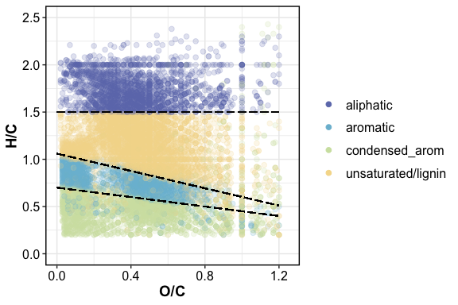
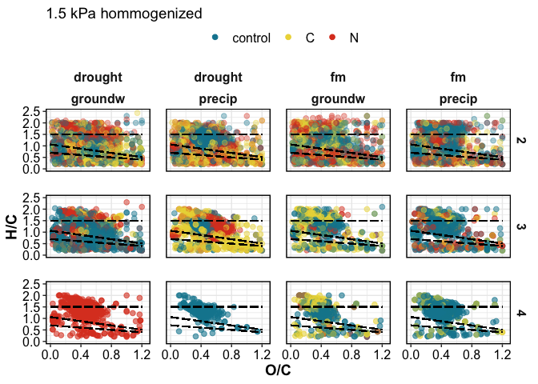
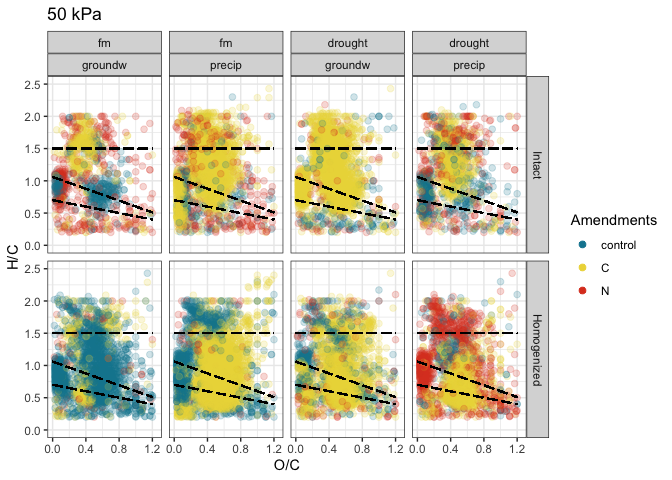
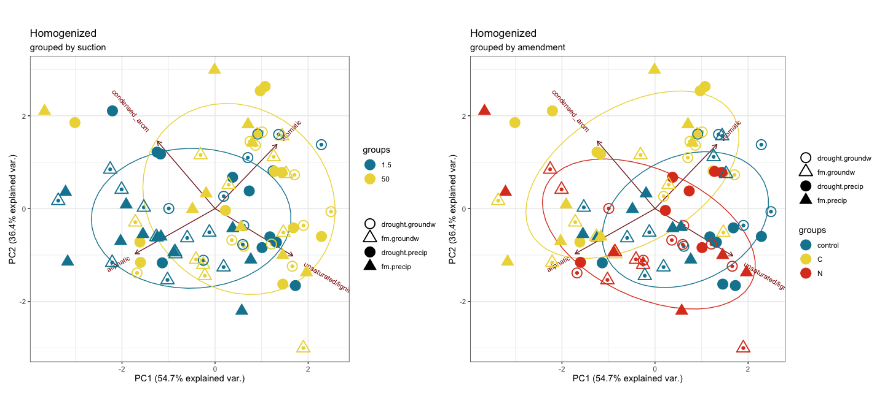
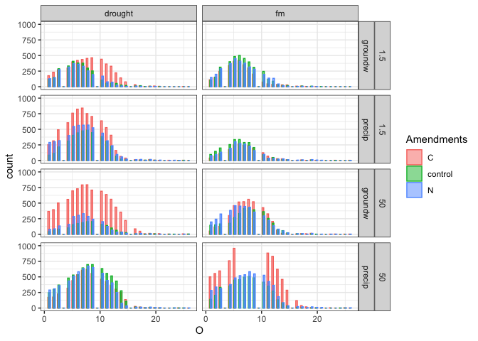

fticr
================

## HYPOTHESES

  - C amendments will increase diversity of SOM molecules
  - C amendments will cause a depletion of aromatic molecules,
    especially in fine pores
  - Homogenization will increase (a) total peaks, (b) diversity of
    peaks, (c) aromatic peaks

We selected only peaks seen in \>1 of the 4 replicates (i.e. n = 2 or 3
or 4)

-----

how many FTICR reps per treatment type?

| SampleAssignment                        | reps |
| :-------------------------------------- | ---: |
| 50-drought-groundw-control-Intact       |    2 |
| 50-drought-precip-C-Intact              |    2 |
| 1.5-drought-groundw-C-Homogenized       |    3 |
| 1.5-drought-groundw-C-Intact            |    3 |
| 1.5-drought-groundw-control-Homogenized |    3 |
| 1.5-drought-groundw-N-Intact            |    3 |
| 1.5-drought-precip-C-Homogenized        |    3 |
| 1.5-drought-precip-N-Homogenized        |    3 |
| 1.5-fm-precip-C-Intact                  |    3 |
| 1.5-fm-precip-N-Homogenized             |    3 |
| 50-drought-groundw-control-Homogenized  |    3 |
| 50-drought-groundw-N-Intact             |    3 |
| 50-drought-precip-control-Homogenized   |    3 |
| 50-fm-groundw-control-Intact            |    3 |
| 50-fm-groundw-N-Homogenized             |    3 |
| 50-fm-precip-control-Homogenized        |    3 |
| 50-fm-precip-N-Homogenized              |    3 |
| 1.5-drought-groundw-control-Intact      |    4 |
| 1.5-drought-groundw-N-Homogenized       |    4 |
| 1.5-drought-precip-C-Intact             |    4 |
| 1.5-drought-precip-control-Homogenized  |    4 |
| 1.5-drought-precip-control-Intact       |    4 |
| 1.5-drought-precip-N-Intact             |    4 |
| 1.5-fm-groundw-C-Homogenized            |    4 |
| 1.5-fm-groundw-C-Intact                 |    4 |
| 1.5-fm-groundw-control-Homogenized      |    4 |
| 1.5-fm-groundw-control-Intact           |    4 |
| 1.5-fm-groundw-N-Homogenized            |    4 |
| 1.5-fm-groundw-N-Intact                 |    4 |
| 1.5-fm-precip-C-Homogenized             |    4 |
| 1.5-fm-precip-control-Homogenized       |    4 |
| 1.5-fm-precip-control-Intact            |    4 |
| 1.5-fm-precip-N-Intact                  |    4 |
| 50-drought-groundw-C-Homogenized        |    4 |
| 50-drought-groundw-C-Intact             |    4 |
| 50-drought-groundw-N-Homogenized        |    4 |
| 50-drought-precip-C-Homogenized         |    4 |
| 50-drought-precip-control-Intact        |    4 |
| 50-drought-precip-N-Homogenized         |    4 |
| 50-drought-precip-N-Intact              |    4 |
| 50-fm-groundw-C-Homogenized             |    4 |
| 50-fm-groundw-C-Intact                  |    4 |
| 50-fm-groundw-control-Homogenized       |    4 |
| 50-fm-groundw-N-Intact                  |    4 |
| 50-fm-precip-C-Homogenized              |    4 |
| 50-fm-precip-C-Intact                   |    4 |
| 50-fm-precip-control-Intact             |    4 |
| 50-fm-precip-N-Intact                   |    4 |

**so we select formulae seen in at least 2 reps per treatment type**

### fticr domains

<!-- -->

-----

### van krevelens

<!-- -->

#### VK by replication

<!-- --><!-- --><!-- --><!-- -->

#### VK diagrams by treatment

<!-- --><!-- -->

#### VK unique

unique to each amendment, in each incubation type
<!-- --><!-- -->

<!-- --><!-- -->

-----

### relative abundances

<!-- -->

<!-- -->

-----

### PEAKS

distinct peaks seen in each treatment type

click to expand

    #> [1] "1.5 kPa -- INTACT"

| Moisture | Wetting | class              | control |    C |    N |
| :------- | :------ | :----------------- | ------: | ---: | ---: |
| drought  | groundw | aliphatic          |     301 |  547 |  474 |
| drought  | groundw | unsaturated/lignin |     466 | 1014 |  553 |
| drought  | groundw | aromatic           |      90 |  281 |  138 |
| drought  | groundw | condensed\_arom    |     285 |  176 |  140 |
| drought  | groundw | total              |    1142 | 2018 | 1305 |
| drought  | precip  | aliphatic          |     401 |  825 |  471 |
| drought  | precip  | unsaturated/lignin |     812 | 1080 |  872 |
| drought  | precip  | aromatic           |     106 |  236 |  211 |
| drought  | precip  | condensed\_arom    |     189 |  356 |  267 |
| drought  | precip  | total              |    1508 | 2497 | 1821 |
| fm       | groundw | aliphatic          |     431 |  426 |  679 |
| fm       | groundw | unsaturated/lignin |     586 |  410 |  449 |
| fm       | groundw | aromatic           |      82 |   78 |  118 |
| fm       | groundw | condensed\_arom    |     241 |  242 |  197 |
| fm       | groundw | total              |    1340 | 1156 | 1443 |
| fm       | precip  | aliphatic          |     309 |  227 |  213 |
| fm       | precip  | unsaturated/lignin |     383 |  394 |  332 |
| fm       | precip  | aromatic           |      78 |   23 |   51 |
| fm       | precip  | condensed\_arom    |     131 |  149 |  139 |
| fm       | precip  | total              |     901 |  793 |  735 |

    #> [1] "50 kPa -- INTACT"

| Moisture | Wetting | class              | control |    C |    N |
| :------- | :------ | :----------------- | ------: | ---: | ---: |
| drought  | groundw | aliphatic          |     106 |  828 |  250 |
| drought  | groundw | unsaturated/lignin |     506 | 1552 |  509 |
| drought  | groundw | aromatic           |      80 |  580 |   83 |
| drought  | groundw | condensed\_arom    |     192 |  318 |  152 |
| drought  | groundw | total              |     884 | 3278 |  994 |
| drought  | precip  | aliphatic          |     424 |  714 |  603 |
| drought  | precip  | unsaturated/lignin |    1251 | 1519 | 1103 |
| drought  | precip  | aromatic           |     456 |  349 |  240 |
| drought  | precip  | condensed\_arom    |     295 |  241 |  277 |
| drought  | precip  | total              |    2426 | 2823 | 2223 |
| fm       | groundw | aliphatic          |     307 |  509 |  399 |
| fm       | groundw | unsaturated/lignin |     791 |  721 |  724 |
| fm       | groundw | aromatic           |     248 |   70 |  204 |
| fm       | groundw | condensed\_arom    |     113 |  113 |  230 |
| fm       | groundw | total              |    1459 | 1413 | 1557 |
| fm       | precip  | aliphatic          |     432 | 1059 |  517 |
| fm       | precip  | unsaturated/lignin |     849 | 2003 |  870 |
| fm       | precip  | aromatic           |     280 |  546 |  183 |
| fm       | precip  | condensed\_arom    |     301 |  398 |  329 |
| fm       | precip  | total              |    1862 | 4006 | 1899 |

    #> [1] "1.5 kPa -- HOMOGENIZED"

| Moisture | Wetting | class              | control |    C |    N |
| :------- | :------ | :----------------- | ------: | ---: | ---: |
| drought  | groundw | aliphatic          |     285 |  395 |  533 |
| drought  | groundw | unsaturated/lignin |    1337 | 1081 | 1004 |
| drought  | groundw | aromatic           |     638 |  462 |  264 |
| drought  | groundw | condensed\_arom    |     531 |  434 |  259 |
| drought  | groundw | total              |    2791 | 2372 | 2060 |
| drought  | precip  | aliphatic          |     379 |  313 |  295 |
| drought  | precip  | unsaturated/lignin |    1012 |  506 |  746 |
| drought  | precip  | aromatic           |     267 |  165 |  250 |
| drought  | precip  | condensed\_arom    |     208 |  379 |  245 |
| drought  | precip  | total              |    1866 | 1363 | 1536 |
| fm       | groundw | aliphatic          |     377 |  483 |  256 |
| fm       | groundw | unsaturated/lignin |     657 |  552 |  329 |
| fm       | groundw | aromatic           |     123 |  127 |   57 |
| fm       | groundw | condensed\_arom    |     235 |  227 |  190 |
| fm       | groundw | total              |    1392 | 1389 |  832 |
| fm       | precip  | aliphatic          |     715 |  352 |  310 |
| fm       | precip  | unsaturated/lignin |     866 |  394 |  523 |
| fm       | precip  | aromatic           |     259 |   96 |   40 |
| fm       | precip  | condensed\_arom    |     316 |  170 |  188 |
| fm       | precip  | total              |    2156 | 1012 | 1061 |

    #> [1] "50 kPa -- HOMOGENIZED"

| Moisture | Wetting | class              | control |    C |    N |
| :------- | :------ | :----------------- | ------: | ---: | ---: |
| drought  | groundw | aliphatic          |     471 |  620 |  312 |
| drought  | groundw | unsaturated/lignin |    1434 | 1798 |  841 |
| drought  | groundw | aromatic           |     522 |  875 |  186 |
| drought  | groundw | condensed\_arom    |     248 |  763 |  188 |
| drought  | groundw | total              |    2675 | 4056 | 1527 |
| drought  | precip  | aliphatic          |     259 |  284 |  510 |
| drought  | precip  | unsaturated/lignin |     865 | 1232 | 1398 |
| drought  | precip  | aromatic           |     264 |  734 |  654 |
| drought  | precip  | condensed\_arom    |     148 |  718 |  438 |
| drought  | precip  | total              |    1536 | 2968 | 3000 |
| fm       | groundw | aliphatic          |     516 |  465 |  187 |
| fm       | groundw | unsaturated/lignin |    1602 |  875 |  390 |
| fm       | groundw | aromatic           |     780 |  335 |   29 |
| fm       | groundw | condensed\_arom    |     596 |  337 |  113 |
| fm       | groundw | total              |    3494 | 2012 |  719 |
| fm       | precip  | aliphatic          |     712 |  599 |  206 |
| fm       | precip  | unsaturated/lignin |    1077 | 2020 |  706 |
| fm       | precip  | aromatic           |     409 |  981 |  128 |
| fm       | precip  | condensed\_arom    |     395 | 1029 |  146 |
| fm       | precip  | total              |    2593 | 4629 | 1186 |

**Peak counts**

<!--html_preserve-->

<table class="gt_table">

<thead class="gt_header">

<tr>

<th colspan="8" class="gt_heading gt_title gt_font_normal" style>

Total Peaks Present

</th>

</tr>

<tr>

<th colspan="8" class="gt_heading gt_subtitle gt_font_normal gt_bottom_border" style>

</th>

</tr>

</thead>

<thead class="gt_col_headings">

<tr>

<th class="gt_col_heading gt_center gt_columns_bottom_border" rowspan="2" colspan="1">

Moisture

</th>

<th class="gt_col_heading gt_center gt_columns_bottom_border" rowspan="2" colspan="1">

Wetting

</th>

<th class="gt_center gt_columns_top_border gt_column_spanner_outer" rowspan="1" colspan="3">

1.5 kPa

</th>

<th class="gt_center gt_columns_top_border gt_column_spanner_outer" rowspan="1" colspan="3">

50 kPa

</th>

</tr>

<tr>

<th class="gt_col_heading gt_columns_bottom_border gt_center" rowspan="1" colspan="1">

1.5-control

</th>

<th class="gt_col_heading gt_columns_bottom_border gt_center" rowspan="1" colspan="1">

1.5-C

</th>

<th class="gt_col_heading gt_columns_bottom_border gt_center" rowspan="1" colspan="1">

1.5-N

</th>

<th class="gt_col_heading gt_columns_bottom_border gt_center" rowspan="1" colspan="1">

50-control

</th>

<th class="gt_col_heading gt_columns_bottom_border gt_center" rowspan="1" colspan="1">

50-C

</th>

<th class="gt_col_heading gt_columns_bottom_border gt_center" rowspan="1" colspan="1">

50-N

</th>

</tr>

</thead>

<tbody class="gt_table_body">

<tr class="gt_group_heading_row">

<td colspan="8" class="gt_group_heading">

Intact

</td>

</tr>

<tr>

<td class="gt_row gt_left">

drought

</td>

<td class="gt_row gt_left">

groundw

</td>

<td class="gt_row gt_center">

1142

</td>

<td class="gt_row gt_center">

2018

</td>

<td class="gt_row gt_center">

1305

</td>

<td class="gt_row gt_center">

884

</td>

<td class="gt_row gt_center">

3278

</td>

<td class="gt_row gt_center">

994

</td>

</tr>

<tr>

<td class="gt_row gt_left">

drought

</td>

<td class="gt_row gt_left">

precip

</td>

<td class="gt_row gt_center">

1508

</td>

<td class="gt_row gt_center">

2497

</td>

<td class="gt_row gt_center">

1821

</td>

<td class="gt_row gt_center">

2426

</td>

<td class="gt_row gt_center">

2823

</td>

<td class="gt_row gt_center">

2223

</td>

</tr>

<tr>

<td class="gt_row gt_left">

fm

</td>

<td class="gt_row gt_left">

groundw

</td>

<td class="gt_row gt_center">

1340

</td>

<td class="gt_row gt_center">

1156

</td>

<td class="gt_row gt_center">

1443

</td>

<td class="gt_row gt_center">

1459

</td>

<td class="gt_row gt_center">

1413

</td>

<td class="gt_row gt_center">

1557

</td>

</tr>

<tr>

<td class="gt_row gt_left">

fm

</td>

<td class="gt_row gt_left">

precip

</td>

<td class="gt_row gt_center">

901

</td>

<td class="gt_row gt_center">

793

</td>

<td class="gt_row gt_center">

735

</td>

<td class="gt_row gt_center">

1862

</td>

<td class="gt_row gt_center">

4006

</td>

<td class="gt_row gt_center">

1899

</td>

</tr>

<tr class="gt_group_heading_row">

<td colspan="8" class="gt_group_heading">

Homogenized

</td>

</tr>

<tr>

<td class="gt_row gt_left">

drought

</td>

<td class="gt_row gt_left">

groundw

</td>

<td class="gt_row gt_center">

2791

</td>

<td class="gt_row gt_center">

2372

</td>

<td class="gt_row gt_center">

2060

</td>

<td class="gt_row gt_center">

2675

</td>

<td class="gt_row gt_center">

4056

</td>

<td class="gt_row gt_center">

1527

</td>

</tr>

<tr>

<td class="gt_row gt_left">

drought

</td>

<td class="gt_row gt_left">

precip

</td>

<td class="gt_row gt_center">

1866

</td>

<td class="gt_row gt_center">

1363

</td>

<td class="gt_row gt_center">

1536

</td>

<td class="gt_row gt_center">

1536

</td>

<td class="gt_row gt_center">

2968

</td>

<td class="gt_row gt_center">

3000

</td>

</tr>

<tr>

<td class="gt_row gt_left">

fm

</td>

<td class="gt_row gt_left">

groundw

</td>

<td class="gt_row gt_center">

1392

</td>

<td class="gt_row gt_center">

1389

</td>

<td class="gt_row gt_center">

832

</td>

<td class="gt_row gt_center">

3494

</td>

<td class="gt_row gt_center">

2012

</td>

<td class="gt_row gt_center">

719

</td>

</tr>

<tr>

<td class="gt_row gt_left">

fm

</td>

<td class="gt_row gt_left">

precip

</td>

<td class="gt_row gt_center">

2156

</td>

<td class="gt_row gt_center">

1012

</td>

<td class="gt_row gt_center">

1061

</td>

<td class="gt_row gt_center">

2593

</td>

<td class="gt_row gt_center">

4629

</td>

<td class="gt_row gt_center">

1186

</td>

</tr>

</tbody>

</table>

<!--/html_preserve-->

<!--html_preserve-->

<table class="gt_table">

<thead class="gt_header">

<tr>

<th colspan="8" class="gt_heading gt_title gt_font_normal" style>

Aromatic Peaks Present

</th>

</tr>

<tr>

<th colspan="8" class="gt_heading gt_subtitle gt_font_normal gt_bottom_border" style>

</th>

</tr>

</thead>

<thead class="gt_col_headings">

<tr>

<th class="gt_col_heading gt_center gt_columns_bottom_border" rowspan="2" colspan="1">

Moisture

</th>

<th class="gt_col_heading gt_center gt_columns_bottom_border" rowspan="2" colspan="1">

Wetting

</th>

<th class="gt_center gt_columns_top_border gt_column_spanner_outer" rowspan="1" colspan="3">

1.5 kPa

</th>

<th class="gt_center gt_columns_top_border gt_column_spanner_outer" rowspan="1" colspan="3">

50 kPa

</th>

</tr>

<tr>

<th class="gt_col_heading gt_columns_bottom_border gt_center" rowspan="1" colspan="1">

1.5-control

</th>

<th class="gt_col_heading gt_columns_bottom_border gt_center" rowspan="1" colspan="1">

1.5-C

</th>

<th class="gt_col_heading gt_columns_bottom_border gt_center" rowspan="1" colspan="1">

1.5-N

</th>

<th class="gt_col_heading gt_columns_bottom_border gt_center" rowspan="1" colspan="1">

50-control

</th>

<th class="gt_col_heading gt_columns_bottom_border gt_center" rowspan="1" colspan="1">

50-C

</th>

<th class="gt_col_heading gt_columns_bottom_border gt_center" rowspan="1" colspan="1">

50-N

</th>

</tr>

</thead>

<tbody class="gt_table_body">

<tr class="gt_group_heading_row">

<td colspan="8" class="gt_group_heading">

Intact

</td>

</tr>

<tr>

<td class="gt_row gt_left">

drought

</td>

<td class="gt_row gt_left">

groundw

</td>

<td class="gt_row gt_center">

375

</td>

<td class="gt_row gt_center">

457

</td>

<td class="gt_row gt_center">

278

</td>

<td class="gt_row gt_center">

272

</td>

<td class="gt_row gt_center">

898

</td>

<td class="gt_row gt_center">

235

</td>

</tr>

<tr>

<td class="gt_row gt_left">

drought

</td>

<td class="gt_row gt_left">

precip

</td>

<td class="gt_row gt_center">

295

</td>

<td class="gt_row gt_center">

592

</td>

<td class="gt_row gt_center">

478

</td>

<td class="gt_row gt_center">

751

</td>

<td class="gt_row gt_center">

590

</td>

<td class="gt_row gt_center">

517

</td>

</tr>

<tr>

<td class="gt_row gt_left">

fm

</td>

<td class="gt_row gt_left">

groundw

</td>

<td class="gt_row gt_center">

323

</td>

<td class="gt_row gt_center">

320

</td>

<td class="gt_row gt_center">

315

</td>

<td class="gt_row gt_center">

361

</td>

<td class="gt_row gt_center">

183

</td>

<td class="gt_row gt_center">

434

</td>

</tr>

<tr>

<td class="gt_row gt_left">

fm

</td>

<td class="gt_row gt_left">

precip

</td>

<td class="gt_row gt_center">

209

</td>

<td class="gt_row gt_center">

172

</td>

<td class="gt_row gt_center">

190

</td>

<td class="gt_row gt_center">

581

</td>

<td class="gt_row gt_center">

944

</td>

<td class="gt_row gt_center">

512

</td>

</tr>

<tr class="gt_group_heading_row">

<td colspan="8" class="gt_group_heading">

Homogenized

</td>

</tr>

<tr>

<td class="gt_row gt_left">

drought

</td>

<td class="gt_row gt_left">

groundw

</td>

<td class="gt_row gt_center">

1169

</td>

<td class="gt_row gt_center">

896

</td>

<td class="gt_row gt_center">

523

</td>

<td class="gt_row gt_center">

770

</td>

<td class="gt_row gt_center">

1638

</td>

<td class="gt_row gt_center">

374

</td>

</tr>

<tr>

<td class="gt_row gt_left">

drought

</td>

<td class="gt_row gt_left">

precip

</td>

<td class="gt_row gt_center">

475

</td>

<td class="gt_row gt_center">

544

</td>

<td class="gt_row gt_center">

495

</td>

<td class="gt_row gt_center">

412

</td>

<td class="gt_row gt_center">

1452

</td>

<td class="gt_row gt_center">

1092

</td>

</tr>

<tr>

<td class="gt_row gt_left">

fm

</td>

<td class="gt_row gt_left">

groundw

</td>

<td class="gt_row gt_center">

358

</td>

<td class="gt_row gt_center">

354

</td>

<td class="gt_row gt_center">

247

</td>

<td class="gt_row gt_center">

1376

</td>

<td class="gt_row gt_center">

672

</td>

<td class="gt_row gt_center">

142

</td>

</tr>

<tr>

<td class="gt_row gt_left">

fm

</td>

<td class="gt_row gt_left">

precip

</td>

<td class="gt_row gt_center">

575

</td>

<td class="gt_row gt_center">

266

</td>

<td class="gt_row gt_center">

228

</td>

<td class="gt_row gt_center">

804

</td>

<td class="gt_row gt_center">

2010

</td>

<td class="gt_row gt_center">

274

</td>

</tr>

</tbody>

</table>

<!--/html_preserve-->

### STATS –

#### PERMANOVA

**overall, all variables**

    #> Permutation test for adonis under reduced model
    #> Terms added sequentially (first to last)
    #> Permutation: free
    #> Number of permutations: 999
    #> 
    #> adonis2(formula = relabund_wide$DV ~ (Amendments + Moisture + Wetting + Suction + Homogenization)^3, data = relabund_wide)
    #>                                     Df SumOfSqs      R2       F Pr(>F)    
    #> Amendments                           2  0.14437 0.04766  7.8109  0.001 ***
    #> Moisture                             1  0.21505 0.07099 23.2697  0.001 ***
    #> Wetting                              1  0.00916 0.00302  0.9908  0.366    
    #> Suction                              1  0.38447 0.12691 41.6021  0.001 ***
    #> Homogenization                       1  0.17475 0.05768 18.9089  0.001 ***
    #> Amendments:Moisture                  2  0.04268 0.01409  2.3090  0.056 .  
    #> Amendments:Wetting                   2  0.05754 0.01899  3.1133  0.018 *  
    #> Amendments:Suction                   2  0.02715 0.00896  1.4688  0.227    
    #> Amendments:Homogenization            2  0.13898 0.04588  7.5190  0.001 ***
    #> Moisture:Wetting                     1  0.01834 0.00606  1.9850  0.128    
    #> Moisture:Suction                     1  0.05683 0.01876  6.1493  0.005 ** 
    #> Moisture:Homogenization              1  0.00560 0.00185  0.6056  0.567    
    #> Wetting:Suction                      1  0.04302 0.01420  4.6549  0.009 ** 
    #> Wetting:Homogenization               1  0.05849 0.01931  6.3290  0.008 ** 
    #> Suction:Homogenization               1  0.02368 0.00782  2.5619  0.079 .  
    #> Amendments:Moisture:Wetting          2  0.08926 0.02946  4.8293  0.001 ***
    #> Amendments:Moisture:Suction          2  0.03187 0.01052  1.7241  0.163    
    #> Amendments:Moisture:Homogenization   2  0.04422 0.01460  2.3922  0.057 .  
    #> Amendments:Wetting:Suction           2  0.03512 0.01159  1.9002  0.105    
    #> Amendments:Wetting:Homogenization    2  0.02055 0.00678  1.1117  0.321    
    #> Amendments:Suction:Homogenization    2  0.08361 0.02760  4.5237  0.005 ** 
    #> Moisture:Wetting:Suction             1  0.02044 0.00675  2.2122  0.110    
    #> Moisture:Wetting:Homogenization      1  0.00995 0.00328  1.0768  0.341    
    #> Moisture:Suction:Homogenization      1  0.02605 0.00860  2.8190  0.075 .  
    #> Wetting:Suction:Homogenization       1  0.01140 0.00376  1.2332  0.314    
    #> Residual                           136  1.25687 0.41488                   
    #> Total                              172  3.02945 1.00000                   
    #> ---
    #> Signif. codes:  0 '***' 0.001 '**' 0.01 '*' 0.05 '.' 0.1 ' ' 1

**subsets**

    #> [1] "Intact-1.5 kPa"
    #> Permutation test for adonis under reduced model
    #> Terms added sequentially (first to last)
    #> Permutation: free
    #> Number of permutations: 999
    #> 
    #> adonis2(formula = relabund_wide %>% filter(Homogenization == "Intact" & Suction == 1.5) %>% select(DV) ~ Amendments * Moisture * Wetting, data = relabund_wide %>% filter(Homogenization == "Intact" & Suction == 1.5))
    #>                             Df SumOfSqs      R2       F Pr(>F)    
    #> Amendments                   2  0.00603 0.01288  0.4995  0.754    
    #> Moisture                     1  0.07530 0.16088 12.4784  0.001 ***
    #> Wetting                      1  0.05498 0.11746  9.1107  0.003 ** 
    #> Amendments:Moisture          2  0.02583 0.05518  2.1399  0.079 .  
    #> Amendments:Wetting           2  0.04222 0.09020  3.4981  0.012 *  
    #> Moisture:Wetting             1  0.01142 0.02441  1.8931  0.144    
    #> Amendments:Moisture:Wetting  2  0.05315 0.11356  4.4042  0.004 ** 
    #> Residual                    33  0.19913 0.42545                   
    #> Total                       44  0.46805 1.00000                   
    #> ---
    #> Signif. codes:  0 '***' 0.001 '**' 0.01 '*' 0.05 '.' 0.1 ' ' 1
    #> [1] "Intact-50 kPa"
    #> Permutation test for adonis under reduced model
    #> Terms added sequentially (first to last)
    #> Permutation: free
    #> Number of permutations: 999
    #> 
    #> adonis2(formula = relabund_wide %>% filter(Homogenization == "Intact" & Suction == 50) %>% select(DV) ~ Amendments * Moisture * Wetting, data = relabund_wide %>% filter(Homogenization == "Intact" & Suction == 50))
    #>                             Df SumOfSqs      R2      F Pr(>F)    
    #> Amendments                   2  0.08850 0.19694 5.8702  0.001 ***
    #> Moisture                     1  0.01117 0.02485 1.4815  0.220    
    #> Wetting                      1  0.01314 0.02923 1.7426  0.185    
    #> Amendments:Moisture          2  0.03599 0.08010 2.3875  0.063 .  
    #> Amendments:Wetting           2  0.02278 0.05070 1.5112  0.234    
    #> Moisture:Wetting             1  0.02859 0.06361 3.7923  0.023 *  
    #> Amendments:Moisture:Wetting  2  0.02308 0.05135 1.5305  0.168    
    #> Residual                    30  0.22615 0.50323                  
    #> Total                       41  0.44940 1.00000                  
    #> ---
    #> Signif. codes:  0 '***' 0.001 '**' 0.01 '*' 0.05 '.' 0.1 ' ' 1
    #> [1] "Homogenized-1.5 kPa"
    #> Permutation test for adonis under reduced model
    #> Terms added sequentially (first to last)
    #> Permutation: free
    #> Number of permutations: 999
    #> 
    #> adonis2(formula = relabund_wide %>% filter(Homogenization == "Homogenized" & Suction == 1.5) %>% select(DV) ~ Amendments * Moisture * Wetting, data = relabund_wide %>% filter(Homogenization == "Homogenized" & Suction == 1.5))
    #>                             Df SumOfSqs      R2       F Pr(>F)    
    #> Amendments                   2  0.11805 0.16791  7.9299  0.001 ***
    #> Moisture                     1  0.20467 0.29111 27.4967  0.001 ***
    #> Wetting                      1  0.01808 0.02571  2.4286  0.104    
    #> Amendments:Moisture          2  0.02850 0.04053  1.9143  0.129    
    #> Amendments:Wetting           2  0.03984 0.05666  2.6758  0.035 *  
    #> Moisture:Wetting             1  0.01283 0.01825  1.7238  0.172    
    #> Amendments:Moisture:Wetting  2  0.05037 0.07164  3.3836  0.021 *  
    #> Residual                    31  0.23075 0.32819                   
    #> Total                       42  0.70308 1.00000                   
    #> ---
    #> Signif. codes:  0 '***' 0.001 '**' 0.01 '*' 0.05 '.' 0.1 ' ' 1
    #> [1] "Homogenized-50 kPa"
    #> Permutation test for adonis under reduced model
    #> Terms added sequentially (first to last)
    #> Permutation: free
    #> Number of permutations: 999
    #> 
    #> adonis2(formula = relabund_wide %>% filter(Homogenization == "Homogenized" & Suction == 50) %>% select(DV) ~ Amendments * Moisture * Wetting, data = relabund_wide %>% filter(Homogenization == "Homogenized" & Suction == 50))
    #>                             Df SumOfSqs      R2      F Pr(>F)    
    #> Amendments                   2  0.19013 0.22768 6.7194  0.001 ***
    #> Moisture                     1  0.00599 0.00718 0.4236  0.704    
    #> Wetting                      1  0.03243 0.03884 2.2922  0.117    
    #> Amendments:Moisture          2  0.07244 0.08675 2.5602  0.043 *  
    #> Amendments:Wetting           2  0.03066 0.03671 1.0835  0.384    
    #> Moisture:Wetting             1  0.00933 0.01117 0.6593  0.551    
    #> Amendments:Moisture:Wetting  2  0.05551 0.06647 1.9617  0.098 .  
    #> Residual                    31  0.43858 0.52520                  
    #> Total                       42  0.83506 1.00000                  
    #> ---
    #> Signif. codes:  0 '***' 0.001 '**' 0.01 '*' 0.05 '.' 0.1 ' ' 1

#### PCA

**intact cores**

<!-- -->

**homogenized cores**

<!-- -->

<!-- --><!-- -->

## Elements

<!-- --><!-- -->

-----

## Session Info

click to expand

Date run: 2020-08-21

    #> R version 4.0.2 (2020-06-22)
    #> Platform: x86_64-apple-darwin17.0 (64-bit)
    #> Running under: macOS Catalina 10.15.6
    #> 
    #> Matrix products: default
    #> BLAS:   /Library/Frameworks/R.framework/Versions/4.0/Resources/lib/libRblas.dylib
    #> LAPACK: /Library/Frameworks/R.framework/Versions/4.0/Resources/lib/libRlapack.dylib
    #> 
    #> locale:
    #> [1] en_US.UTF-8/en_US.UTF-8/en_US.UTF-8/C/en_US.UTF-8/en_US.UTF-8
    #> 
    #> attached base packages:
    #> [1] stats     graphics  grDevices utils     datasets  methods   base     
    #> 
    #> other attached packages:
    #>  [1] patchwork_1.0.1 vegan_2.5-6     lattice_0.20-41 permute_0.9-5  
    #>  [5] gt_0.2.2        ggbiplot_0.55   PNWColors_0.1.0 forcats_0.5.0  
    #>  [9] stringr_1.4.0   dplyr_1.0.1     purrr_0.3.4     readr_1.3.1    
    #> [13] tidyr_1.1.1     tibble_3.0.3    ggplot2_3.3.2   tidyverse_1.3.0
    #> [17] here_0.1       
    #> 
    #> loaded via a namespace (and not attached):
    #>  [1] Rcpp_1.0.5       lubridate_1.7.9  assertthat_0.2.1 rprojroot_1.3-2 
    #>  [5] digest_0.6.25    R6_2.4.1         cellranger_1.1.0 plyr_1.8.6      
    #>  [9] backports_1.1.8  reprex_0.3.0     evaluate_0.14    httr_1.4.2      
    #> [13] highr_0.8        pillar_1.4.6     rlang_0.4.7      readxl_1.3.1    
    #> [17] rstudioapi_0.11  blob_1.2.1       Matrix_1.2-18    checkmate_2.0.0 
    #> [21] rmarkdown_2.3    splines_4.0.2    labeling_0.3     munsell_0.5.0   
    #> [25] broom_0.7.0      compiler_4.0.2   modelr_0.1.8     xfun_0.16       
    #> [29] pkgconfig_2.0.3  mgcv_1.8-31      htmltools_0.5.0  tidyselect_1.1.0
    #> [33] fansi_0.4.1      crayon_1.3.4     dbplyr_1.4.4     withr_2.2.0     
    #> [37] MASS_7.3-51.6    commonmark_1.7   grid_4.0.2       nlme_3.1-148    
    #> [41] jsonlite_1.7.0   gtable_0.3.0     lifecycle_0.2.0  DBI_1.1.0       
    #> [45] magrittr_1.5     scales_1.1.1     cli_2.0.2        stringi_1.4.6   
    #> [49] farver_2.0.3     fs_1.5.0         xml2_1.3.2       ellipsis_0.3.1  
    #> [53] generics_0.0.2   vctrs_0.3.2      tools_4.0.2      glue_1.4.1      
    #> [57] hms_0.5.3        parallel_4.0.2   yaml_2.2.1       colorspace_1.4-1
    #> [61] cluster_2.1.0    rvest_0.3.6      knitr_1.29       haven_2.3.1     
    #> [65] sass_0.2.0

