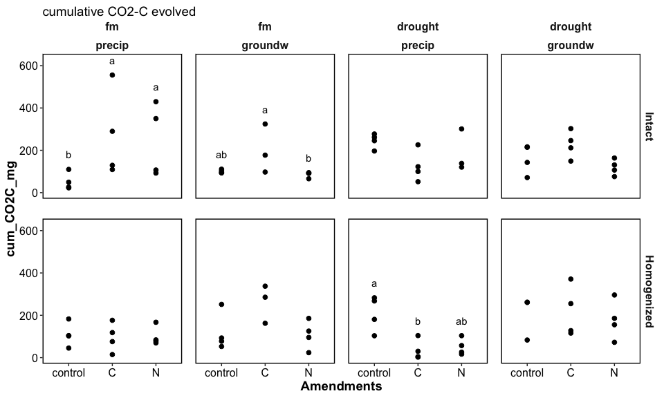
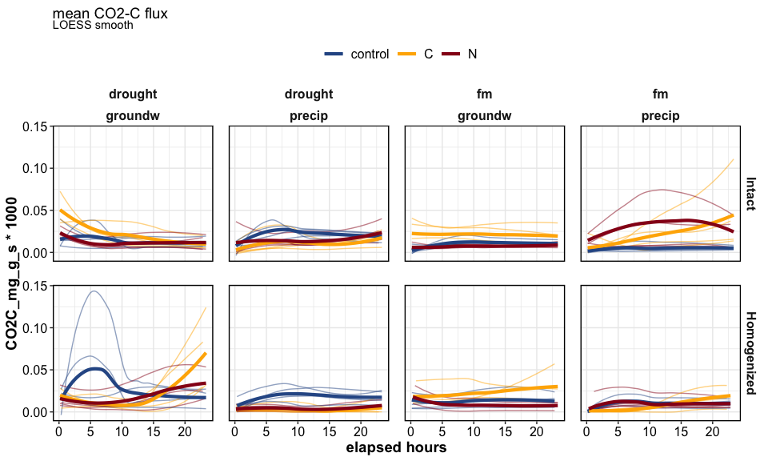
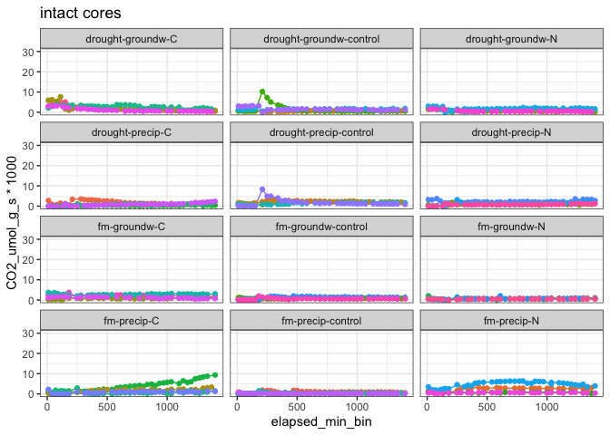
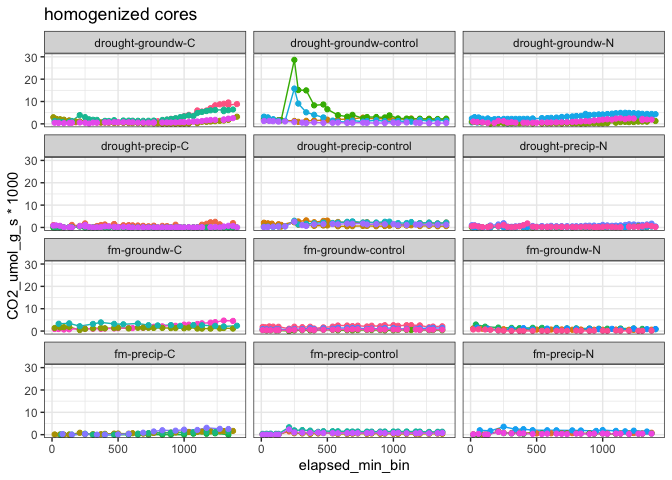

Spatial Access – Gas Fluxes
================

### HYPOTHESES

  - C amendments will increase CO2 flux
    
      - especially in cores wet from below

  - post-rewetting CO2 flush: drought \> fm for unamended soils, but
    drought \< fm for C-amended soils

  - N amendments will increase CO2 flux when wet from above

-----

### CUMULATIVE FLUX/CO2 EVOLVED

<details>

<summary>stats - click to expand</summary>

``` r
aov_flux_intact = aov(log(cum_CO2C_mg) ~ Moisture*Amendments + Moisture*Wetting + Wetting*Amendments, 
                      data = flux_summary %>% filter(Homogenization=="Intact"))
summary(aov_flux_intact)
#>                     Df Sum Sq Mean Sq F value  Pr(>F)   
#> Moisture             1  1.167  1.1669   3.556 0.06742 . 
#> Amendments           2  1.526  0.7632   2.326 0.11223   
#> Wetting              1  0.058  0.0585   0.178 0.67547   
#> Moisture:Amendments  2  3.700  1.8502   5.638 0.00741 **
#> Moisture:Wetting     1  0.000  0.0000   0.000 0.99046   
#> Amendments:Wetting   2  1.895  0.9475   2.887 0.06871 . 
#> Residuals           36 11.814  0.3282                   
#> ---
#> Signif. codes:  0 '***' 0.001 '**' 0.01 '*' 0.05 '.' 0.1 ' ' 1
#> 2 observations deleted due to missingness

aov_flux_homo = aov(log(cum_CO2C_mg) ~ Moisture*Amendments + Moisture*Wetting + Wetting*Amendments, 
                    data = flux_summary %>% filter(Homogenization=="Homogenized"))
summary(aov_flux_homo)
#>                     Df Sum Sq Mean Sq F value  Pr(>F)   
#> Moisture             1  0.192   0.192   0.277 0.60177   
#> Amendments           2  2.536   1.268   1.835 0.17427   
#> Wetting              1  7.961   7.961  11.521 0.00169 **
#> Moisture:Amendments  2  4.872   2.436   3.525 0.03999 * 
#> Moisture:Wetting     1  2.989   2.989   4.326 0.04472 * 
#> Amendments:Wetting   2  7.521   3.760   5.442 0.00861 **
#> Residuals           36 24.877   0.691                   
#> ---
#> Signif. codes:  0 '***' 0.001 '**' 0.01 '*' 0.05 '.' 0.1 ' ' 1
#> 1 observation deleted due to missingness
```

</details>

<!-- -->

<!-- -->

-----

<details>

<summary>time series by core</summary>

<!-- --><!-- -->

-----

</details>

-----

#### Session Info

<details>

<summary>click to expand</summary>

Date run: 2020-07-24

    #> R version 4.0.2 (2020-06-22)
    #> Platform: x86_64-apple-darwin17.0 (64-bit)
    #> Running under: macOS Catalina 10.15.6
    #> 
    #> Matrix products: default
    #> BLAS:   /Library/Frameworks/R.framework/Versions/4.0/Resources/lib/libRblas.dylib
    #> LAPACK: /Library/Frameworks/R.framework/Versions/4.0/Resources/lib/libRlapack.dylib
    #> 
    #> locale:
    #> [1] en_US.UTF-8/en_US.UTF-8/en_US.UTF-8/C/en_US.UTF-8/en_US.UTF-8
    #> 
    #> attached base packages:
    #> [1] stats     graphics  grDevices utils     datasets  methods   base     
    #> 
    #> other attached packages:
    #>  [1] ggbiplot_0.55   PNWColors_0.1.0 forcats_0.5.0   stringr_1.4.0  
    #>  [5] dplyr_1.0.0     purrr_0.3.4     readr_1.3.1     tidyr_1.1.0    
    #>  [9] tibble_3.0.3    ggplot2_3.3.2   tidyverse_1.3.0 here_0.1       
    #> 
    #> loaded via a namespace (and not attached):
    #>  [1] nlme_3.1-148       fs_1.4.2           lubridate_1.7.9    httr_1.4.2        
    #>  [5] rprojroot_1.3-2    tools_4.0.2        backports_1.1.8    R6_2.4.1          
    #>  [9] AlgDesign_1.2.0    DBI_1.1.0          mgcv_1.8-31        questionr_0.7.1   
    #> [13] colorspace_1.4-1   withr_2.2.0        tidyselect_1.1.0   klaR_0.6-15       
    #> [17] compiler_4.0.2     cli_2.0.2          rvest_0.3.5        xml2_1.3.2        
    #> [21] labeling_0.3       scales_1.1.1       digest_0.6.25      rmarkdown_2.3     
    #> [25] pkgconfig_2.0.3    htmltools_0.5.0    labelled_2.5.0     dbplyr_1.4.4      
    #> [29] fastmap_1.0.1      highr_0.8          rlang_0.4.7        readxl_1.3.1      
    #> [33] rstudioapi_0.11    shiny_1.5.0        generics_0.0.2     farver_2.0.3      
    #> [37] combinat_0.0-8     jsonlite_1.7.0     magrittr_1.5       Matrix_1.2-18     
    #> [41] Rcpp_1.0.5         munsell_0.5.0      fansi_0.4.1        lifecycle_0.2.0   
    #> [45] stringi_1.4.6      yaml_2.2.1         MASS_7.3-51.6      plyr_1.8.6        
    #> [49] grid_4.0.2         blob_1.2.1         promises_1.1.1     crayon_1.3.4      
    #> [53] miniUI_0.1.1.1     lattice_0.20-41    splines_4.0.2      haven_2.3.1       
    #> [57] hms_0.5.3          knitr_1.29         pillar_1.4.6       soilpalettes_0.1.0
    #> [61] reprex_0.3.0       glue_1.4.1         evaluate_0.14      agricolae_1.3-3   
    #> [65] modelr_0.1.8       vctrs_0.3.2        httpuv_1.5.4       cellranger_1.1.0  
    #> [69] gtable_0.3.0       assertthat_0.2.1   xfun_0.15          mime_0.9          
    #> [73] xtable_1.8-4       broom_0.7.0        later_1.1.0.1      cluster_2.1.0     
    #> [77] ellipsis_0.3.1

</details>
