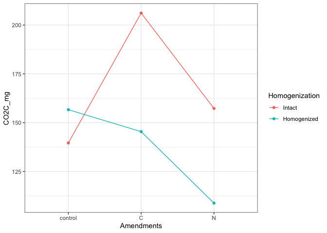

Spatial Access – Gas Fluxes
================

### HYPOTHESES

  - C amendments will increase CO2 flux
    
      - especially in cores wet from below

  - post-rewetting CO2 flush: drought \> fm for unamended soils, but
    drought \< fm for C-amended soils

  - N amendments will increase CO2 flux when wet from above

-----

### CUMULATIVE FLUX/CO2 EVOLVED

<details>

<summary>stats - click to expand</summary>

``` r
car::Anova(lme4::lmer(log(cum_CO2C_mg) ~ 
                        (Homogenization + Moisture + Amendments + Wetting)^2 +
                        (1|CORE),
                      REML = TRUE, data = flux_summary)
            )
#> Analysis of Deviance Table (Type II Wald chisquare tests)
#> 
#> Response: log(cum_CO2C_mg)
#>                             Chisq Df Pr(>Chisq)   
#> Homogenization             5.9998  1   0.014308 * 
#> Moisture                   0.2506  1   0.616681   
#> Amendments                 0.5724  2   0.751126   
#> Wetting                    6.0786  1   0.013683 * 
#> Homogenization:Moisture    1.8476  1   0.174061   
#> Homogenization:Amendments  8.9919  2   0.011154 * 
#> Homogenization:Wetting    10.3246  1   0.001313 **
#> Moisture:Amendments       13.5320  2   0.001152 **
#> Moisture:Wetting           1.9290  1   0.164873   
#> Amendments:Wetting         8.8856  2   0.011763 * 
#> ---
#> Signif. codes:  0 '***' 0.001 '**' 0.01 '*' 0.05 '.' 0.1 ' ' 1

car::Anova(lm(log(cum_CO2C_mg) ~ 
                (Moisture + Amendments + Wetting)^2,
              data = flux_summary %>% filter(Homogenization=="Intact")), 
           type="III")
#> Anova Table (Type III tests)
#> 
#> Response: log(cum_CO2C_mg)
#>                     Sum Sq Df  F value    Pr(>F)    
#> (Intercept)         79.287  1 241.6145 < 2.2e-16 ***
#> Moisture             3.510  1  10.6970  0.002369 ** 
#> Amendments           4.212  2   6.4184  0.004131 ** 
#> Wetting              0.119  1   0.3618  0.551283    
#> Moisture:Amendments  3.729  2   5.6818  0.007169 ** 
#> Moisture:Wetting     0.005  1   0.0152  0.902494    
#> Amendments:Wetting   1.895  2   2.8874  0.068706 .  
#> Residuals           11.814 36                       
#> ---
#> Signif. codes:  0 '***' 0.001 '**' 0.01 '*' 0.05 '.' 0.1 ' ' 1

car::Anova(lm(log(cum_CO2C_mg) ~ 
                (Moisture + Amendments + Wetting)^2,
              data = flux_summary %>% filter(Homogenization=="Homogenized")), 
           type="III")
#> Anova Table (Type III tests)
#> 
#> Response: log(cum_CO2C_mg)
#>                      Sum Sq Df  F value    Pr(>F)    
#> (Intercept)         109.678  1 158.7171 9.264e-15 ***
#> Moisture              0.140  1   0.2022  0.655667    
#> Amendments            1.197  2   0.8662  0.429114    
#> Wetting               0.598  1   0.8655  0.358398    
#> Moisture:Amendments   4.970  2   3.5958  0.037692 *  
#> Moisture:Wetting      2.431  1   3.5182  0.068825 .  
#> Amendments:Wetting    7.521  2   5.4416  0.008613 ** 
#> Residuals            24.877 36                       
#> ---
#> Signif. codes:  0 '***' 0.001 '**' 0.01 '*' 0.05 '.' 0.1 ' ' 1


flux_summary %>% group_by(Amendments, Homogenization) %>% 
  dplyr::summarise(CO2C_mg = mean(cum_CO2C_mg, na.rm=TRUE)) %>% 
  ggplot()+
  geom_point(aes(x = Amendments, y = CO2C_mg, color = Homogenization))+
  geom_path(aes(x = Amendments, y = CO2C_mg, color = Homogenization,
                group=Homogenization))
```

<!-- -->

</details>

<!-- -->

Homogenization:  
\- interactive response with Amendment  
\- Homogenization increased respiration in the control soils  
\- Homogenization decreased respiration in the amended soils

For intact cores,  
\- respiration was influenced by Moisture:Amendments  
\- C-amendments increased respiration in FM soils  
\- N-amendments increased respiration only in FM-precip soils

<!-- -->

-----

<details>

<summary>time series by core</summary>

<!-- --><!-- -->

-----

</details>

**Cumulative flux – summary table**

| Homogenization | Moisture | Wetting |    control     |        C        |       N        |
| :------------: | :------: | :-----: | :------------: | :-------------: | :------------: |
|     Intact     |    fm    | precip  |   52 ± 20.16   | 270.95 ± 103.11 | 244.8 ± 85.34  |
|     Intact     |    fm    | groundw | 100.22 ± 4.12  | 199.62 ± 57.58  |  85.92 ± 6.79  |
|     Intact     | drought  | precip  | 245.11 ± 17.38 | 125.07 ± 36.68  | 186.55 ± 49.75 |
|     Intact     | drought  | groundw | 161.18 ± 34.49 | 227.34 ± 32.09  | 119.25 ± 18.59 |
|  Homogenized   |    fm    | precip  | 108.62 ± 28.23 |  96.28 ± 34.16  | 99.67 ± 22.65  |
|  Homogenized   |    fm    | groundw | 118.74 ± 45.04 | 261.79 ± 51.91  | 107.47 ± 33.66 |
|  Homogenized   | drought  | precip  | 208.65 ± 41.69 |  35.29 ± 23.78  | 50.76 ± 19.67  |
|  Homogenized   | drought  | groundw | 201.98 ± 51.46 | 217.43 ± 60.18  | 177.38 ± 46.22 |

-----

#### Session Info

<details>

<summary>click to expand</summary>

Date run: 2020-07-28

    #> R version 4.0.2 (2020-06-22)
    #> Platform: x86_64-apple-darwin17.0 (64-bit)
    #> Running under: macOS Catalina 10.15.6
    #> 
    #> Matrix products: default
    #> BLAS:   /Library/Frameworks/R.framework/Versions/4.0/Resources/lib/libRblas.dylib
    #> LAPACK: /Library/Frameworks/R.framework/Versions/4.0/Resources/lib/libRlapack.dylib
    #> 
    #> locale:
    #> [1] en_US.UTF-8/en_US.UTF-8/en_US.UTF-8/C/en_US.UTF-8/en_US.UTF-8
    #> 
    #> attached base packages:
    #> [1] stats     graphics  grDevices utils     datasets  methods   base     
    #> 
    #> other attached packages:
    #>  [1] ggbiplot_0.55   PNWColors_0.1.0 forcats_0.5.0   stringr_1.4.0  
    #>  [5] dplyr_1.0.0     purrr_0.3.4     readr_1.3.1     tidyr_1.1.0    
    #>  [9] tibble_3.0.3    ggplot2_3.3.2   tidyverse_1.3.0 here_0.1       
    #> 
    #> loaded via a namespace (and not attached):
    #>  [1] nlme_3.1-148       fs_1.4.2           lubridate_1.7.9    httr_1.4.2        
    #>  [5] rprojroot_1.3-2    tools_4.0.2        backports_1.1.8    R6_2.4.1          
    #>  [9] AlgDesign_1.2.0    mgcv_1.8-31        DBI_1.1.0          questionr_0.7.1   
    #> [13] colorspace_1.4-1   withr_2.2.0        tidyselect_1.1.0   klaR_0.6-15       
    #> [17] curl_4.3           compiler_4.0.2     cli_2.0.2          rvest_0.3.5       
    #> [21] xml2_1.3.2         labeling_0.3       scales_1.1.1       digest_0.6.25     
    #> [25] foreign_0.8-80     minqa_1.2.4        rmarkdown_2.3      rio_0.5.16        
    #> [29] pkgconfig_2.0.3    htmltools_0.5.0    lme4_1.1-23        labelled_2.5.0    
    #> [33] highr_0.8          fastmap_1.0.1      dbplyr_1.4.4       rlang_0.4.7       
    #> [37] readxl_1.3.1       rstudioapi_0.11    shiny_1.5.0        generics_0.0.2    
    #> [41] farver_2.0.3       combinat_0.0-8     jsonlite_1.7.0     zip_2.0.4         
    #> [45] car_3.0-8          magrittr_1.5       Matrix_1.2-18      Rcpp_1.0.5        
    #> [49] munsell_0.5.0      fansi_0.4.1        abind_1.4-5        lifecycle_0.2.0   
    #> [53] stringi_1.4.6      yaml_2.2.1         carData_3.0-4      MASS_7.3-51.6     
    #> [57] plyr_1.8.6         grid_4.0.2         blob_1.2.1         promises_1.1.1    
    #> [61] crayon_1.3.4       miniUI_0.1.1.1     lattice_0.20-41    haven_2.3.1       
    #> [65] splines_4.0.2      hms_0.5.3          knitr_1.29         pillar_1.4.6      
    #> [69] boot_1.3-25        soilpalettes_0.1.0 reprex_0.3.0       glue_1.4.1        
    #> [73] evaluate_0.14      data.table_1.12.8  agricolae_1.3-3    modelr_0.1.8      
    #> [77] httpuv_1.5.4       vctrs_0.3.2        nloptr_1.2.2.2     cellranger_1.1.0  
    #> [81] gtable_0.3.0       assertthat_0.2.1   xfun_0.15          openxlsx_4.1.5    
    #> [85] mime_0.9           xtable_1.8-4       broom_0.7.0        later_1.1.0.1     
    #> [89] cluster_2.1.0      statmod_1.4.34     ellipsis_0.3.1

</details>
