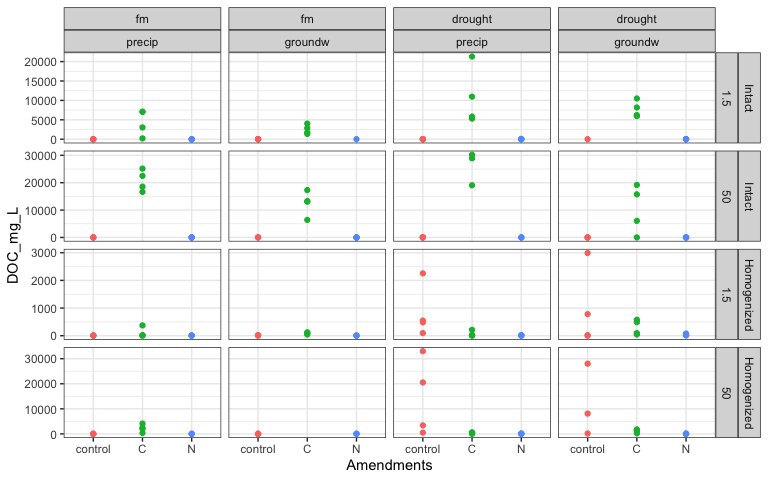

Spatial Access – DOC
================

<!-- --><!-- -->

-----

**what influenced DOC?**

DOC in **intact** cores was influenced by:  
1\. Amendments  
2\. Wetting direction  
DOC in **homogenized** cores was influenced by:  
1\. Amendments  
2\. Wetting direction  
3\. Suction

<details>

<summary> </summary>

``` r
summary(aov(DOC_mg ~ Amendments*Suction*Moisture*Wetting,
              data = doc %>% filter(Homogenization=="Intact")))
#>                                     Df Sum Sq Mean Sq F value   Pr(>F)    
#> Amendments                           2 166582   83291  53.197 5.13e-14 ***
#> Suction                              1   3806    3806   2.431   0.1242    
#> Moisture                             1   8846    8846   5.650   0.0207 *  
#> Wetting                              1   6167    6167   3.939   0.0518 .  
#> Amendments:Suction                   2   6874    3437   2.195   0.1202    
#> Amendments:Moisture                  2  15261    7630   4.873   0.0109 *  
#> Suction:Moisture                     1   8447    8447   5.395   0.0236 *  
#> Amendments:Wetting                   2  11541    5771   3.686   0.0309 *  
#> Suction:Wetting                      1    734     734   0.469   0.4961    
#> Moisture:Wetting                     1    183     183   0.117   0.7335    
#> Amendments:Suction:Moisture          2  12978    6489   4.145   0.0206 *  
#> Amendments:Suction:Wetting           2    998     499   0.319   0.7284    
#> Amendments:Moisture:Wetting          2     79      40   0.025   0.9751    
#> Suction:Moisture:Wetting             1     12      12   0.008   0.9313    
#> Amendments:Suction:Moisture:Wetting  2     22      11   0.007   0.9932    
#> Residuals                           60  93943    1566                     
#> ---
#> Signif. codes:  0 '***' 0.001 '**' 0.01 '*' 0.05 '.' 0.1 ' ' 1
#> 12 observations deleted due to missingness

summary(aov(DOC_mg ~ Amendments*Suction*Moisture*Wetting,
              data = doc %>% filter(Homogenization=="Homogenized")))
#>                                     Df Sum Sq Mean Sq F value   Pr(>F)    
#> Amendments                           2   1533   766.7   5.872 0.004555 ** 
#> Suction                              1    629   629.2   4.819 0.031778 *  
#> Moisture                             1    839   838.6   6.424 0.013719 *  
#> Wetting                              1    118   118.1   0.905 0.345064    
#> Amendments:Suction                   2    401   200.7   1.537 0.222840    
#> Amendments:Moisture                  2   2727  1363.7  10.445 0.000119 ***
#> Suction:Moisture                     1     64    64.1   0.491 0.486094    
#> Amendments:Wetting                   2     93    46.7   0.358 0.700460    
#> Suction:Wetting                      1     37    36.8   0.282 0.597487    
#> Moisture:Wetting                     1      0     0.1   0.001 0.978661    
#> Amendments:Suction:Moisture          2   1304   652.1   4.995 0.009645 ** 
#> Amendments:Suction:Wetting           2     10     5.2   0.040 0.961277    
#> Amendments:Moisture:Wetting          2    133    66.5   0.509 0.603432    
#> Suction:Moisture:Wetting             1      4     3.9   0.030 0.863495    
#> Amendments:Suction:Moisture:Wetting  1      3     2.6   0.020 0.887939    
#> Residuals                           64   8355   130.6                     
#> ---
#> Signif. codes:  0 '***' 0.001 '**' 0.01 '*' 0.05 '.' 0.1 ' ' 1
#> 7 observations deleted due to missingness
```

</details>

**how did amendments influence DOC?**

C addition increased DOC  
N addition decreased DOC - *N stimulated consumption of DOC?*

<details>

<summary> </summary>

``` r
## both C and N
aov1 = aov(DOC_mg ~ Amendments, data = doc); summary(aov1)
#>              Df Sum Sq Mean Sq F value  Pr(>F)    
#> Amendments    2  91536   45768   25.87 1.6e-10 ***
#> Residuals   168 297173    1769                    
#> ---
#> Signif. codes:  0 '***' 0.001 '**' 0.01 '*' 0.05 '.' 0.1 ' ' 1
#> 19 observations deleted due to missingness
h1 = agricolae::HSD.test(aov1, "Amendments"); h1$groups
#>            DOC_mg groups
#> C       51.584138      a
#> control  5.647544      b
#> N        0.183750      b

#DescTools::DunnettTest(DOC_mg ~ Amendments, data = doc, control="control")

## excluding C
aov2 = aov(DOC_mg ~ Amendments, data = doc %>% filter(!Amendments=="C")); summary(aov2)
#>              Df Sum Sq Mean Sq F value Pr(>F)  
#> Amendments    1    843   843.3   6.325 0.0133 *
#> Residuals   111  14798   133.3                 
#> ---
#> Signif. codes:  0 '***' 0.001 '**' 0.01 '*' 0.05 '.' 0.1 ' ' 1
#> 15 observations deleted due to missingness
h2 = agricolae::HSD.test(aov1, "Amendments"); h2$groups
#>            DOC_mg groups
#> C       51.584138      a
#> control  5.647544      b
#> N        0.183750      b

##

# l = nlme::lme(DOC_mg ~ Amendments*Suction*Moisture*Wetting, random = ~1|CORE, 
#               data = doc %>% filter(Homogenization=="Intact"), na.action = na.omit)
# anova(l)
```

</details>

**control soils**

<details>

<summary> </summary>

``` r
doc_control = doc %>% filter(Amendments=="control")

summary(aov(DOC_mg ~ Suction*Moisture,
              data = doc_control %>% filter(Homogenization=="Intact")),
        na.action=na.omit)
#>                  Df  Sum Sq  Mean Sq F value Pr(>F)
#> Suction           1 0.00098 0.000985   0.125  0.727
#> Moisture          1 0.00531 0.005314   0.676  0.420
#> Suction:Moisture  1 0.00073 0.000730   0.093  0.763
#> Residuals        22 0.17296 0.007862               
#> 6 observations deleted due to missingness
```

</details>

-----

how much DOC was added as part of the amendment?

5 mL of 10.1 M acetate (CH3-COO-K)  
1 mole acetate = 2 mole C

10.1 M acetate = 20.2 M C = (20.2 \* 12) g/L C  
5 mL of 10.1 M acetate = 0.005 L \* 20.2 \* 12 g/L C = 1.212 g C

-----

#### Session Info

<details>

<summary>click to expand</summary>

Date run: 2020-07-28

    #> R version 4.0.2 (2020-06-22)
    #> Platform: x86_64-apple-darwin17.0 (64-bit)
    #> Running under: macOS Catalina 10.15.6
    #> 
    #> Matrix products: default
    #> BLAS:   /Library/Frameworks/R.framework/Versions/4.0/Resources/lib/libRblas.dylib
    #> LAPACK: /Library/Frameworks/R.framework/Versions/4.0/Resources/lib/libRlapack.dylib
    #> 
    #> locale:
    #> [1] en_US.UTF-8/en_US.UTF-8/en_US.UTF-8/C/en_US.UTF-8/en_US.UTF-8
    #> 
    #> attached base packages:
    #> [1] stats     graphics  grDevices utils     datasets  methods   base     
    #> 
    #> other attached packages:
    #>  [1] ggbiplot_0.55   PNWColors_0.1.0 forcats_0.5.0   stringr_1.4.0  
    #>  [5] dplyr_1.0.0     purrr_0.3.4     readr_1.3.1     tidyr_1.1.0    
    #>  [9] tibble_3.0.3    ggplot2_3.3.2   tidyverse_1.3.0 here_0.1       
    #> 
    #> loaded via a namespace (and not attached):
    #>  [1] httr_1.4.2       jsonlite_1.7.0   modelr_0.1.8     shiny_1.5.0     
    #>  [5] assertthat_0.2.1 highr_0.8        blob_1.2.1       cellranger_1.1.0
    #>  [9] yaml_2.2.1       lattice_0.20-41  pillar_1.4.6     backports_1.1.8 
    #> [13] glue_1.4.1       digest_0.6.25    promises_1.1.1   rvest_0.3.5     
    #> [17] colorspace_1.4-1 htmltools_0.5.0  httpuv_1.5.4     plyr_1.8.6      
    #> [21] klaR_0.6-15      pkgconfig_2.0.3  labelled_2.5.0   broom_0.7.0     
    #> [25] haven_2.3.1      questionr_0.7.1  xtable_1.8-4     scales_1.1.1    
    #> [29] later_1.1.0.1    combinat_0.0-8   generics_0.0.2   farver_2.0.3    
    #> [33] ellipsis_0.3.1   withr_2.2.0      agricolae_1.3-3  cli_2.0.2       
    #> [37] magrittr_1.5     crayon_1.3.4     readxl_1.3.1     mime_0.9        
    #> [41] evaluate_0.14    fs_1.4.2         fansi_0.4.1      nlme_3.1-148    
    #> [45] MASS_7.3-51.6    xml2_1.3.2       tools_4.0.2      hms_0.5.3       
    #> [49] lifecycle_0.2.0  munsell_0.5.0    reprex_0.3.0     cluster_2.1.0   
    #> [53] compiler_4.0.2   rlang_0.4.7      grid_4.0.2       rstudioapi_0.11 
    #> [57] miniUI_0.1.1.1   labeling_0.3     rmarkdown_2.3    gtable_0.3.0    
    #> [61] DBI_1.1.0        AlgDesign_1.2.0  R6_2.4.1         lubridate_1.7.9 
    #> [65] knitr_1.29       fastmap_1.0.1    rprojroot_1.3-2  stringi_1.4.6   
    #> [69] Rcpp_1.0.5       vctrs_0.3.2      dbplyr_1.4.4     tidyselect_1.1.0
    #> [73] xfun_0.15

</details>
