drake\_md\_report
================

-----

## HYPOTHESES

  - C amendments will increase diversity of SOM molecules
  - C amendments will cause a depletion of aromatic molecules,
    especially in fine pores
  - Homogenization will increase (a) total peaks, (b) diversity of
    peaks, (c) aromatic peaks

We selected only peaks seen in \>1 of the 4 replicates (i.e. n = 2 or 3
or 4)

-----

### setup

how many FTICR reps per treatment type?

**so we select formulae seen in at least 2 reps per treatment type**

-----

## van krevelens

domains, baseline

### fticr domains

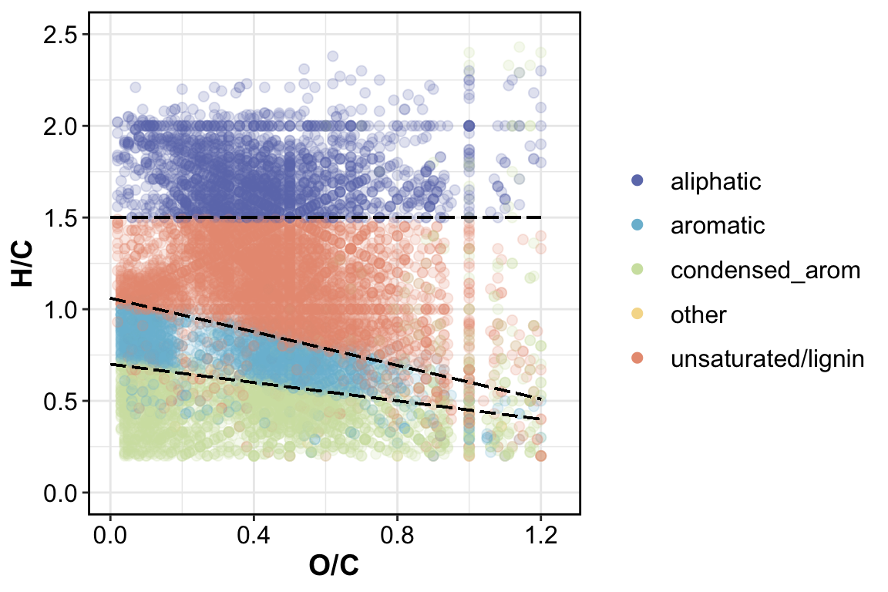<!-- -->

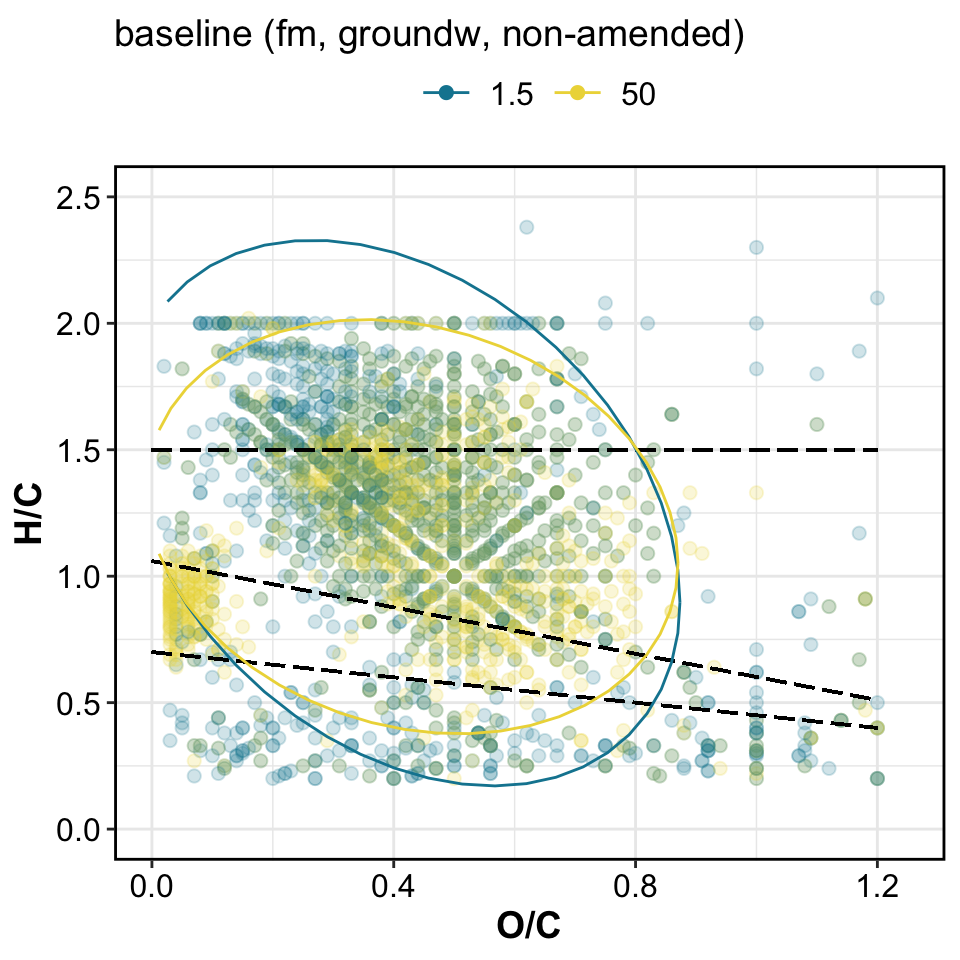<!-- -->

VK by replication

### VK by replication

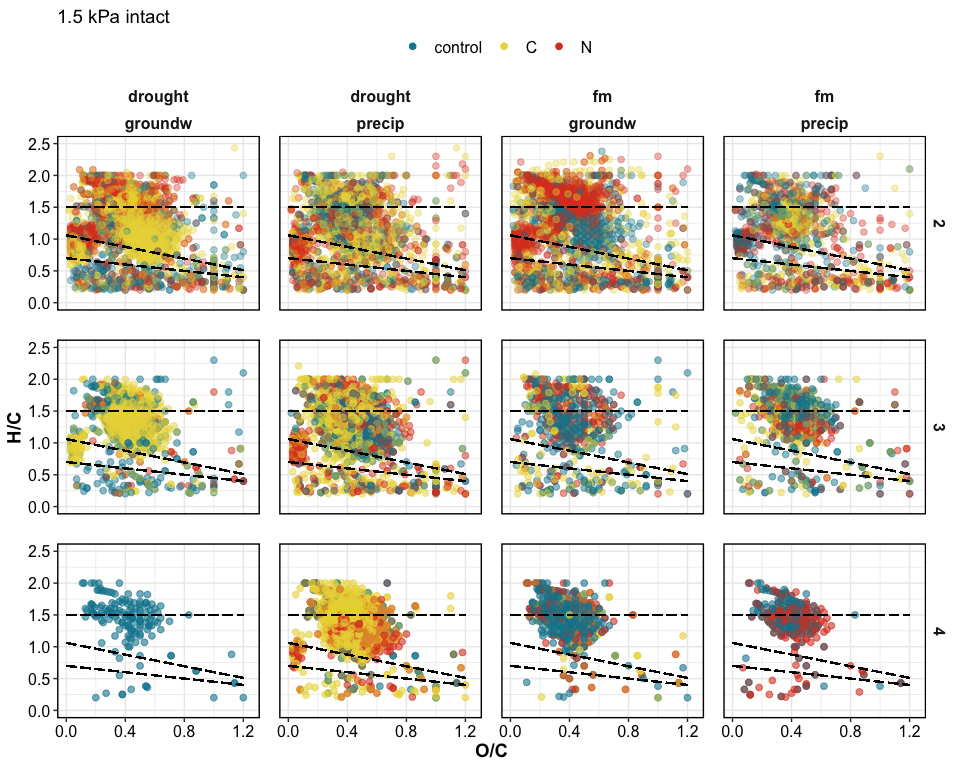<!-- -->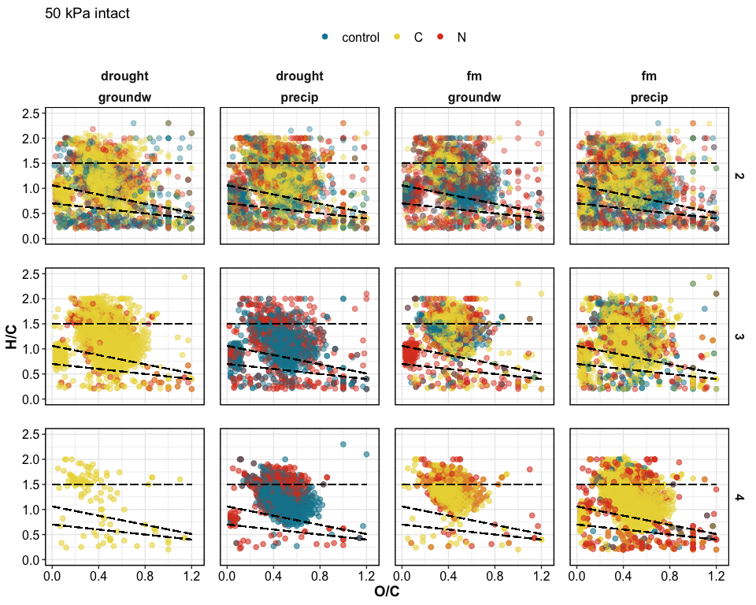<!-- -->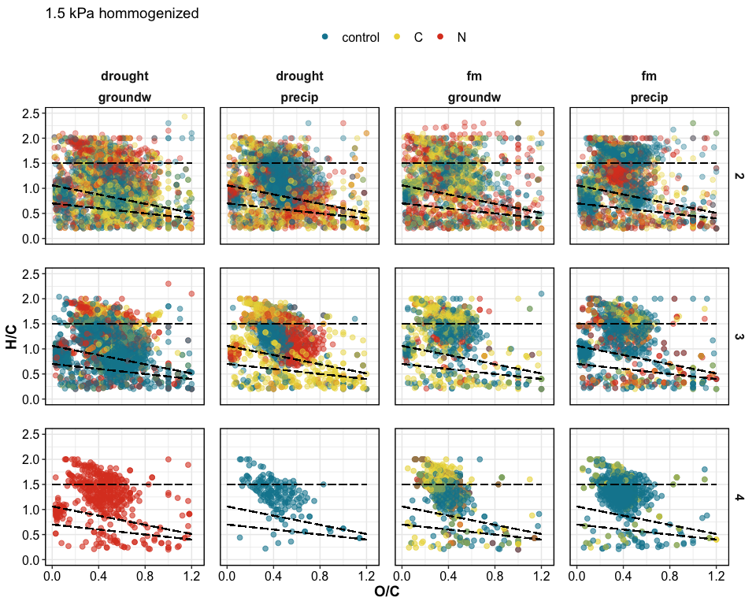<!-- -->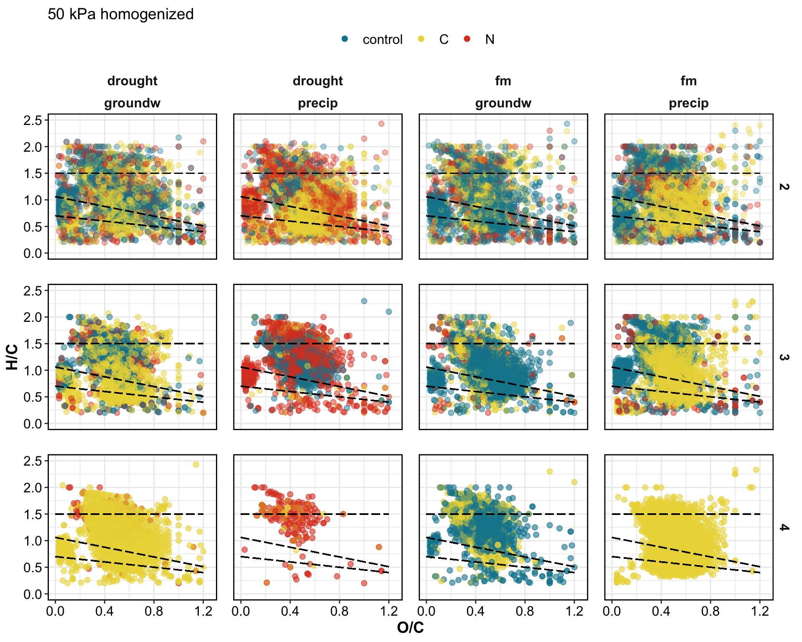<!-- -->

VK by treatment

#### VK diagrams by treatment

<!-- --><!-- -->

VK unique

#### VK unique

unique to each amendment, in each incubation type

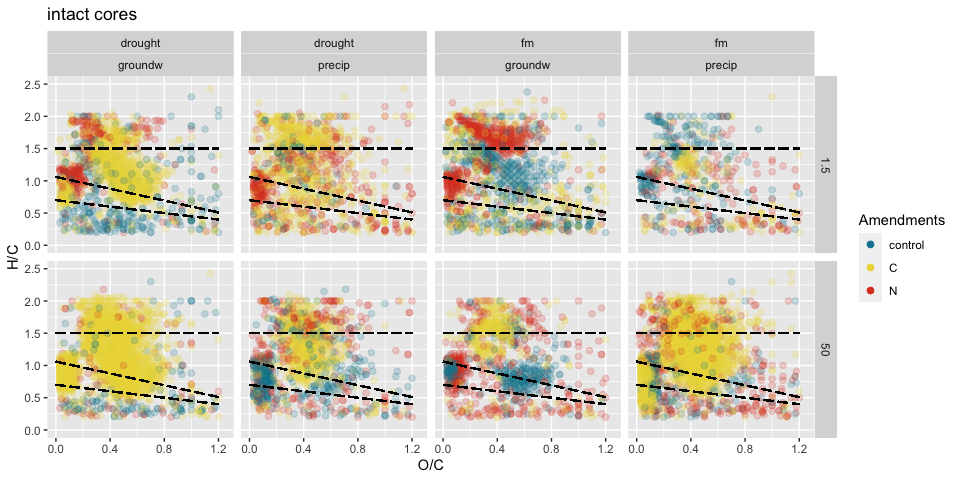<!-- -->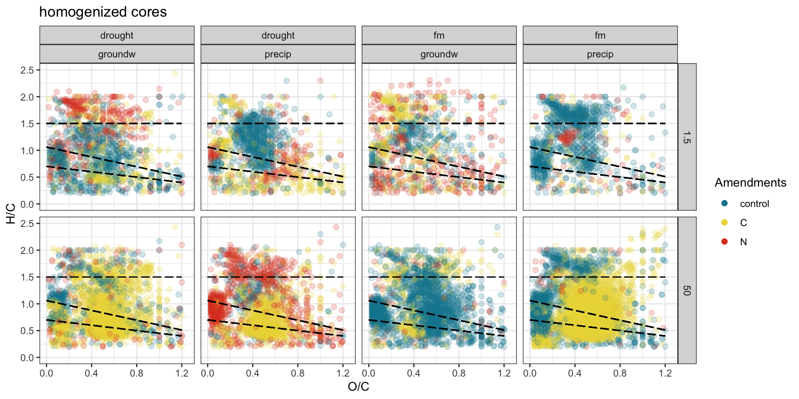<!-- -->

-----

### peaks

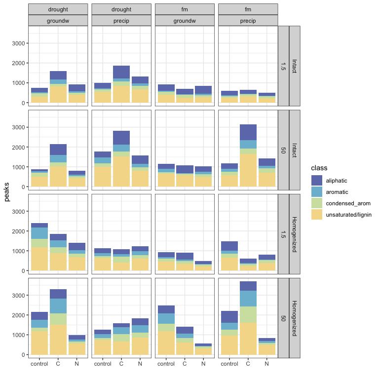<!-- -->

-----

### relative abundances

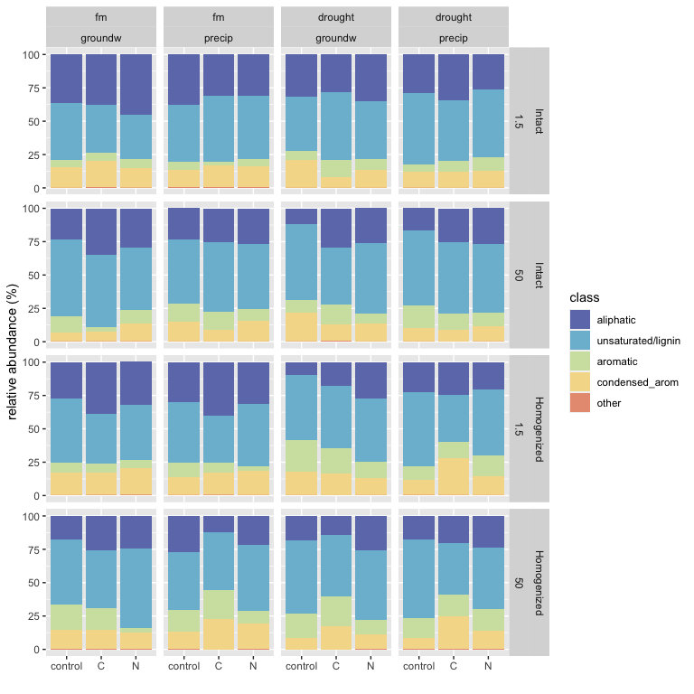<!-- -->

### STATS

PERMANOVA

#### PERMANOVA

**overall**

    #> 
    #> Call:
    #> adonis(formula = relabund_wide %>% select(aliphatic:other) ~      (Amendments + Moisture + Wetting + Suction + Homogenization)^3,      data = relabund_wide) 
    #> 
    #> Permutation: free
    #> Number of permutations: 999
    #> 
    #> Terms added sequentially (first to last)
    #> 
    #>                                     Df SumsOfSqs MeanSqs F.Model      R2 Pr(>F)    
    #> Amendments                           2   0.14469 0.07235   7.749 0.04743  0.001 ***
    #> Moisture                             1   0.21659 0.21659  23.197 0.07100  0.001 ***
    #> Wetting                              1   0.00949 0.00949   1.017 0.00311  0.359    
    #> Suction                              1   0.38693 0.38693  41.442 0.12683  0.001 ***
    #> Homogenization                       1   0.17509 0.17509  18.753 0.05739  0.001 ***
    #> Amendments:Moisture                  2   0.04272 0.02136   2.288 0.01400  0.053 .  
    #> Amendments:Wetting                   2   0.05755 0.02878   3.082 0.01887  0.017 *  
    #> Amendments:Suction                   2   0.02770 0.01385   1.483 0.00908  0.186    
    #> Amendments:Homogenization            2   0.13843 0.06921   7.413 0.04538  0.001 ***
    #> Moisture:Wetting                     1   0.01834 0.01834   1.964 0.00601  0.163    
    #> Moisture:Suction                     1   0.05744 0.05744   6.152 0.01883  0.004 ** 
    #> Moisture:Homogenization              1   0.00569 0.00569   0.610 0.00187  0.586    
    #> Wetting:Suction                      1   0.04324 0.04324   4.631 0.01417  0.015 *  
    #> Wetting:Homogenization               1   0.05857 0.05857   6.273 0.01920  0.005 ** 
    #> Suction:Homogenization               1   0.02398 0.02398   2.568 0.00786  0.073 .  
    #> Amendments:Moisture:Wetting          2   0.08924 0.04462   4.779 0.02925  0.002 ** 
    #> Amendments:Moisture:Suction          2   0.03256 0.01628   1.744 0.01067  0.140    
    #> Amendments:Moisture:Homogenization   2   0.04431 0.02216   2.373 0.01452  0.061 .  
    #> Amendments:Wetting:Suction           2   0.03546 0.01773   1.899 0.01162  0.097 .  
    #> Amendments:Wetting:Homogenization    2   0.02015 0.01007   1.079 0.00660  0.370    
    #> Amendments:Suction:Homogenization    2   0.08434 0.04217   4.517 0.02765  0.004 ** 
    #> Moisture:Wetting:Suction             1   0.02053 0.02053   2.199 0.00673  0.123    
    #> Moisture:Wetting:Homogenization      1   0.01006 0.01006   1.078 0.00330  0.329    
    #> Moisture:Suction:Homogenization      1   0.02606 0.02606   2.791 0.00854  0.080 .  
    #> Wetting:Suction:Homogenization       1   0.01174 0.01174   1.257 0.00385  0.284    
    #> Residuals                          136   1.26979 0.00934         0.41623           
    #> Total                              172   3.05069                 1.00000           
    #> ---
    #> Signif. codes:  0 '***' 0.001 '**' 0.01 '*' 0.05 '.' 0.1 ' ' 1

**PERMANOVA for treatments**

1.5 kPa intact cores

    #> 
    #> Call:
    #> adonis(formula = intact_1_5 %>% select(aliphatic:other) ~ Amendments *      Moisture * Wetting, data = intact_1_5) 
    #> 
    #> Permutation: free
    #> Number of permutations: 999
    #> 
    #> Terms added sequentially (first to last)
    #> 
    #>                             Df SumsOfSqs  MeanSqs F.Model      R2 Pr(>F)    
    #> Amendments                   2   0.00598 0.002992  0.4876 0.01265  0.761    
    #> Moisture                     1   0.07655 0.076546 12.4747 0.16179  0.001 ***
    #> Wetting                      1   0.05513 0.055131  8.9847 0.11653  0.001 ***
    #> Amendments:Moisture          2   0.02610 0.013050  2.1268 0.05517  0.077 .  
    #> Amendments:Wetting           2   0.04201 0.021005  3.4232 0.08880  0.018 *  
    #> Moisture:Wetting             1   0.01159 0.011590  1.8888 0.02450  0.136    
    #> Amendments:Moisture:Wetting  2   0.05326 0.026629  4.3398 0.11257  0.006 ** 
    #> Residuals                   33   0.20249 0.006136         0.42800           
    #> Total                       44   0.47311                  1.00000           
    #> ---
    #> Signif. codes:  0 '***' 0.001 '**' 0.01 '*' 0.05 '.' 0.1 ' ' 1

50 kPa intact cores

    #> 
    #> Call:
    #> adonis(formula = intact_50 %>% select(aliphatic:other) ~ Amendments *      Moisture * Wetting, data = intact_50) 
    #> 
    #> Permutation: free
    #> Number of permutations: 999
    #> 
    #> Terms added sequentially (first to last)
    #> 
    #>                             Df SumsOfSqs  MeanSqs F.Model      R2 Pr(>F)    
    #> Amendments                   2   0.08911 0.044557  5.8120 0.19613  0.001 ***
    #> Moisture                     1   0.01105 0.011052  1.4416 0.02432  0.253    
    #> Wetting                      1   0.01364 0.013645  1.7798 0.03003  0.175    
    #> Amendments:Moisture          2   0.03580 0.017902  2.3352 0.07880  0.064 .  
    #> Amendments:Wetting           2   0.02310 0.011549  1.5064 0.05084  0.225    
    #> Moisture:Wetting             1   0.02864 0.028638  3.7355 0.06303  0.029 *  
    #> Amendments:Moisture:Wetting  2   0.02301 0.011506  1.5008 0.05065  0.231    
    #> Residuals                   30   0.22999 0.007666         0.50620           
    #> Total                       41   0.45436                  1.00000           
    #> ---
    #> Signif. codes:  0 '***' 0.001 '**' 0.01 '*' 0.05 '.' 0.1 ' ' 1

1.5 kPa homogenized cores

    #> 
    #> Call:
    #> adonis(formula = homo_1_5 %>% select(aliphatic:other) ~ Amendments *      Moisture * Wetting, data = homo_1_5) 
    #> 
    #> Permutation: free
    #> Number of permutations: 999
    #> 
    #> Terms added sequentially (first to last)
    #> 
    #>                             Df SumsOfSqs  MeanSqs F.Model      R2 Pr(>F)    
    #> Amendments                   2   0.11836 0.059179  7.8805 0.16732  0.001 ***
    #> Moisture                     1   0.20554 0.205538 27.3701 0.29057  0.001 ***
    #> Wetting                      1   0.01826 0.018258  2.4313 0.02581  0.077 .  
    #> Amendments:Moisture          2   0.02901 0.014506  1.9317 0.04102  0.106    
    #> Amendments:Wetting           2   0.04013 0.020065  2.6719 0.05673  0.046 *  
    #> Moisture:Wetting             1   0.01276 0.012762  1.6995 0.01804  0.167    
    #> Amendments:Moisture:Wetting  2   0.05051 0.025255  3.3630 0.07140  0.021 *  
    #> Residuals                   31   0.23280 0.007510         0.32910           
    #> Total                       42   0.70737                  1.00000           
    #> ---
    #> Signif. codes:  0 '***' 0.001 '**' 0.01 '*' 0.05 '.' 0.1 ' ' 1

50 kPa homogenized cores

    #> 
    #> Call:
    #> adonis(formula = homo_50 %>% select(aliphatic:other) ~ Amendments *      Moisture * Wetting, data = homo_50) 
    #> 
    #> Permutation: free
    #> Number of permutations: 999
    #> 
    #> Terms added sequentially (first to last)
    #> 
    #>                             Df SumsOfSqs  MeanSqs F.Model      R2 Pr(>F)    
    #> Amendments                   2   0.19043 0.095213  6.6889 0.22699  0.001 ***
    #> Moisture                     1   0.00609 0.006088  0.4277 0.00726  0.668    
    #> Wetting                      1   0.03251 0.032511  2.2839 0.03875  0.128    
    #> Amendments:Moisture          2   0.07283 0.036415  2.5582 0.08681  0.046 *  
    #> Amendments:Wetting           2   0.03047 0.015235  1.0703 0.03632  0.407    
    #> Moisture:Wetting             1   0.00969 0.009687  0.6805 0.01155  0.524    
    #> Amendments:Moisture:Wetting  2   0.05565 0.027826  1.9548 0.06634  0.101    
    #> Residuals                   31   0.44127 0.014235         0.52599           
    #> Total                       42   0.83893                  1.00000           
    #> ---
    #> Signif. codes:  0 '***' 0.001 '**' 0.01 '*' 0.05 '.' 0.1 ' ' 1

#### PCA

overall PCA

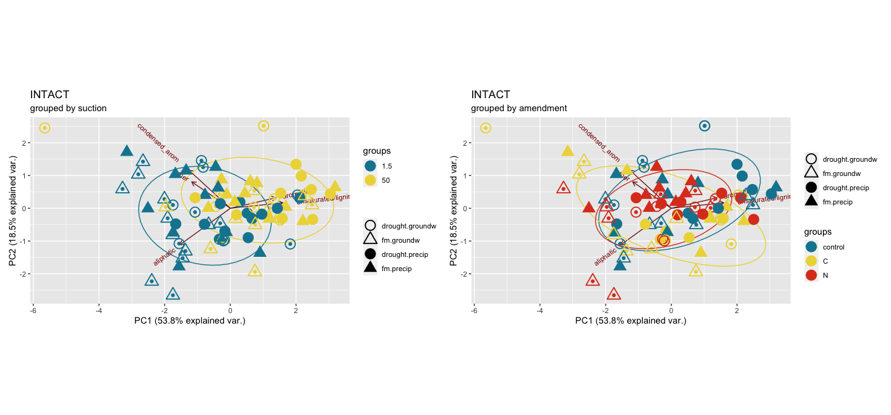<!-- -->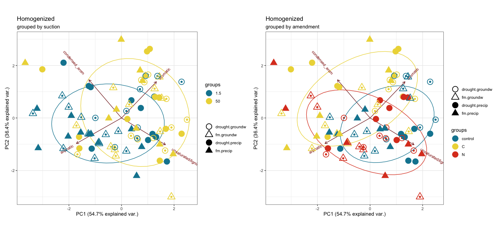<!-- -->

PCA individual treatments

**individual cores**

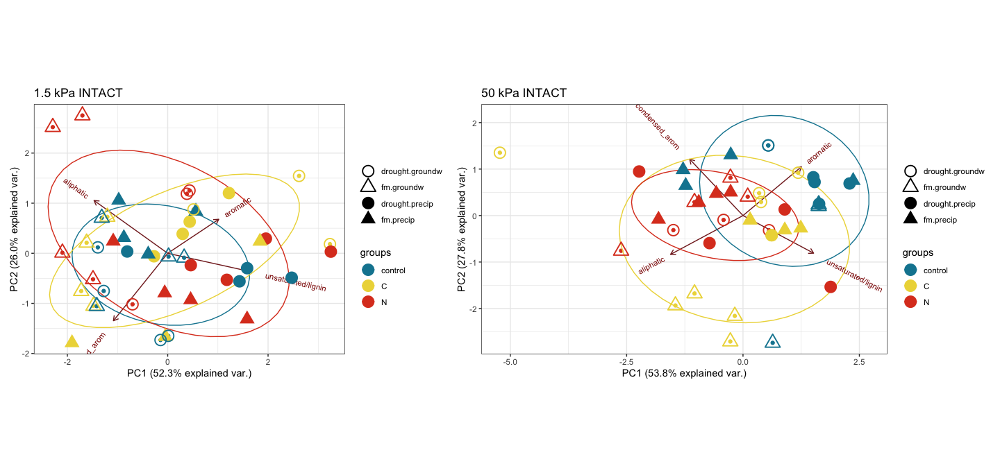<!-- -->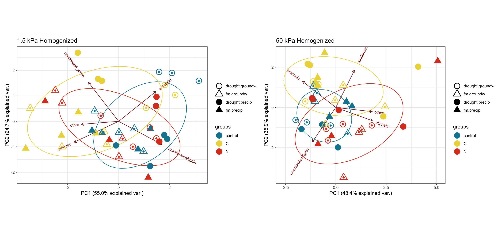<!-- -->

-----

### others

other plots

#### NOSC

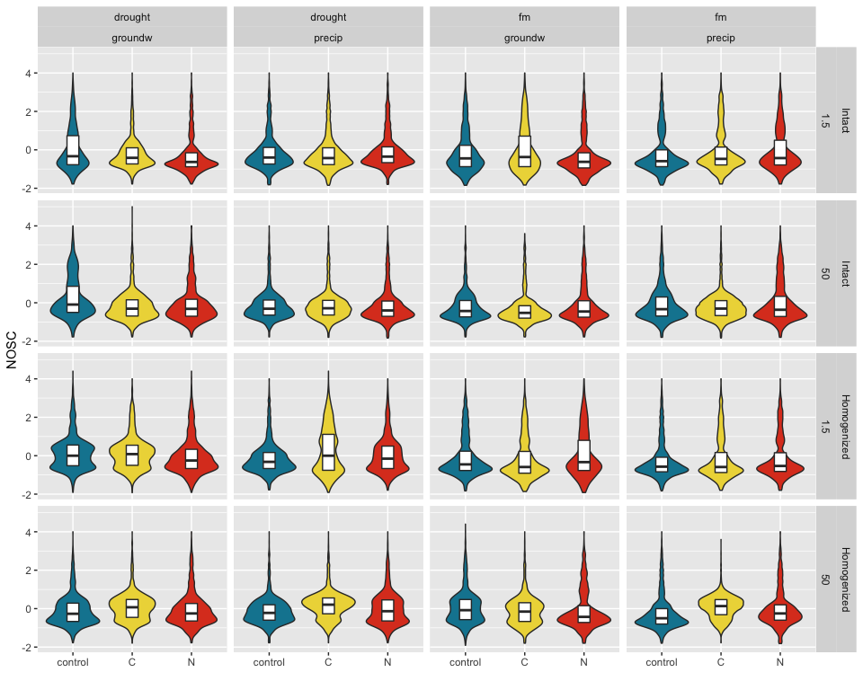<!-- -->

#### elements

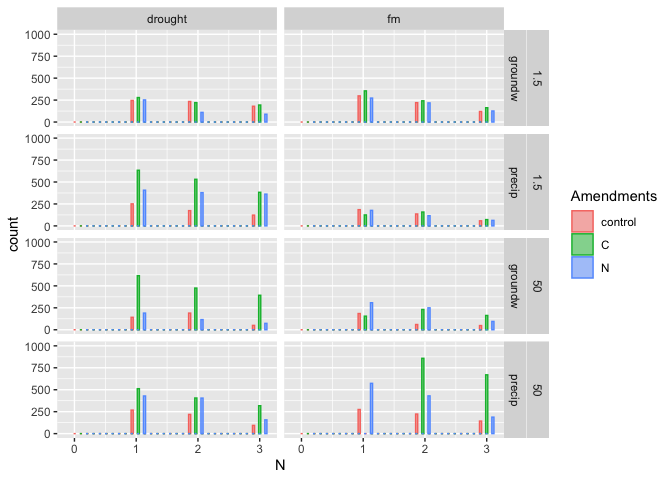<!-- -->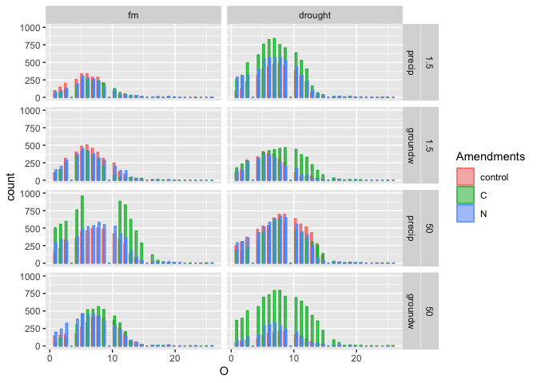<!-- -->

## Session Info

click to expand

Date run: 2020-08-10

    #> R version 4.0.2 (2020-06-22)
    #> Platform: x86_64-apple-darwin17.0 (64-bit)
    #> Running under: macOS Catalina 10.15.6
    #> 
    #> Matrix products: default
    #> BLAS:   /System/Library/Frameworks/Accelerate.framework/Versions/A/Frameworks/vecLib.framework/Versions/A/libBLAS.dylib
    #> LAPACK: /Library/Frameworks/R.framework/Versions/4.0/Resources/lib/libRlapack.dylib
    #> 
    #> locale:
    #> [1] en_US.UTF-8/en_US.UTF-8/en_US.UTF-8/C/en_US.UTF-8/en_US.UTF-8
    #> 
    #> attached base packages:
    #> [1] stats     graphics  grDevices utils     datasets  methods   base     
    #> 
    #> other attached packages:
    #>  [1] patchwork_1.0.1  visNetwork_2.0.9 vegan_2.5-6      lattice_0.20-41  permute_0.9-5    rmarkdown_2.3   
    #>  [7] drake_7.12.4     ggbiplot_0.55    PNWColors_0.1.0  forcats_0.5.0    stringr_1.4.0    dplyr_1.0.1     
    #> [13] purrr_0.3.4      readr_1.3.1      tidyr_1.1.1      tibble_3.0.3     ggplot2_3.3.2    tidyverse_1.3.0 
    #> [19] here_0.1        
    #> 
    #> loaded via a namespace (and not attached):
    #>  [1] httr_1.4.2        jsonlite_1.7.0    splines_4.0.2     modelr_0.1.8      assertthat_0.2.1  base64url_1.4    
    #>  [7] blob_1.2.1        cellranger_1.1.0  yaml_2.2.1        progress_1.2.2    pillar_1.4.6      backports_1.1.8  
    #> [13] glue_1.4.1        digest_0.6.25     rvest_0.3.6       colorspace_1.4-1  htmltools_0.5.0   Matrix_1.2-18    
    #> [19] plyr_1.8.6        pkgconfig_2.0.3   broom_0.7.0       haven_2.3.1       scales_1.1.1      mgcv_1.8-31      
    #> [25] txtq_0.2.3        generics_0.0.2    farver_2.0.3      ellipsis_0.3.1    withr_2.2.0       cli_2.0.2        
    #> [31] magrittr_1.5      crayon_1.3.4      readxl_1.3.1      evaluate_0.14     storr_1.2.1       fs_1.5.0         
    #> [37] fansi_0.4.1       nlme_3.1-148      MASS_7.3-51.6     xml2_1.3.2        tools_4.0.2       prettyunits_1.1.1
    #> [43] hms_0.5.3         lifecycle_0.2.0   munsell_0.5.0     reprex_0.3.0      cluster_2.1.0     compiler_4.0.2   
    #> [49] rlang_0.4.7       grid_4.0.2        rstudioapi_0.11   htmlwidgets_1.5.1 igraph_1.2.5      labeling_0.3     
    #> [55] gtable_0.3.0      DBI_1.1.0         R6_2.4.1          lubridate_1.7.9   knitr_1.29        utf8_1.1.4       
    #> [61] filelock_1.0.2    rprojroot_1.3-2   stringi_1.4.6     parallel_4.0.2    Rcpp_1.0.5        vctrs_0.3.2      
    #> [67] dbplyr_1.4.4      tidyselect_1.1.0  xfun_0.16

