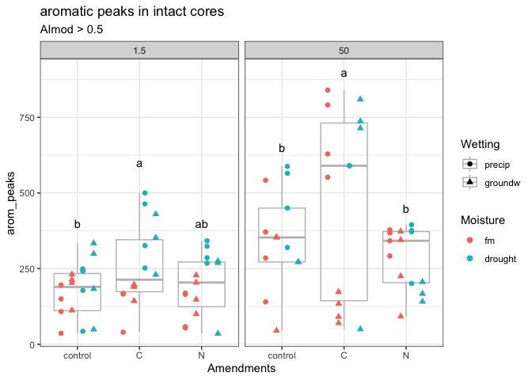

Spatial Access – Results
================

### H: C amendments will cause a depletion of aromatic molecules, especially in fine pores

<!-- -->

### H: Homogenization will increase (a) total peaks, (b) diversity of peaks, (c) aromatic peaks

-----

**Table: how do different treatments alter aromatic peaks?**

|                             |                |                    |          |
| --------------------------- | -------------- | ------------------ | -------- |
| suction (p \< 0.001)\*      | 1.5 kPa: 209 b | 50 kPa: 371 a      |          |
| moisture (p = 0.004)\*      | fm: 245 b      | drought: 335 a     |          |
| wetting (p = 0.008)\*       | precip: 328 a  | groundw: 244 b     |          |
| amendments (p = 0.001)\*    | control: 255 b | C: 372 a           | N: 240 b |
| homogenization (p \< 0.001) | intact: 287 b  | homogenized: 507 b |          |

Note: \* intact cores only
