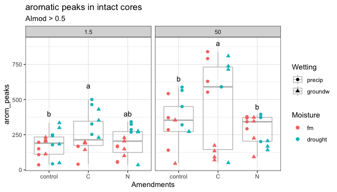

Spatial Access – Results
================

# FTICR

## Aromatic Peaks

<!-- -->

Statistics - click to open

Overall lmer (REML)

    #> Analysis of Deviance Table (Type II Wald chisquare tests)
    #> 
    #> Response: arom_peaks
    #>                             Chisq Df Pr(>Chisq)    
    #> Homogenization            27.3880  1  1.665e-07 ***
    #> Moisture                   8.8251  1  0.0029711 ** 
    #> Wetting                    1.0844  1  0.2977158    
    #> Amendments                32.1461  2  1.046e-07 ***
    #> Suction                   36.4891  1  1.535e-09 ***
    #> Homogenization:Moisture    0.1434  1  0.7049018    
    #> Homogenization:Wetting     1.6577  1  0.1979102    
    #> Homogenization:Amendments  9.9531  2  0.0068979 ** 
    #> Homogenization:Suction     3.3998  1  0.0652058 .  
    #> Moisture:Wetting           6.8433  1  0.0088976 ** 
    #> Moisture:Amendments        2.5536  2  0.2789286    
    #> Moisture:Suction           5.0507  1  0.0246165 *  
    #> Wetting:Amendments         6.0874  2  0.0476572 *  
    #> Wetting:Suction            8.2742  1  0.0040212 ** 
    #> Amendments:Suction        16.9316  2  0.0002106 ***
    #> ---
    #> Signif. codes:  0 '***' 0.001 '**' 0.01 '*' 0.05 '.' 0.1 ' ' 1

Intact cores ANOVA

    #> [1] "intact cores: aov(arom_peaks ~ (Moisture + Wetting + Amendments + Suction)"
    #>                     Df  Sum Sq Mean Sq F value   Pr(>F)    
    #> Moisture             1  177483  177483   9.268 0.003255 ** 
    #> Wetting              1  142152  142152   7.423 0.008076 ** 
    #> Amendments           2  336316  168158   8.781 0.000387 ***
    #> Suction              1  572253  572253  29.884 6.27e-07 ***
    #> Moisture:Wetting     1    6411    6411   0.335 0.564644    
    #> Moisture:Amendments  2   86632   43316   2.262 0.111492    
    #> Moisture:Suction     1    6494    6494   0.339 0.562140    
    #> Wetting:Amendments   2   63563   31782   1.660 0.197393    
    #> Wetting:Suction      1  217689  217689  11.368 0.001205 ** 
    #> Amendments:Suction   2  108263   54132   2.827 0.065788 .  
    #> Residuals           72 1378749   19149                     
    #> ---
    #> Signif. codes:  0 '***' 0.001 '**' 0.01 '*' 0.05 '.' 0.1 ' ' 1
    #>         arom_peaks groups
    #> C         372.2500      a
    #> control   254.5862      b
    #> N         239.9333      b

Homogenized cores ANOVA

    #> [1] "homogenized cores: aov(arom_peaks ~ (Moisture + Wetting + Amendments + Suction)"
    #>                     Df  Sum Sq Mean Sq F value   Pr(>F)    
    #> Moisture             1  362120  362120   3.520  0.06475 .  
    #> Wetting              1       6       6   0.000  0.99418    
    #> Amendments           2 2763411 1381706  13.431 1.13e-05 ***
    #> Suction              1 2151951 2151951  20.918 1.98e-05 ***
    #> Moisture:Wetting     1  946405  946405   9.199  0.00338 ** 
    #> Moisture:Amendments  2  189662   94831   0.922  0.40251    
    #> Moisture:Suction     1  617460  617460   6.002  0.01676 *  
    #> Wetting:Amendments   2  709232  354616   3.447  0.03726 *  
    #> Wetting:Suction      1  355237  355237   3.453  0.06728 .  
    #> Amendments:Suction   2 1525521  762761   7.414  0.00119 ** 
    #> Residuals           71 7304270  102877                     
    #> ---
    #> Signif. codes:  0 '***' 0.001 '**' 0.01 '*' 0.05 '.' 0.1 ' ' 1
    #>         arom_peaks groups
    #> C         705.5333      a
    #> control   521.6071      a
    #> N         279.7143      b

## Total Peaks

Statistics - click to expand

Overall lmer (REML)

    #> Analysis of Deviance Table (Type II Wald chisquare tests)
    #> 
    #> Response: total_peaks
    #>                             Chisq Df Pr(>Chisq)    
    #> Homogenization             6.1162  1  0.0133950 *  
    #> Moisture                  11.2927  1  0.0007781 ***
    #> Wetting                    2.5799  1  0.1082285    
    #> Amendments                32.3137  2  9.620e-08 ***
    #> Suction                   46.2647  1  1.033e-11 ***
    #> Homogenization:Moisture    0.0741  1  0.7854136    
    #> Homogenization:Wetting     6.2924  1  0.0121257 *  
    #> Homogenization:Amendments 11.8652  2  0.0026516 ** 
    #> Homogenization:Suction     0.3079  1  0.5789723    
    #> Moisture:Wetting           4.9808  1  0.0256301 *  
    #> Moisture:Amendments        3.5415  2  0.1702085    
    #> Moisture:Suction           6.8635  1  0.0087975 ** 
    #> Wetting:Amendments         3.4900  2  0.1746457    
    #> Wetting:Suction            8.2260  1  0.0041294 ** 
    #> Amendments:Suction        17.6531  2  0.0001468 ***
    #> ---
    #> Signif. codes:  0 '***' 0.001 '**' 0.01 '*' 0.05 '.' 0.1 ' ' 1

Intact cores

    #> [1] "intact cores: aov(arom_peaks ~ (Moisture + Wetting + Amendments + Suction)"
    #>                     Df   Sum Sq Mean Sq F value   Pr(>F)    
    #> Moisture             1  2149242 2149242  10.159 0.002125 ** 
    #> Wetting              1  2504864 2504864  11.840 0.000968 ***
    #> Amendments           2  8003084 4001542  18.915  2.5e-07 ***
    #> Suction              1  7168510 7168510  33.885  1.5e-07 ***
    #> Moisture:Wetting     1    93392   93392   0.441 0.508542    
    #> Moisture:Amendments  2   923842  461921   2.183 0.120054    
    #> Moisture:Suction     1   567720  567720   2.684 0.105751    
    #> Wetting:Amendments   2  1367464  683732   3.232 0.045274 *  
    #> Wetting:Suction      1  2541526 2541526  12.014 0.000894 ***
    #> Amendments:Suction   2  2629608 1314804   6.215 0.003237 ** 
    #> Residuals           72 15231861  211554                     
    #> ---
    #> Signif. codes:  0 '***' 0.001 '**' 0.01 '*' 0.05 '.' 0.1 ' ' 1
    #>         arom_peaks groups
    #> C         372.2500      a
    #> control   254.5862      b
    #> N         239.9333      b

Homogenized cores

    #> [1] "homogenized cores: aov(arom_peaks ~ (Moisture + Wetting + Amendments + Suction)"
    #>                     Df   Sum Sq  Mean Sq F value   Pr(>F)    
    #> Moisture             1  1800528  1800528   3.952 0.050662 .  
    #> Wetting              1    76429    76429   0.168 0.683335    
    #> Amendments           2  9660718  4830359  10.603 9.35e-05 ***
    #> Suction              1 10138964 10138964  22.256 1.16e-05 ***
    #> Moisture:Wetting     1  6181547  6181547  13.569 0.000445 ***
    #> Moisture:Amendments  2  1424701   712351   1.564 0.216486    
    #> Moisture:Suction     1  2413010  2413010   5.297 0.024302 *  
    #> Wetting:Amendments   2  1989251   994626   2.183 0.120175    
    #> Wetting:Suction      1   888007   888007   1.949 0.167015    
    #> Amendments:Suction   2  5252515  2626257   5.765 0.004786 ** 
    #> Residuals           71 32344623   455558                     
    #> ---
    #> Signif. codes:  0 '***' 0.001 '**' 0.01 '*' 0.05 '.' 0.1 ' ' 1
    #>         total_peaks groups
    #> C         1728.0667      a
    #> control   1627.0357      a
    #> N          993.9643      b

## FTICR summary tables

| treatment      | level       | total\_peaks | arom\_peaks |
| :------------- | :---------- | :----------- | :---------- |
| Moisture\*     | fm          | 1049 ± 103   | 244 ± 27    |
| Moisture\*     | drought     | 1364 ± 107   | 335 ± 29    |
| Wetting\*      | precip      | 1367 ± 115   | 328 ± 29    |
| Wetting\*      | groundw     | 1016 ± 90    | 243 ± 26    |
| Amendments\*   | control     | 981 ± 86     | 254 ± 28    |
| Amendments\*   | C           | 1616 ± 180   | 372 ± 48    |
| Amendments\*   | N           | 1017 ± 77    | 239 ± 20    |
| Suction\*      | 1.5         | 916 ± 70     | 208 ± 16    |
| Suction\*      | 50          | 1499 ± 122   | 371 ± 33    |
| Homogenization | Intact      | 1198 ± 75    | 287 ± 20    |
| Homogenization | Homogenized | 1456 ± 99    | 507 ± 48    |

-----

Session Info

Date: 2020-07-26

    #> R version 4.0.2 (2020-06-22)
    #> Platform: x86_64-apple-darwin17.0 (64-bit)
    #> Running under: macOS Catalina 10.15.6
    #> 
    #> Matrix products: default
    #> BLAS:   /Library/Frameworks/R.framework/Versions/4.0/Resources/lib/libRblas.dylib
    #> LAPACK: /Library/Frameworks/R.framework/Versions/4.0/Resources/lib/libRlapack.dylib
    #> 
    #> locale:
    #> [1] en_US.UTF-8/en_US.UTF-8/en_US.UTF-8/C/en_US.UTF-8/en_US.UTF-8
    #> 
    #> attached base packages:
    #> [1] stats     graphics  grDevices utils     datasets  methods   base     
    #> 
    #> other attached packages:
    #>  [1] multcomp_1.4-13 TH.data_1.0-10  MASS_7.3-51.6   survival_3.1-12
    #>  [5] mvtnorm_1.1-1   lme4_1.1-23     Matrix_1.2-18   gt_0.2.1       
    #>  [9] ggbiplot_0.55   PNWColors_0.1.0 forcats_0.5.0   stringr_1.4.0  
    #> [13] dplyr_1.0.0     purrr_0.3.4     readr_1.3.1     tidyr_1.1.0    
    #> [17] tibble_3.0.3    ggplot2_3.3.2   tidyverse_1.3.0 here_0.1       
    #> 
    #> loaded via a namespace (and not attached):
    #>  [1] minqa_1.2.4       colorspace_1.4-1  ellipsis_0.3.1    rio_0.5.16       
    #>  [5] rprojroot_1.3-2   fs_1.4.2          rstudioapi_0.11   farver_2.0.3     
    #>  [9] fansi_0.4.1       lubridate_1.7.9   xml2_1.3.2        codetools_0.2-16 
    #> [13] splines_4.0.2     knitr_1.29        jsonlite_1.7.0    nloptr_1.2.2.2   
    #> [17] broom_0.7.0       cluster_2.1.0     dbplyr_1.4.4      shiny_1.5.0      
    #> [21] compiler_4.0.2    httr_1.4.2        backports_1.1.8   assertthat_0.2.1 
    #> [25] fastmap_1.0.1     cli_2.0.2         later_1.1.0.1     htmltools_0.5.0  
    #> [29] tools_4.0.2       gtable_0.3.0      agricolae_1.3-3   glue_1.4.1       
    #> [33] Rcpp_1.0.5        carData_3.0-4     cellranger_1.1.0  vctrs_0.3.2      
    #> [37] nlme_3.1-148      xfun_0.15         openxlsx_4.1.5    rvest_0.3.5      
    #> [41] mime_0.9          miniUI_0.1.1.1    lifecycle_0.2.0   statmod_1.4.34   
    #> [45] zoo_1.8-8         scales_1.1.1      hms_0.5.3         promises_1.1.1   
    #> [49] sandwich_2.5-1    yaml_2.2.1        curl_4.3          labelled_2.5.0   
    #> [53] stringi_1.4.6     AlgDesign_1.2.0   highr_0.8         klaR_0.6-15      
    #> [57] boot_1.3-25       zip_2.0.4         rlang_0.4.7       pkgconfig_2.0.3  
    #> [61] evaluate_0.14     lattice_0.20-41   labeling_0.3      tidyselect_1.1.0 
    #> [65] plyr_1.8.6        magrittr_1.5      R6_2.4.1          generics_0.0.2   
    #> [69] combinat_0.0-8    DBI_1.1.0         pillar_1.4.6      haven_2.3.1      
    #> [73] foreign_0.8-80    withr_2.2.0       abind_1.4-5       modelr_0.1.8     
    #> [77] crayon_1.3.4      car_3.0-8         questionr_0.7.1   rmarkdown_2.3    
    #> [81] grid_4.0.2        readxl_1.3.1      data.table_1.12.8 blob_1.2.1       
    #> [85] reprex_0.3.0      digest_0.6.25     xtable_1.8-4      httpuv_1.5.4     
    #> [89] munsell_0.5.0
