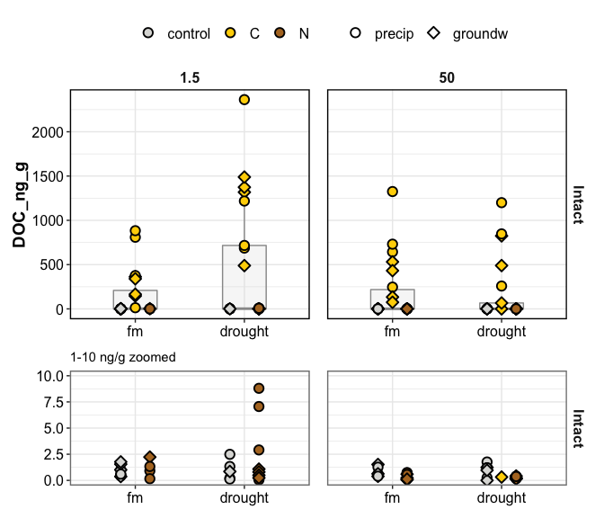
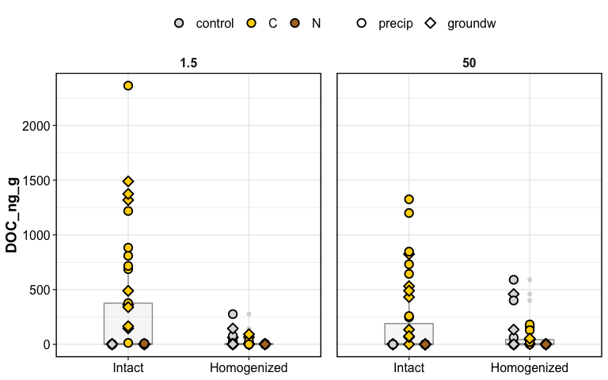
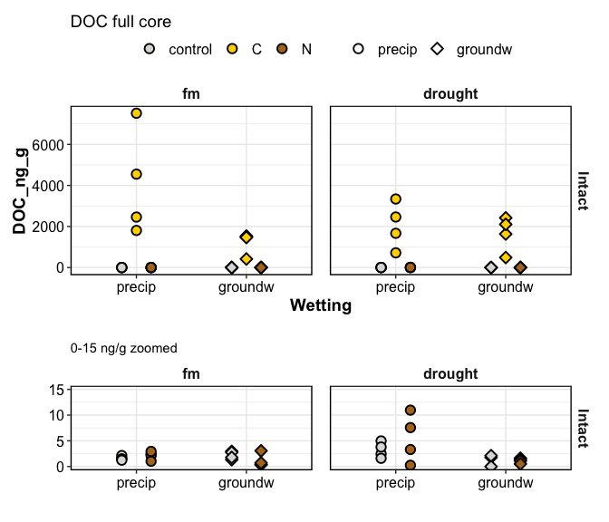
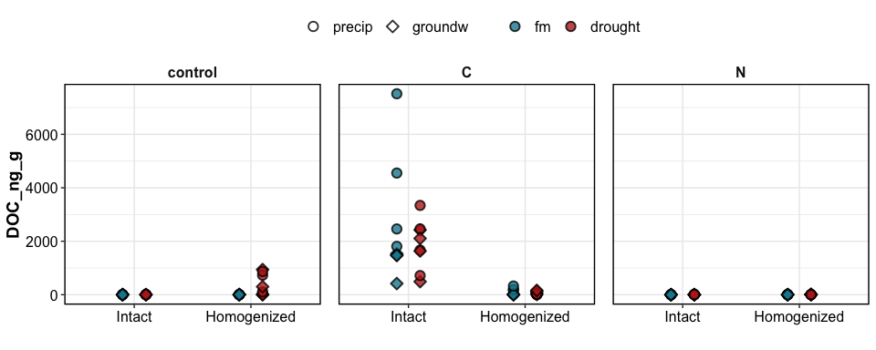

doc\_report
================

<!-- -->

effect of homogenization

<!-- -->

-----

## combined porewaters for full core

<!-- -->

<!-- -->

-----

## what influenced DOC?

DOC was influenced by:

  - Amendments
  - Homogenization:Amendments
  - Moisture:Amendments
  - Wetting: Amendments

DOC in **intact** cores was influenced by:  
1\. Amendments  
2\. Moisture

DOC in **homogenized** cores was influenced by:  
1\. Amendments  
2\. Moisture  
3\. Suction

click for stats

overall ANOVA

    #> Anova Table (Type III tests)
    #> 
    #> Response: (DOC_ng_g)
    #>                            Sum Sq  Df F value    Pr(>F)    
    #> (Intercept)                 27016   1  0.5540   0.45786    
    #> Homogenization               2880   1  0.0591   0.80832    
    #> Suction                     26023   1  0.5336   0.46622    
    #> Moisture                   181596   1  3.7238   0.05553 .  
    #> Wetting                      2463   1  0.0505   0.82250    
    #> Amendments                4276677   2 43.8491 1.011e-15 ***
    #> Homogenization:Suction     139077   1  2.8519   0.09334 .  
    #> Homogenization:Moisture     88448   1  1.8137   0.18009    
    #> Homogenization:Wetting      32370   1  0.6638   0.41652    
    #> Homogenization:Amendments 4709620   2 48.2881 < 2.2e-16 ***
    #> Suction:Moisture           127599   1  2.6166   0.10785    
    #> Suction:Wetting             74563   1  1.5290   0.21820    
    #> Suction:Amendments         224976   2  2.3067   0.10311    
    #> Moisture:Wetting            37310   1  0.7651   0.38314    
    #> Moisture:Amendments        423724   2  4.3445   0.01465 *  
    #> Wetting:Amendments         330851   2  3.3922   0.03623 *  
    #> Residuals                 7314884 150                      
    #> ---
    #> Signif. codes:  0 '***' 0.001 '**' 0.01 '*' 0.05 '.' 0.1 ' ' 1

intact cores

    #> Anova Table (Type III tests)
    #> 
    #> Response: DOC_ng_g
    #>                      Sum Sq Df F value    Pr(>F)    
    #> (Intercept)           39639  1  0.5001  0.481830    
    #> Amendments          2723785  2 17.1826 8.798e-07 ***
    #> Suction              137950  1  1.7405  0.191439    
    #> Moisture              93109  1  1.1747  0.282205    
    #> Wetting                9322  1  0.1176  0.732683    
    #> Amendments:Suction   315585  2  1.9908  0.144351    
    #> Amendments:Moisture  796557  2  5.0250  0.009177 ** 
    #> Amendments:Wetting   475696  2  3.0009  0.056277 .  
    #> Suction:Moisture     472656  1  5.9634  0.017173 *  
    #> Suction:Wetting       56533  1  0.7133  0.401282    
    #> Moisture:Wetting      20242  1  0.2554  0.614916    
    #> Residuals           5468924 69                      
    #> ---
    #> Signif. codes:  0 '***' 0.001 '**' 0.01 '*' 0.05 '.' 0.1 ' ' 1

homogenized cores

    #> Anova Table (Type III tests)
    #> 
    #> Response: DOC_ng_g
    #>                     Sum Sq Df F value    Pr(>F)    
    #> (Intercept)           3187  1  0.4588 0.5003570    
    #> Amendments           10579  2  0.7615 0.4706979    
    #> Suction              25033  1  3.6037 0.0616581 .  
    #> Moisture             78688  1 11.3281 0.0012274 ** 
    #> Wetting               1679  1  0.2417 0.6244758    
    #> Amendments:Suction   23338  2  1.6799 0.1936160    
    #> Amendments:Moisture 131288  2  9.4502 0.0002268 ***
    #> Amendments:Wetting    4487  2  0.3230 0.7250408    
    #> Suction:Moisture      3615  1  0.5204 0.4729891    
    #> Suction:Wetting       1827  1  0.2630 0.6096644    
    #> Moisture:Wetting         1  1  0.0002 0.9896456    
    #> Residuals           500132 72                      
    #> ---
    #> Signif. codes:  0 '***' 0.001 '**' 0.01 '*' 0.05 '.' 0.1 ' ' 1

**how did amendments influence DOC?**

C addition increased DOC  
N addition decreased DOC - *N stimulated consumption of DOC?*

-----

how much DOC was added as part of the amendment?

5 mL of 10.1 M acetate (CH3-COO-K)  
1 mole acetate = 2 mole C

10.1 M acetate = 20.2 M C = (20.2 \* 12) g/L C  
5 mL of 10.1 M acetate = 0.005 L \* 20.2 \* 12 g/L C = 1.212 g C

-----

#### Session Info

click to expand

Date run: 2020-08-19

    #> R version 4.0.2 (2020-06-22)
    #> Platform: x86_64-apple-darwin17.0 (64-bit)
    #> Running under: macOS Catalina 10.15.6
    #> 
    #> Matrix products: default
    #> BLAS:   /System/Library/Frameworks/Accelerate.framework/Versions/A/Frameworks/vecLib.framework/Versions/A/libBLAS.dylib
    #> LAPACK: /Library/Frameworks/R.framework/Versions/4.0/Resources/lib/libRlapack.dylib
    #> 
    #> locale:
    #> [1] en_US.UTF-8/en_US.UTF-8/en_US.UTF-8/C/en_US.UTF-8/en_US.UTF-8
    #> 
    #> attached base packages:
    #> [1] stats     graphics  grDevices utils     datasets  methods   base     
    #> 
    #> other attached packages:
    #>  [1] patchwork_1.0.1 drake_7.12.4    ggbiplot_0.55   PNWColors_0.1.0 forcats_0.5.0  
    #>  [6] stringr_1.4.0   dplyr_1.0.1     purrr_0.3.4     readr_1.3.1     tidyr_1.1.1    
    #> [11] tibble_3.0.3    ggplot2_3.3.2   tidyverse_1.3.0
    #> 
    #> loaded via a namespace (and not attached):
    #>  [1] Rcpp_1.0.5         lubridate_1.7.9    txtq_0.2.3         prettyunits_1.1.1 
    #>  [5] assertthat_0.2.1   digest_0.6.25      packrat_0.5.0      R6_2.4.1          
    #>  [9] cellranger_1.1.0   plyr_1.8.6         backports_1.1.8    reprex_0.3.0      
    #> [13] evaluate_0.14      httr_1.4.2         pillar_1.4.6       soilpalettes_0.1.0
    #> [17] rlang_0.4.7        progress_1.2.2     readxl_1.3.1       rstudioapi_0.11   
    #> [21] blob_1.2.1         rmarkdown_2.3      labeling_0.3       igraph_1.2.5      
    #> [25] munsell_0.5.0      broom_0.7.0        compiler_4.0.2     modelr_0.1.8      
    #> [29] xfun_0.16          pkgconfig_2.0.3    htmltools_0.5.0    tidyselect_1.1.0  
    #> [33] fansi_0.4.1        crayon_1.3.4       dbplyr_1.4.4       withr_2.2.0       
    #> [37] grid_4.0.2         jsonlite_1.7.0     gtable_0.3.0       lifecycle_0.2.0   
    #> [41] DBI_1.1.0          magrittr_1.5       storr_1.2.1        scales_1.1.1      
    #> [45] cli_2.0.2          stringi_1.4.6      farver_2.0.3       fs_1.5.0          
    #> [49] xml2_1.3.2         ellipsis_0.3.1     filelock_1.0.2     generics_0.0.2    
    #> [53] vctrs_0.3.2        tools_4.0.2        glue_1.4.1         hms_0.5.3         
    #> [57] yaml_2.2.1         parallel_4.0.2     colorspace_1.4-1   base64url_1.4     
    #> [61] rvest_0.3.6        knitr_1.29         haven_2.3.1

