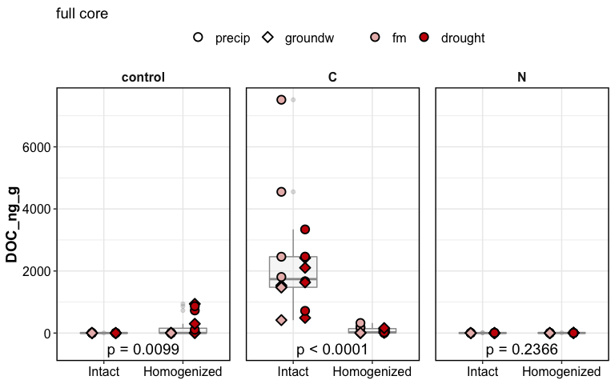

doc\_report
================

    #> $gg_doc_boxplot_suctions_combined

<!-- -->

full core

    #> $gg_doc_boxdotplot_fullcore

<!-- -->

    #> 
    #> $gg_doc_boxdotplot_fullcore_homo

<!-- -->

## what influenced DOC?

DOC was influenced by:

  - Amendments
  - Homogenization:Amendments
  - Moisture:Amendments
  - Wetting: Amendments

DOC in **intact** cores was influenced by:  
1\. Amendments  
2\. Moisture

DOC in **homogenized** cores was influenced by:  
1\. Amendments  
2\. Moisture  
3\. Suction

click for stats

overall ANOVA

    #> Anova Table (Type III tests)
    #> 
    #> Response: (DOC_ng_g)
    #>                             Sum Sq  Df F value    Pr(>F)    
    #> (Intercept)                  99119   1  0.5598   0.45511    
    #> Homogenization              212419   1  1.1996   0.27453    
    #> Suction                       2143   1  0.0121   0.91250    
    #> Moisture                     44524   1  0.2514   0.61653    
    #> Wetting                     275057   1  1.5534   0.21390    
    #> Amendments                14242121   2 40.2156 1.012e-15 ***
    #> Homogenization:Suction      233676   1  1.3197   0.25184    
    #> Homogenization:Moisture     206812   1  1.1680   0.28094    
    #> Homogenization:Wetting      455843   1  2.5743   0.10997    
    #> Homogenization:Amendments  9577920   2 27.0453 2.768e-11 ***
    #> Suction:Moisture                35   1  0.0002   0.98879    
    #> Suction:Wetting              11284   1  0.0637   0.80092    
    #> Suction:Amendments          450526   2  1.2722   0.28217    
    #> Moisture:Wetting            417277   1  2.3565   0.12612    
    #> Moisture:Amendments         201210   2  0.5682   0.56735    
    #> Wetting:Amendments         1466618   2  4.1413   0.01709 *  
    #> Residuals                 41080712 232                      
    #> ---
    #> Signif. codes:  0 '***' 0.001 '**' 0.01 '*' 0.05 '.' 0.1 ' ' 1

intact cores

    #> Anova Table (Type III tests)
    #> 
    #> Response: DOC_ng_g
    #>                       Sum Sq  Df F value    Pr(>F)    
    #> (Intercept)            14927   1  0.0430   0.83601    
    #> Amendments          13268044   2 19.1323 7.258e-08 ***
    #> Suction                 6658   1  0.0192   0.89004    
    #> Moisture               20785   1  0.0599   0.80704    
    #> Wetting                80193   1  0.2313   0.63153    
    #> Amendments:Suction    656412   2  0.9465   0.39119    
    #> Amendments:Moisture   264560   2  0.3815   0.68373    
    #> Amendments:Wetting   2518720   2  3.6319   0.02966 *  
    #> Suction:Moisture       68357   1  0.1971   0.65790    
    #> Suction:Wetting            0   1  0.0000   0.99963    
    #> Moisture:Wetting      613284   1  1.7687   0.18627    
    #> Residuals           38488677 111                      
    #> ---
    #> Signif. codes:  0 '***' 0.001 '**' 0.01 '*' 0.05 '.' 0.1 ' ' 1

homogenized cores

    #> Anova Table (Type III tests)
    #> 
    #> Response: DOC_ng_g
    #>                     Sum Sq  Df F value    Pr(>F)    
    #> (Intercept)           3841   1  0.6260 0.4304814    
    #> Amendments           15950   2  1.2999 0.2766457    
    #> Suction              26587   1  4.3336 0.0396447 *  
    #> Moisture             84695   1 13.8050 0.0003181 ***
    #> Wetting               1187   1  0.1934 0.6609438    
    #> Amendments:Suction   25382   2  2.0686 0.1311673    
    #> Amendments:Moisture 161218   2 13.1390 7.483e-06 ***
    #> Amendments:Wetting    2072   2  0.1689 0.8448309    
    #> Suction:Moisture      5539   1  0.9029 0.3440496    
    #> Suction:Wetting       2569   1  0.4188 0.5188764    
    #> Moisture:Wetting       571   1  0.0931 0.7608904    
    #> Residuals           687132 112                      
    #> ---
    #> Signif. codes:  0 '***' 0.001 '**' 0.01 '*' 0.05 '.' 0.1 ' ' 1

**how did amendments influence DOC?**

C addition increased DOC  
N addition decreased DOC - *N stimulated consumption of DOC?*

-----

how much DOC was added as part of the amendment?

5 mL of 10.1 M acetate (CH3-COO-K)  
1 mole acetate = 2 mole C

10.1 M acetate = 20.2 M C = (20.2 \* 12) g/L C  
5 mL of 10.1 M acetate = 0.005 L \* 20.2 \* 12 g/L C = 1.212 g C

-----

#### Session Info

click to expand

Date run: 2020-09-09

    #> R version 4.0.2 (2020-06-22)
    #> Platform: x86_64-apple-darwin17.0 (64-bit)
    #> Running under: macOS Catalina 10.15.6
    #> 
    #> Matrix products: default
    #> BLAS:   /System/Library/Frameworks/Accelerate.framework/Versions/A/Frameworks/vecLib.framework/Versions/A/libBLAS.dylib
    #> LAPACK: /Library/Frameworks/R.framework/Versions/4.0/Resources/lib/libRlapack.dylib
    #> 
    #> locale:
    #> [1] en_US.UTF-8/en_US.UTF-8/en_US.UTF-8/C/en_US.UTF-8/en_US.UTF-8
    #> 
    #> attached base packages:
    #> [1] stats     graphics  grDevices utils     datasets  methods  
    #> [7] base     
    #> 
    #> other attached packages:
    #>  [1] patchwork_1.0.1 car_3.0-9       carData_3.0-4   drake_7.12.4   
    #>  [5] ggbiplot_0.55   PNWColors_0.1.0 forcats_0.5.0   stringr_1.4.0  
    #>  [9] dplyr_1.0.1     purrr_0.3.4     readr_1.3.1     tidyr_1.1.1    
    #> [13] tibble_3.0.3    ggplot2_3.3.2   tidyverse_1.3.0
    #> 
    #> loaded via a namespace (and not attached):
    #>  [1] httr_1.4.2         jsonlite_1.7.0     modelr_0.1.8      
    #>  [4] assertthat_0.2.1   base64url_1.4      blob_1.2.1        
    #>  [7] cellranger_1.1.0   yaml_2.2.1         progress_1.2.2    
    #> [10] pillar_1.4.6       backports_1.1.8    glue_1.4.1        
    #> [13] digest_0.6.25      rvest_0.3.6        colorspace_1.4-1  
    #> [16] htmltools_0.5.0    plyr_1.8.6         pkgconfig_2.0.3   
    #> [19] broom_0.7.0        haven_2.3.1        scales_1.1.1      
    #> [22] openxlsx_4.1.5     rio_0.5.16         txtq_0.2.3        
    #> [25] generics_0.0.2     farver_2.0.3       ellipsis_0.3.1    
    #> [28] withr_2.2.0        cli_2.0.2          magrittr_1.5      
    #> [31] crayon_1.3.4       readxl_1.3.1       evaluate_0.14     
    #> [34] storr_1.2.1        fs_1.5.0           fansi_0.4.1       
    #> [37] xml2_1.3.2         foreign_0.8-80     tools_4.0.2       
    #> [40] data.table_1.13.0  prettyunits_1.1.1  hms_0.5.3         
    #> [43] lifecycle_0.2.0    munsell_0.5.0      reprex_0.3.0      
    #> [46] zip_2.1.0          packrat_0.5.0      compiler_4.0.2    
    #> [49] rlang_0.4.7        soilpalettes_0.1.0 grid_4.0.2        
    #> [52] rstudioapi_0.11    igraph_1.2.5       labeling_0.3      
    #> [55] rmarkdown_2.3      gtable_0.3.0       abind_1.4-5       
    #> [58] DBI_1.1.0          curl_4.3           R6_2.4.1          
    #> [61] lubridate_1.7.9    knitr_1.29         filelock_1.0.2    
    #> [64] stringi_1.4.6      parallel_4.0.2     Rcpp_1.0.5        
    #> [67] vctrs_0.3.2        dbplyr_1.4.4       tidyselect_1.1.0  
    #> [70] xfun_0.16

