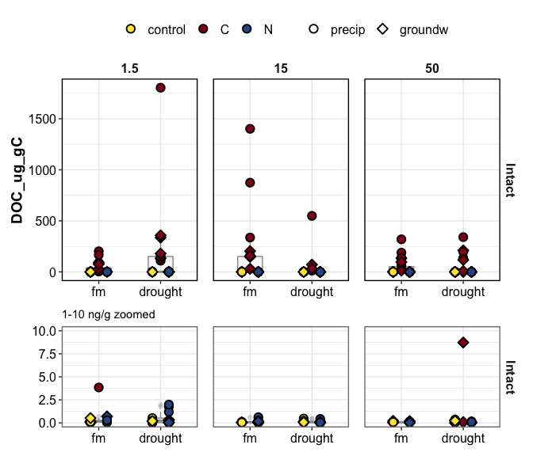
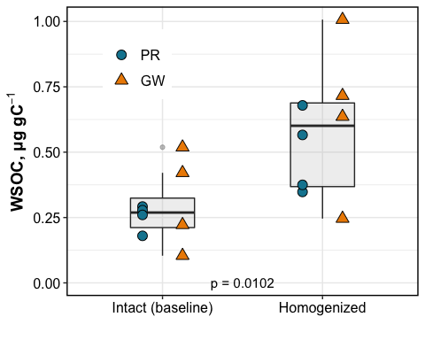

doc\_report
================

    #> $gg_doc_boxplot_suctions_combined

<!-- -->

full core

<!-- -->

<!-- -->

## what influenced DOC?

DOC was influenced by:

  - Amendments
  - Homogenization:Amendments
  - Moisture:Amendments
  - Wetting: Amendments

DOC in **intact** cores was influenced by:  
1\. Amendments  
2\. Moisture

DOC in **homogenized** cores was influenced by:  
1\. Amendments  
2\. Moisture  
3\. Suction

click for stats

overall ANOVA

    #> Analysis of Deviance Table (Type III Wald chisquare tests)
    #> 
    #> Response: log(DOC_ng_g)
    #>                              Chisq Df Pr(>Chisq)    
    #> (Intercept)                 0.5377  1  0.4633675    
    #> Homogenization              3.5975  1  0.0578675 .  
    #> Moisture                    4.2740  1  0.0386991 *  
    #> Wetting                     0.9744  1  0.3235974    
    #> Amendments                216.6116  2  < 2.2e-16 ***
    #> Homogenization:Moisture     8.5730  1  0.0034119 ** 
    #> Homogenization:Wetting      0.3228  1  0.5699143    
    #> Homogenization:Amendments 105.0014  2  < 2.2e-16 ***
    #> Moisture:Wetting            2.1534  1  0.1422518    
    #> Moisture:Amendments        15.7527  2  0.0003796 ***
    #> Wetting:Amendments          0.7639  2  0.6825395    
    #> ---
    #> Signif. codes:  0 '***' 0.001 '**' 0.01 '*' 0.05 '.' 0.1 ' ' 1

intact cores

    #> Anova Table (Type III tests)
    #> 
    #> Response: log(DOC_ng_g)
    #>                      Sum Sq Df  F value  Pr(>F)    
    #> (Intercept)           1.833  1   3.1364 0.08503 .  
    #> Moisture              0.225  1   0.3857 0.53849    
    #> Amendments          186.289  2 159.3627 < 2e-16 ***
    #> Wetting               0.008  1   0.0139 0.90669    
    #> Moisture:Amendments   0.816  2   0.6979 0.50424    
    #> Moisture:Wetting      0.052  1   0.0886 0.76761    
    #> Amendments:Wetting    1.905  2   1.6296 0.21013    
    #> Residuals            21.041 36                     
    #> ---
    #> Signif. codes:  0 '***' 0.001 '**' 0.01 '*' 0.05 '.' 0.1 ' ' 1

homogenized cores

    #> [1] NA

**how did amendments influence DOC?**

C addition increased DOC  
N addition decreased DOC - *N stimulated consumption of DOC?*

-----

how much DOC was added as part of the amendment?

5 mL of 10.1 M acetate (CH3-COO-K)  
1 mole acetate = 2 mole C

10.1 M acetate = 20.2 M C = (20.2 \* 12) g/L C  
5 mL of 10.1 M acetate = 0.005 L \* 20.2 \* 12 g/L C = 1.212 g C

-----

#### Session Info

click to expand

Date run: 2020-09-11

    #> R version 4.0.2 (2020-06-22)
    #> Platform: x86_64-apple-darwin17.0 (64-bit)
    #> Running under: macOS Catalina 10.15.6
    #> 
    #> Matrix products: default
    #> BLAS:   /System/Library/Frameworks/Accelerate.framework/Versions/A/Frameworks/vecLib.framework/Versions/A/libBLAS.dylib
    #> LAPACK: /Library/Frameworks/R.framework/Versions/4.0/Resources/lib/libRlapack.dylib
    #> 
    #> locale:
    #> [1] en_US.UTF-8/en_US.UTF-8/en_US.UTF-8/C/en_US.UTF-8/en_US.UTF-8
    #> 
    #> attached base packages:
    #> [1] stats     graphics  grDevices utils     datasets  methods   base     
    #> 
    #> other attached packages:
    #>  [1] patchwork_1.0.1 lme4_1.1-23     Matrix_1.2-18   drake_7.12.4   
    #>  [5] ggbiplot_0.55   PNWColors_0.1.0 forcats_0.5.0   stringr_1.4.0  
    #>  [9] dplyr_1.0.1     purrr_0.3.4     readr_1.3.1     tidyr_1.1.1    
    #> [13] tibble_3.0.3    ggplot2_3.3.2   tidyverse_1.3.0
    #> 
    #> loaded via a namespace (and not attached):
    #>  [1] minqa_1.2.4        colorspace_1.4-1   ellipsis_0.3.1    
    #>  [4] rio_0.5.16         fs_1.5.0           rstudioapi_0.11   
    #>  [7] farver_2.0.3       soilpalettes_0.1.0 fansi_0.4.1       
    #> [10] lubridate_1.7.9    xml2_1.3.2         splines_4.0.2     
    #> [13] knitr_1.29         jsonlite_1.7.0     nloptr_1.2.2.2    
    #> [16] packrat_0.5.0      broom_0.7.0        cluster_2.1.0     
    #> [19] dbplyr_1.4.4       shiny_1.5.0        compiler_4.0.2    
    #> [22] httr_1.4.2         backports_1.1.8    assertthat_0.2.1  
    #> [25] fastmap_1.0.1      cli_2.0.2          later_1.1.0.1     
    #> [28] htmltools_0.5.0    prettyunits_1.1.1  tools_4.0.2       
    #> [31] igraph_1.2.5       gtable_0.3.0       agricolae_1.3-3   
    #> [34] glue_1.4.1         Rcpp_1.0.5         carData_3.0-4     
    #> [37] cellranger_1.1.0   vctrs_0.3.2        nlme_3.1-148      
    #> [40] xfun_0.16          openxlsx_4.1.5     rvest_0.3.6       
    #> [43] mime_0.9           miniUI_0.1.1.1     lifecycle_0.2.0   
    #> [46] statmod_1.4.34     MASS_7.3-51.6      scales_1.1.1      
    #> [49] hms_0.5.3          promises_1.1.1     parallel_4.0.2    
    #> [52] yaml_2.2.1         curl_4.3           labelled_2.5.0    
    #> [55] stringi_1.4.6      highr_0.8          klaR_0.6-15       
    #> [58] AlgDesign_1.2.0    filelock_1.0.2     boot_1.3-25       
    #> [61] zip_2.1.0          storr_1.2.1        rlang_0.4.7       
    #> [64] pkgconfig_2.0.3    evaluate_0.14      lattice_0.20-41   
    #> [67] labeling_0.3       tidyselect_1.1.0   plyr_1.8.6        
    #> [70] magrittr_1.5       R6_2.4.1           generics_0.0.2    
    #> [73] base64url_1.4      combinat_0.0-8     txtq_0.2.3        
    #> [76] DBI_1.1.0          mgcv_1.8-31        pillar_1.4.6      
    #> [79] haven_2.3.1        foreign_0.8-80     withr_2.2.0       
    #> [82] abind_1.4-5        modelr_0.1.8       crayon_1.3.4      
    #> [85] car_3.0-9          questionr_0.7.1    utf8_1.1.4        
    #> [88] rmarkdown_2.3      progress_1.2.2     grid_4.0.2        
    #> [91] readxl_1.3.1       data.table_1.13.0  blob_1.2.1        
    #> [94] reprex_0.3.0       digest_0.6.25      xtable_1.8-4      
    #> [97] httpuv_1.5.4       munsell_0.5.0

