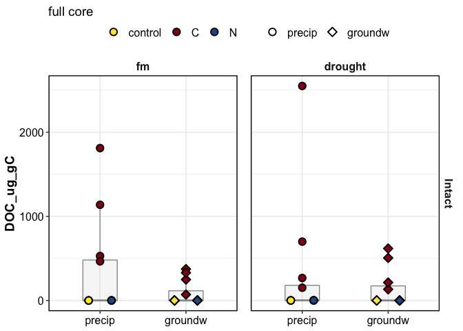

doc\_report
================

## PLOTS

    #> $gg_doc_boxplot_suctions_combined

<!-- -->

full core

<!-- -->

<!-- -->

## TABLES

| Homogenization | Moisture | Wetting | Suction   | control        | C               | N           |
| :------------- | :------- | :------ | :-------- | :------------- | :-------------- | :---------- |
| Intact         | fm       | precip  | 1.5       | 0.11 ± 0.03    | 115.93 ± 44.03  | 0.18 ± 0.07 |
| Intact         | fm       | precip  | 15        | 0.07 ± 0.02    | 692.98 ± 280.75 | 0.26 ± 0.13 |
| Intact         | fm       | precip  | 50        | 0.1 ± 0.01     | 176.8 ± 54.17   | 0.09 ± 0.03 |
| Intact         | fm       | precip  | full core | 0.25 ± 0.03    | 985.72 ± 314.24 | 0.49 ± 0.15 |
| Intact         | fm       | groundw | 1.5       | 0.2 ± 0.11     | 54.87 ± 17.07   | 0.7 ± NA    |
| Intact         | fm       | groundw | 15        | 0.05 ± 0.01    | 134.28 ± 36.88  | 0.09 ± 0.03 |
| Intact         | fm       | groundw | 50        | 0.1 ± 0.06     | 66.36 ± 29.44   | 0.06 ± 0.04 |
| Intact         | fm       | groundw | full core | 0.32 ± 0.09    | 255.51 ± 66.81  | 0.33 ± 0.22 |
| Intact         | drought  | precip  | 1.5       | 0.21 ± 0.11    | 602.85 ± 403.62 | 1.24 ± 0.44 |
| Intact         | drought  | precip  | 15        | 0.22 ± 0.09    | 194.45 ± 177.23 | 0.16 ± 0.14 |
| Intact         | drought  | precip  | 50        | 0.23 ± 0.06    | 224.57 ± 60.76  | 0.1 ± 0.03  |
| Intact         | drought  | precip  | full core | 0.66 ± 0.14    | 917.11 ± 556.88 | 1.44 ± 0.49 |
| Intact         | drought  | groundw | 1.5       | 0.2 ± NA       | 251.63 ± 56.07  | 0.17 ± 0.08 |
| Intact         | drought  | groundw | 15        | 0.1 ± 0.03     | 42.28 ± 14.52   | 0.07 ± 0.03 |
| Intact         | drought  | groundw | 50        | 0.17 ± 0.09    | 84.17 ± 49.82   | 0.05 ± 0.01 |
| Intact         | drought  | groundw | full core | 0.46 ± 0.04    | 367.52 ± 115.62 | 0.29 ± 0.11 |
| Homogenized    | fm       | precip  | 1.5       | 0.29 ± 0.08    | 2.33 ± 2.12     | 0.16 ± 0.05 |
| Homogenized    | fm       | precip  | 15        | 0.08 ± 0.01    | 16.74 ± 13.08   | 0.17 ± 0.08 |
| Homogenized    | fm       | precip  | 50        | 0.12 ± 0.02    | 33.71 ± 10.44   | 0.13 ± 0.11 |
| Homogenized    | fm       | precip  | full core | 0.49 ± 0.08    | 48.59 ± 16.75   | 0.38 ± 0.18 |
| Homogenized    | fm       | groundw | 1.5       | 0.4 ± 0.12     | 0.86 ± 0.29     | 0.26 ± 0.05 |
| Homogenized    | fm       | groundw | 15        | 0.08 ± 0.02    | 0.41 ± 0.35     | 0.1 ± 0.01  |
| Homogenized    | fm       | groundw | 50        | 0.17 ± 0.04    | NA              | 0.14 ± 0.03 |
| Homogenized    | fm       | groundw | full core | 0.65 ± 0.16    | 1.13 ± 0.15     | 0.38 ± 0.09 |
| Homogenized    | drought  | precip  | 1.5       | 22.33 ± 14.52  | 0.3 ± 0.18      | 0.56 ± 0.3  |
| Homogenized    | drought  | precip  | 15        | 22.41 ± 16.63  | 1.18 ± 0.93     | 0.13 ± 0.05 |
| Homogenized    | drought  | precip  | 50        | 60.99 ± 32.17  | 3.17 ± 1.61     | 0.48 ± 0.22 |
| Homogenized    | drought  | precip  | full core | 100.12 ± 48.42 | 4.65 ± 2.28     | 1.13 ± 0.25 |
| Homogenized    | drought  | groundw | 1.5       | 12.25 ± 7.63   | 9.32 ± 5.45     | 0.81 ± 0.21 |
| Homogenized    | drought  | groundw | 15        | 27.46 ± 25.86  | 2.88 ± 0.87     | 0.38 ± 0.34 |
| Homogenized    | drought  | groundw | 50        | 48.49 ± 34.4   | 8.43 ± 2.88     | 0.29 ± 0.19 |
| Homogenized    | drought  | groundw | full core | 76.07 ± 55.47  | 20.63 ± 8.28    | 1.38 ± 0.49 |

## what influenced DOC?

DOC was influenced by:

  - Amendments
  - Homogenization:Amendments
  - Moisture:Amendments
  - Wetting: Amendments

DOC in **intact** cores was influenced by:  
1\. Amendments  
2\. Moisture

DOC in **homogenized** cores was influenced by:  
1\. Amendments  
2\. Moisture  
3\. Suction

click for stats

overall ANOVA

    #> Analysis of Deviance Table (Type III Wald chisquare tests)
    #> 
    #> Response: log(DOC_ug_gC)
    #>                              Chisq Df Pr(>Chisq)    
    #> (Intercept)                 8.1213  1  0.0043748 ** 
    #> Homogenization              6.8380  1  0.0089238 ** 
    #> Moisture                    6.0477  1  0.0139245 *  
    #> Wetting                     1.0524  1  0.3049538    
    #> Amendments                196.8836  2  < 2.2e-16 ***
    #> Homogenization:Moisture     5.1632  1  0.0230703 *  
    #> Homogenization:Wetting      0.4417  1  0.5062850    
    #> Homogenization:Amendments 107.7626  2  < 2.2e-16 ***
    #> Moisture:Wetting            1.0350  1  0.3089952    
    #> Moisture:Amendments        14.0543  2  0.0008875 ***
    #> Wetting:Amendments          0.8482  2  0.6543606    
    #> ---
    #> Signif. codes:  0 '***' 0.001 '**' 0.01 '*' 0.05 '.' 0.1 ' ' 1

intact cores

    #> Anova Table (Type III tests)
    #> 
    #> Response: log(DOC_ug_gC)
    #>                      Sum Sq Df  F value    Pr(>F)    
    #> (Intercept)           8.114  1   8.6378  0.005717 ** 
    #> Moisture              1.583  1   1.6856  0.202441    
    #> Amendments          204.809  2 109.0199 5.311e-16 ***
    #> Wetting               0.017  1   0.0184  0.892995    
    #> Moisture:Amendments   1.380  2   0.7343  0.486878    
    #> Moisture:Wetting      0.000  1   0.0001  0.994395    
    #> Amendments:Wetting    2.163  2   1.1516  0.327498    
    #> Residuals            33.815 36                       
    #> ---
    #> Signif. codes:  0 '***' 0.001 '**' 0.01 '*' 0.05 '.' 0.1 ' ' 1

homogenized cores

    #> [1] NA

**how did amendments influence DOC?**

C addition increased DOC  
N addition decreased DOC - *N stimulated consumption of DOC?*

-----

how much DOC was added as part of the amendment?

5 mL of 10.1 M acetate (CH3-COO-K)  
1 mole acetate = 2 mole C

10.1 M acetate = 20.2 M C = (20.2 \* 12) g/L C  
5 mL of 10.1 M acetate = 0.005 L \* 20.2 \* 12 g/L C = 1.212 g C

-----

#### Session Info

click to expand

Date run: 2020-12-08

    #> R version 4.0.2 (2020-06-22)
    #> Platform: x86_64-apple-darwin17.0 (64-bit)
    #> Running under: macOS Catalina 10.15.7
    #> 
    #> Matrix products: default
    #> BLAS:   /System/Library/Frameworks/Accelerate.framework/Versions/A/Frameworks/vecLib.framework/Versions/A/libBLAS.dylib
    #> LAPACK: /Library/Frameworks/R.framework/Versions/4.0/Resources/lib/libRlapack.dylib
    #> 
    #> locale:
    #> [1] en_US.UTF-8/en_US.UTF-8/en_US.UTF-8/C/en_US.UTF-8/en_US.UTF-8
    #> 
    #> attached base packages:
    #> [1] stats     graphics  grDevices utils     datasets  methods   base     
    #> 
    #> other attached packages:
    #>  [1] patchwork_1.0.1 lme4_1.1-23     Matrix_1.2-18   drake_7.12.4    ggbiplot_0.55   PNWColors_0.1.0
    #>  [7] forcats_0.5.0   stringr_1.4.0   dplyr_1.0.1     purrr_0.3.4     readr_1.3.1     tidyr_1.1.1    
    #> [13] tibble_3.0.3    ggplot2_3.3.2   tidyverse_1.3.0
    #> 
    #> loaded via a namespace (and not attached):
    #>   [1] minqa_1.2.4        colorspace_1.4-1   ggsignif_0.6.0     ellipsis_0.3.1     class_7.3-17      
    #>   [6] rio_0.5.16         fs_1.5.0           gld_2.6.2          rstudioapi_0.11    ggpubr_0.4.0      
    #>  [11] farver_2.0.3       soilpalettes_0.1.0 fansi_0.4.1        mvtnorm_1.1-1      lubridate_1.7.9   
    #>  [16] xml2_1.3.2         splines_4.0.2      rootSolve_1.8.2.1  knitr_1.29         jsonlite_1.7.0    
    #>  [21] nloptr_1.2.2.2     packrat_0.5.0      broom_0.7.0        cluster_2.1.0      dbplyr_1.4.4      
    #>  [26] shiny_1.5.0        compiler_4.0.2     httr_1.4.2         backports_1.1.8    fastmap_1.0.1     
    #>  [31] assertthat_0.2.1   cli_2.0.2          later_1.1.0.1      htmltools_0.5.0    prettyunits_1.1.1 
    #>  [36] tools_4.0.2        igraph_1.2.5       agricolae_1.3-3    gtable_0.3.0       glue_1.4.1        
    #>  [41] lmom_2.8           Rcpp_1.0.5         carData_3.0-4      cellranger_1.1.0   vctrs_0.3.2       
    #>  [46] nlme_3.1-148       xfun_0.16          openxlsx_4.1.5     rvest_0.3.6        mime_0.9          
    #>  [51] miniUI_0.1.1.1     lifecycle_0.2.0    statmod_1.4.34     rstatix_0.6.0      MASS_7.3-51.6     
    #>  [56] scales_1.1.1       promises_1.1.1     hms_0.5.3          parallel_4.0.2     expm_0.999-5      
    #>  [61] yaml_2.2.1         curl_4.3           Exact_2.1          labelled_2.5.0     stringi_1.4.6     
    #>  [66] AlgDesign_1.2.0    klaR_0.6-15        highr_0.8          e1071_1.7-3        filelock_1.0.2    
    #>  [71] boot_1.3-25        zip_2.1.0          storr_1.2.1        rlang_0.4.7        pkgconfig_2.0.3   
    #>  [76] evaluate_0.14      lattice_0.20-41    labeling_0.3       cowplot_1.0.0      tidyselect_1.1.0  
    #>  [81] plyr_1.8.6         magrittr_1.5       R6_2.4.1           DescTools_0.99.38  generics_0.0.2    
    #>  [86] combinat_0.0-8     base64url_1.4      txtq_0.2.3         DBI_1.1.0          pillar_1.4.6      
    #>  [91] haven_2.3.1        foreign_0.8-80     withr_2.2.0        mgcv_1.8-31        abind_1.4-5       
    #>  [96] questionr_0.7.1    modelr_0.1.8       crayon_1.3.4       car_3.0-9          rmarkdown_2.3     
    #> [101] progress_1.2.2     grid_4.0.2         readxl_1.3.1       data.table_1.13.0  blob_1.2.1        
    #> [106] reprex_0.3.0       digest_0.6.25      xtable_1.8-4       httpuv_1.5.4       munsell_0.5.0

