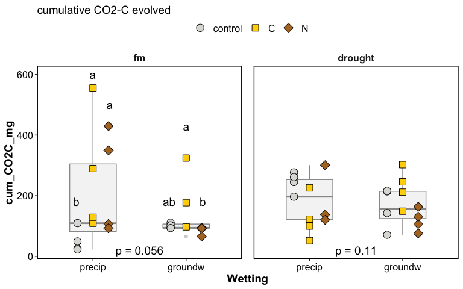
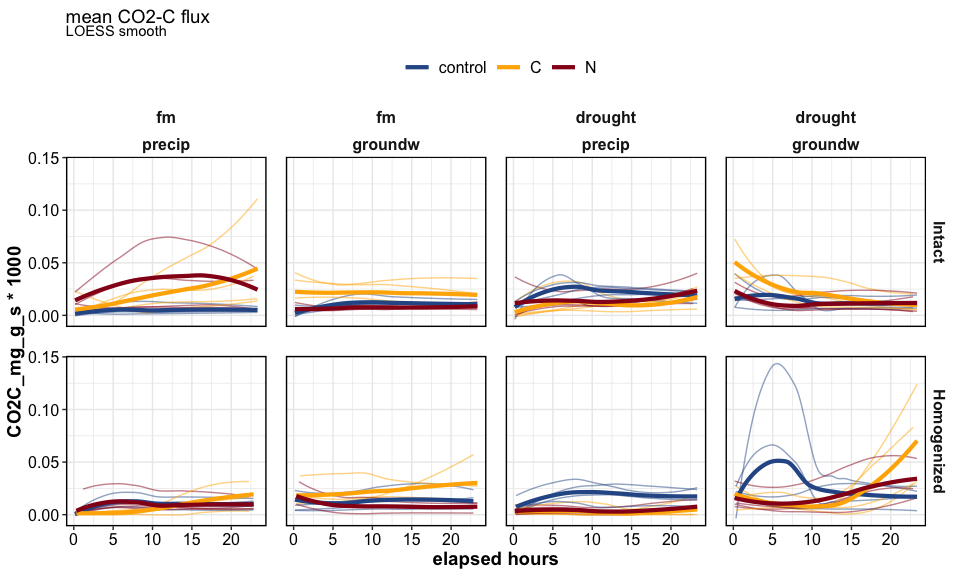
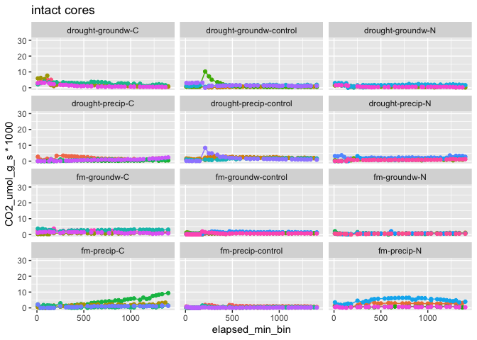

flux\_drake\_plan
================

### HYPOTHESES

  - C amendments will increase CO2 flux
    
      - especially in cores wet from below

  - post-rewetting CO2 flush: drought \> fm for unamended soils, but
    drought \< fm for C-amended soils

  - N amendments will increase CO2 flux when wet from above

-----

## stats

stats

intact cores

    #> Anova Table (Type III tests)
    #> 
    #> Response: log(cum_CO2C_mg)
    #>                     Sum Sq Df  F value    Pr(>F)    
    #> (Intercept)         79.287  1 241.6145 < 2.2e-16 ***
    #> Moisture             3.510  1  10.6970  0.002369 ** 
    #> Amendments           4.212  2   6.4184  0.004131 ** 
    #> Wetting              0.119  1   0.3618  0.551283    
    #> Moisture:Amendments  3.729  2   5.6818  0.007169 ** 
    #> Moisture:Wetting     0.005  1   0.0152  0.902494    
    #> Amendments:Wetting   1.895  2   2.8874  0.068706 .  
    #> Residuals           11.814 36                       
    #> ---
    #> Signif. codes:  0 '***' 0.001 '**' 0.01 '*' 0.05 '.' 0.1 ' ' 1

homogenized cores

    #> Anova Table (Type III tests)
    #> 
    #> Response: log(cum_CO2C_mg)
    #>                      Sum Sq Df  F value    Pr(>F)    
    #> (Intercept)         109.678  1 158.7171 9.264e-15 ***
    #> Moisture              0.140  1   0.2022  0.655667    
    #> Amendments            1.197  2   0.8662  0.429114    
    #> Wetting               0.598  1   0.8655  0.358398    
    #> Moisture:Amendments   4.970  2   3.5958  0.037692 *  
    #> Moisture:Wetting      2.431  1   3.5182  0.068825 .  
    #> Amendments:Wetting    7.521  2   5.4416  0.008613 ** 
    #> Residuals            24.877 36                       
    #> ---
    #> Signif. codes:  0 '***' 0.001 '**' 0.01 '*' 0.05 '.' 0.1 ' ' 1

intact cores: interaction of Amendments and Moisture
<!-- -->

Homogenization:

  - interactive response with Amendment  
  - Homogenization increased respiration in the control soils  
  - Homogenization decreased respiration in the amended soils

For intact cores,

  - respiration was influenced by Moisture:Amendments
      - drought+rewetting increased flux for control soils only
      - for +C/+N amended soils, drought did not have a strong effect
  - C-amendments increased respiration in FM soils  
  - N-amendments increased respiration only in FM-precip soils

## graphs

<!-- -->

  - drought increased respiration only in control soils
      - microbes limited by substrate as well as N, which were released
        during drought?
      - the C/N amendments alleviated these limitations, and therefore
        drought did not alter mineralization
  - in the drought soils, precip had more min than groundw, but only in
    control soils
      - possibly because there was more C available in the top 3 cm,
        which stimulated respiration when rewet.
      - but when we consider all the amendments, this effect of wetting
        direction is lost
  - fm soils, on the other hand, showed greater response to amendments
      - possibly because less C was available, and therefore microbes
        were more limited
      - N??

<!-- -->

<!-- -->

<!-- -->

time series by core

<!-- --><!-- -->

## summary table

| Homogenization | Moisture | Wetting |    control     |        C        |       N        |
| :------------: | :------: | :-----: | :------------: | :-------------: | :------------: |
|     Intact     |    fm    | precip  |   52 ± 20.16   | 270.95 ± 103.11 | 244.8 ± 85.34  |
|     Intact     |    fm    | groundw | 100.22 ± 4.12  | 199.62 ± 57.58  |  85.92 ± 6.79  |
|     Intact     | drought  | precip  | 245.11 ± 17.38 | 125.07 ± 36.68  | 186.55 ± 49.75 |
|     Intact     | drought  | groundw | 161.18 ± 34.49 | 227.34 ± 32.09  | 119.25 ± 18.59 |
|  Homogenized   |    fm    | precip  | 108.62 ± 28.23 |  96.28 ± 34.16  | 99.67 ± 22.65  |
|  Homogenized   |    fm    | groundw | 118.74 ± 45.04 | 261.79 ± 51.91  | 107.47 ± 33.66 |
|  Homogenized   | drought  | precip  | 208.65 ± 41.69 |  35.29 ± 23.78  | 50.76 ± 19.67  |
|  Homogenized   | drought  | groundw | 201.98 ± 51.46 | 217.43 ± 60.18  | 177.38 ± 46.22 |

-----

#### Session Info

click to expand

Date run: 2020-08-15

    #> R version 4.0.2 (2020-06-22)
    #> Platform: x86_64-apple-darwin17.0 (64-bit)
    #> Running under: macOS Catalina 10.15.6
    #> 
    #> Matrix products: default
    #> BLAS:   /System/Library/Frameworks/Accelerate.framework/Versions/A/Frameworks/vecLib.framework/Versions/A/libBLAS.dylib
    #> LAPACK: /Library/Frameworks/R.framework/Versions/4.0/Resources/lib/libRlapack.dylib
    #> 
    #> locale:
    #> [1] en_US.UTF-8/en_US.UTF-8/en_US.UTF-8/C/en_US.UTF-8/en_US.UTF-8
    #> 
    #> attached base packages:
    #> [1] stats     graphics  grDevices utils     datasets  methods  
    #> [7] base     
    #> 
    #> other attached packages:
    #>  [1] lme4_1.1-23     Matrix_1.2-18   drake_7.12.4    ggbiplot_0.55  
    #>  [5] PNWColors_0.1.0 forcats_0.5.0   stringr_1.4.0   dplyr_1.0.1    
    #>  [9] purrr_0.3.4     readr_1.3.1     tidyr_1.1.1     tibble_3.0.3   
    #> [13] ggplot2_3.3.2   tidyverse_1.3.0
    #> 
    #> loaded via a namespace (and not attached):
    #>  [1] minqa_1.2.4        colorspace_1.4-1   ellipsis_0.3.1    
    #>  [4] rio_0.5.16         fs_1.5.0           rstudioapi_0.11   
    #>  [7] farver_2.0.3       soilpalettes_0.1.0 fansi_0.4.1       
    #> [10] lubridate_1.7.9    xml2_1.3.2         splines_4.0.2     
    #> [13] knitr_1.29         jsonlite_1.7.0     nloptr_1.2.2.2    
    #> [16] broom_0.7.0        cluster_2.1.0      dbplyr_1.4.4      
    #> [19] shiny_1.5.0        compiler_4.0.2     httr_1.4.2        
    #> [22] backports_1.1.8    assertthat_0.2.1   fastmap_1.0.1     
    #> [25] cli_2.0.2          later_1.1.0.1      htmltools_0.5.0   
    #> [28] prettyunits_1.1.1  tools_4.0.2        igraph_1.2.5      
    #> [31] gtable_0.3.0       agricolae_1.3-3    glue_1.4.1        
    #> [34] tinytex_0.25       Rcpp_1.0.5         carData_3.0-4     
    #> [37] cellranger_1.1.0   vctrs_0.3.2        nlme_3.1-148      
    #> [40] xfun_0.16          openxlsx_4.1.5     rvest_0.3.6       
    #> [43] mime_0.9           miniUI_0.1.1.1     lifecycle_0.2.0   
    #> [46] statmod_1.4.34     MASS_7.3-51.6      scales_1.1.1      
    #> [49] hms_0.5.3          promises_1.1.1     parallel_4.0.2    
    #> [52] yaml_2.2.1         curl_4.3           labelled_2.5.0    
    #> [55] stringi_1.4.6      highr_0.8          klaR_0.6-15       
    #> [58] AlgDesign_1.2.0    filelock_1.0.2     boot_1.3-25       
    #> [61] zip_2.1.0          storr_1.2.1        rlang_0.4.7       
    #> [64] pkgconfig_2.0.3    evaluate_0.14      lattice_0.20-41   
    #> [67] labeling_0.3       tidyselect_1.1.0   plyr_1.8.6        
    #> [70] magrittr_1.5       R6_2.4.1           generics_0.0.2    
    #> [73] base64url_1.4      combinat_0.0-8     txtq_0.2.3        
    #> [76] DBI_1.1.0          mgcv_1.8-31        pillar_1.4.6      
    #> [79] haven_2.3.1        foreign_0.8-80     withr_2.2.0       
    #> [82] abind_1.4-5        modelr_0.1.8       crayon_1.3.4      
    #> [85] car_3.0-9          questionr_0.7.1    rmarkdown_2.3     
    #> [88] progress_1.2.2     grid_4.0.2         readxl_1.3.1      
    #> [91] data.table_1.13.0  blob_1.2.1         reprex_0.3.0      
    #> [94] digest_0.6.25      xtable_1.8-4       httpuv_1.5.4      
    #> [97] munsell_0.5.0

