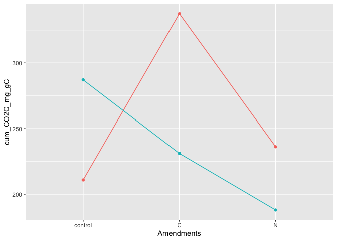
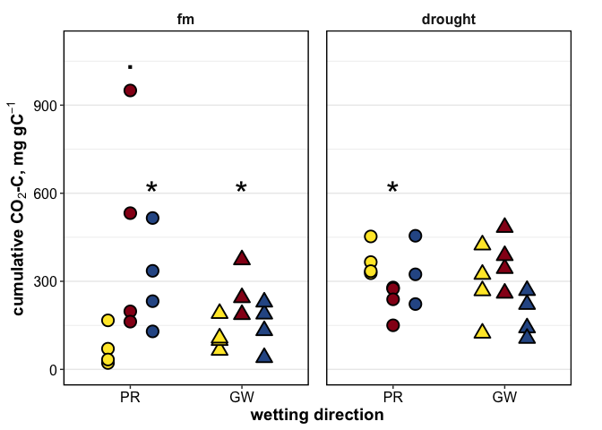

flux\_drake\_plan
================

### HYPOTHESES

  - C amendments will increase CO2 flux
    
      - especially in cores wet from below

  - post-rewetting CO2 flush: drought \> fm for unamended soils, but
    drought \< fm for C-amended soils

  - N amendments will increase CO2 flux when wet from above

-----

## stats

stats

intact cores

    #> Anova Table (Type III tests)
    #> 
    #> Response: log(cum_CO2C_mg_g)
    #>                      Sum Sq Df F value  Pr(>F)  
    #> (Intercept)          2.4064  1  6.0051 0.01926 *
    #> Moisture             2.5334  1  6.3219 0.01653 *
    #> Amendments           3.0693  2  3.8297 0.03105 *
    #> Wetting              0.1035  1  0.2583 0.61439  
    #> Moisture:Amendments  2.8120  2  3.5086 0.04054 *
    #> Moisture:Wetting     0.0073  1  0.0182 0.89347  
    #> Amendments:Wetting   1.9118  2  2.3854 0.10645  
    #> Residuals           14.4263 36                  
    #> ---
    #> Signif. codes:  0 '***' 0.001 '**' 0.01 '*' 0.05 '.' 0.1 ' ' 1

homogenized cores

    #> Anova Table (Type III tests)
    #> 
    #> Response: log(cum_CO2C_mg_g)
    #>                      Sum Sq Df F value  Pr(>F)  
    #> (Intercept)          0.0057  1  0.0072 0.93275  
    #> Moisture             0.0148  1  0.0188 0.89173  
    #> Amendments           1.9157  2  1.2163 0.30821  
    #> Wetting              0.5761  1  0.7316 0.39804  
    #> Moisture:Amendments  4.1127  2  2.6112 0.08730 .
    #> Moisture:Wetting     2.8734  1  3.6488 0.06410 .
    #> Amendments:Wetting   7.7421  2  4.9156 0.01296 *
    #> Residuals           28.3500 36                  
    #> ---
    #> Signif. codes:  0 '***' 0.001 '**' 0.01 '*' 0.05 '.' 0.1 ' ' 1

intact cores: interaction of Amendments and Moisture
<!-- -->

Homogenization:

  - interactive response with Amendment  
  - Homogenization increased respiration in the control soils  
  - Homogenization decreased respiration in the amended soils

For intact cores,

  - respiration was influenced by Moisture:Amendments
      - drought+rewetting increased flux for control soils only
      - for +C/+N amended soils, drought did not have a strong effect
  - C-amendments increased respiration in FM soils  
  - N-amendments increased respiration only in FM-precip soils

## graphs

<!-- -->

  - drought increased respiration only in control soils
      - microbes limited by substrate as well as N, which were released
        during drought?
      - the C/N amendments alleviated these limitations, and therefore
        drought did not alter mineralization
  - in the drought soils, precip had more min than groundw, but only in
    control soils
      - possibly because there was more C available in the top 3 cm,
        which stimulated respiration when rewet.
      - but when we consider all the amendments, this effect of wetting
        direction is lost
  - fm soils, on the other hand, showed greater response to amendments
      - possibly because less C was available, and therefore microbes
        were more limited
      - N??

<!-- end list -->

    #> $gg_cumflux_homo

<!-- -->

    #> $gg_flux_ts

<!-- -->

time series by core

    #> [1] NA
    #> [1] NA

## summary table

cumulative CO2-C, mgC/g soil

| Homogenization | Moisture | Wetting |   control   |      C      |      N      |
| :------------: | :------: | :-----: | :---------: | :---------: | :---------: |
|     Intact     |    fm    | precip  | 0.43 ± 0.17 | 1.82 ± 0.7  |  2.16 ± 1   |
|     Intact     |    fm    | groundw | 0.87 ± 0.14 | 1.38 ± 0.41 | 0.6 ± 0.05  |
|     Intact     | drought  | precip  | 1.79 ± 0.17 | 0.91 ± 0.29 | 1.29 ± 0.43 |
|     Intact     | drought  | groundw | 1.19 ± 0.22 | 1.75 ± 0.33 | 0.98 ± 0.28 |
|  Homogenized   |    fm    | precip  | 0.88 ± 0.21 | 0.65 ± 0.23 | 0.87 ± 0.35 |
|  Homogenized   |    fm    | groundw | 1.02 ± 0.37 |  2 ± 0.42   | 0.74 ± 0.22 |
|  Homogenized   | drought  | precip  | 1.53 ± 0.31 | 0.27 ± 0.19 | 0.36 ± 0.16 |
|  Homogenized   | drought  | groundw | 1.71 ± 0.54 | 1.77 ± 0.56 | 1.56 ± 0.62 |

-----

#### Session Info

click to expand

Date run: 2020-09-11

    #> R version 4.0.2 (2020-06-22)
    #> Platform: x86_64-apple-darwin17.0 (64-bit)
    #> Running under: macOS Catalina 10.15.6
    #> 
    #> Matrix products: default
    #> BLAS:   /System/Library/Frameworks/Accelerate.framework/Versions/A/Frameworks/vecLib.framework/Versions/A/libBLAS.dylib
    #> LAPACK: /Library/Frameworks/R.framework/Versions/4.0/Resources/lib/libRlapack.dylib
    #> 
    #> locale:
    #> [1] en_US.UTF-8/en_US.UTF-8/en_US.UTF-8/C/en_US.UTF-8/en_US.UTF-8
    #> 
    #> attached base packages:
    #> [1] stats     graphics  grDevices utils     datasets  methods   base     
    #> 
    #> other attached packages:
    #>  [1] lme4_1.1-23     Matrix_1.2-18   patchwork_1.0.1 car_3.0-9      
    #>  [5] carData_3.0-4   drake_7.12.4    ggbiplot_0.55   PNWColors_0.1.0
    #>  [9] forcats_0.5.0   stringr_1.4.0   dplyr_1.0.1     purrr_0.3.4    
    #> [13] readr_1.3.1     tidyr_1.1.1     tibble_3.0.3    ggplot2_3.3.2  
    #> [17] tidyverse_1.3.0
    #> 
    #> loaded via a namespace (and not attached):
    #>  [1] minqa_1.2.4        colorspace_1.4-1   ellipsis_0.3.1     rio_0.5.16        
    #>  [5] fs_1.5.0           rstudioapi_0.11    farver_2.0.3       soilpalettes_0.1.0
    #>  [9] fansi_0.4.1        lubridate_1.7.9    xml2_1.3.2         splines_4.0.2     
    #> [13] knitr_1.29         jsonlite_1.7.0     nloptr_1.2.2.2     packrat_0.5.0     
    #> [17] broom_0.7.0        cluster_2.1.0      dbplyr_1.4.4       shiny_1.5.0       
    #> [21] compiler_4.0.2     httr_1.4.2         backports_1.1.8    assertthat_0.2.1  
    #> [25] fastmap_1.0.1      cli_2.0.2          later_1.1.0.1      htmltools_0.5.0   
    #> [29] prettyunits_1.1.1  tools_4.0.2        igraph_1.2.5       gtable_0.3.0      
    #> [33] agricolae_1.3-3    glue_1.4.1         Rcpp_1.0.5         cellranger_1.1.0  
    #> [37] vctrs_0.3.2        nlme_3.1-148       xfun_0.16          openxlsx_4.1.5    
    #> [41] rvest_0.3.6        mime_0.9           miniUI_0.1.1.1     lifecycle_0.2.0   
    #> [45] statmod_1.4.34     MASS_7.3-51.6      scales_1.1.1       hms_0.5.3         
    #> [49] promises_1.1.1     parallel_4.0.2     yaml_2.2.1         curl_4.3          
    #> [53] labelled_2.5.0     stringi_1.4.6      highr_0.8          klaR_0.6-15       
    #> [57] AlgDesign_1.2.0    filelock_1.0.2     boot_1.3-25        zip_2.1.0         
    #> [61] storr_1.2.1        rlang_0.4.7        pkgconfig_2.0.3    evaluate_0.14     
    #> [65] lattice_0.20-41    labeling_0.3       tidyselect_1.1.0   plyr_1.8.6        
    #> [69] magrittr_1.5       R6_2.4.1           generics_0.0.2     base64url_1.4     
    #> [73] combinat_0.0-8     txtq_0.2.3         DBI_1.1.0          mgcv_1.8-31       
    #> [77] pillar_1.4.6       haven_2.3.1        foreign_0.8-80     withr_2.2.0       
    #> [81] abind_1.4-5        modelr_0.1.8       crayon_1.3.4       questionr_0.7.1   
    #> [85] rmarkdown_2.3      progress_1.2.2     grid_4.0.2         readxl_1.3.1      
    #> [89] data.table_1.13.0  blob_1.2.1         reprex_0.3.0       digest_0.6.25     
    #> [93] xtable_1.8-4       httpuv_1.5.4       munsell_0.5.0

