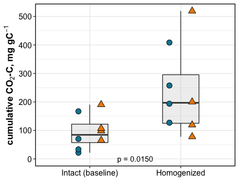
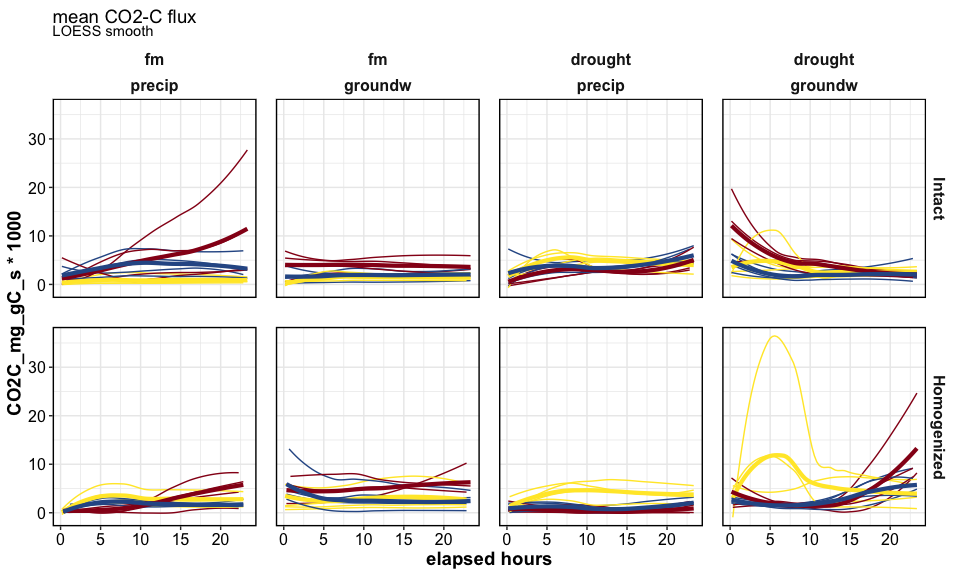

flux\_drake\_plan
================

### HYPOTHESES

  - C amendments will increase CO2 flux
    
      - especially in cores wet from below

  - post-rewetting CO2 flush: drought \> fm for unamended soils, but
    drought \< fm for C-amended soils

  - N amendments will increase CO2 flux when wet from above

-----

## stats

stats

intact cores

    #> Analysis of Deviance Table (Type III Wald chisquare tests)
    #> 
    #> Response: log(cum_CO2C_mg_gC)
    #>                              Chisq Df Pr(>Chisq)    
    #> (Intercept)               271.9808  1  < 2.2e-16 ***
    #> Homogenization              1.6284  1  0.2019312    
    #> Moisture                   11.6195  1  0.0006526 ***
    #> Wetting                     3.5209  1  0.0605982 .  
    #> Amendments                  8.0665  2  0.0177166 *  
    #> Homogenization:Moisture     6.3080  1  0.0120194 *  
    #> Homogenization:Wetting      9.7214  1  0.0018213 ** 
    #> Homogenization:Amendments  12.3807  2  0.0020491 ** 
    #> Moisture:Wetting            1.7002  1  0.1922639    
    #> Moisture:Amendments        17.2625  2  0.0001784 ***
    #> Wetting:Amendments          8.8564  2  0.0119359 *  
    #> ---
    #> Signif. codes:  0 '***' 0.001 '**' 0.01 '*' 0.05 '.' 0.1 ' ' 1

    #> Anova Table (Type III tests)
    #> 
    #> Response: log(cum_CO2C_mg_gC)
    #>                     Sum Sq Df  F value    Pr(>F)    
    #> (Intercept)         85.617  1 257.9917 < 2.2e-16 ***
    #> Moisture             6.033  1  18.1805 0.0001386 ***
    #> Amendments           6.755  2  10.1777 0.0003138 ***
    #> Wetting              0.113  1   0.3400 0.5634526    
    #> Moisture:Amendments  4.697  2   7.0770 0.0025583 ** 
    #> Moisture:Wetting     0.009  1   0.0263 0.8719919    
    #> Amendments:Wetting   1.768  2   2.6644 0.0833505 .  
    #> Residuals           11.947 36                       
    #> ---
    #> Signif. codes:  0 '***' 0.001 '**' 0.01 '*' 0.05 '.' 0.1 ' ' 1

homogenized cores

    #> [1] NA

intact cores: interaction of Amendments and Moisture
<!-- --><!-- --><!-- -->

Homogenization:

  - interactive response with Amendment  
  - Homogenization increased respiration in the control soils  
  - Homogenization decreased respiration in the amended soils

For intact cores,

  - respiration was influenced by Moisture:Amendments
      - drought+rewetting increased flux for control soils only
      - for +C/+N amended soils, drought did not have a strong effect
  - C-amendments increased respiration in FM soils  
  - N-amendments increased respiration only in FM-precip soils

## graphs

<!-- -->

<!-- -->

  - drought increased respiration only in control soils
      - microbes limited by substrate as well as N, which were released
        during drought?
      - the C/N amendments alleviated these limitations, and therefore
        drought did not alter mineralization
  - in the drought soils, precip had more min than groundw, but only in
    control soils
      - possibly because there was more C available in the top 3 cm,
        which stimulated respiration when rewet.
      - but when we consider all the amendments, this effect of wetting
        direction is lost
  - fm soils, on the other hand, showed greater response to amendments
      - possibly because less C was available, and therefore microbes
        were more limited
      - N??

<!-- -->

    #> $gg_flux_ts

<!-- -->

time series by core

    #> [1] NA
    #> [1] NA

## summary table

cumulative CO2-C, mgC/g C

| Homogenization | Moisture | Wetting | control         | C               | N              |
| :------------- | :------- | :------ | :-------------- | :-------------- | :------------- |
| Intact         | fm       | precip  | 73.18 ± 32.93   | 460.58 ± 183.17 | 303.24 ± 82.36 |
| Intact         | fm       | groundw | 115.36 ± 26.67  | 268.21 ± 47.75  | 147.65 ± 40.97 |
| Intact         | drought  | precip  | 370.13 ± 28.76  | 235.6 ± 29.9    | 333.8 ± 58.3   |
| Intact         | drought  | groundw | 284.85 ± 62.71  | 368.72 ± 46.64  | 184.42 ± 37.1  |
| Homogenized    | fm       | precip  | 246.75 ± 60.14  | 181.4 ± 61.43   | 150.26 ± 16.35 |
| Homogenized    | fm       | groundw | 229.07 ± 99.94  | 434.82 ± 56.78  | 247.68 ± 98.32 |
| Homogenized    | drought  | precip  | 330.66 ± 62.16  | 47.29 ± 23.88   | 96.38 ± 32.15  |
| Homogenized    | drought  | groundw | 360.16 ± 103.62 | 311.76 ± 78.33  | 257.53 ± 51.06 |

-----

#### Session Info

click to expand

Date run: 2020-12-08

    #> R version 4.0.2 (2020-06-22)
    #> Platform: x86_64-apple-darwin17.0 (64-bit)
    #> Running under: macOS Catalina 10.15.7
    #> 
    #> Matrix products: default
    #> BLAS:   /System/Library/Frameworks/Accelerate.framework/Versions/A/Frameworks/vecLib.framework/Versions/A/libBLAS.dylib
    #> LAPACK: /Library/Frameworks/R.framework/Versions/4.0/Resources/lib/libRlapack.dylib
    #> 
    #> locale:
    #> [1] en_US.UTF-8/en_US.UTF-8/en_US.UTF-8/C/en_US.UTF-8/en_US.UTF-8
    #> 
    #> attached base packages:
    #> [1] stats     graphics  grDevices utils     datasets  methods   base     
    #> 
    #> other attached packages:
    #>  [1] lme4_1.1-23     Matrix_1.2-18   drake_7.12.4    ggbiplot_0.55   PNWColors_0.1.0 forcats_0.5.0  
    #>  [7] stringr_1.4.0   dplyr_1.0.1     purrr_0.3.4     readr_1.3.1     tidyr_1.1.1     tibble_3.0.3   
    #> [13] ggplot2_3.3.2   tidyverse_1.3.0
    #> 
    #> loaded via a namespace (and not attached):
    #>  [1] nlme_3.1-148      fs_1.5.0          lubridate_1.7.9   filelock_1.0.2    progress_1.2.2    httr_1.4.2       
    #>  [7] tools_4.0.2       backports_1.1.8   R6_2.4.1          mgcv_1.8-31       DBI_1.1.0         colorspace_1.4-1 
    #> [13] withr_2.2.0       Exact_2.1         tidyselect_1.1.0  prettyunits_1.1.1 curl_4.3          compiler_4.0.2   
    #> [19] cli_2.0.2         rvest_0.3.6       expm_0.999-5      xml2_1.3.2        labeling_0.3      scales_1.1.1     
    #> [25] mvtnorm_1.1-1     digest_0.6.25     minqa_1.2.4       foreign_0.8-80    txtq_0.2.3        rmarkdown_2.3    
    #> [31] rio_0.5.16        pkgconfig_2.0.3   htmltools_0.5.0   highr_0.8         dbplyr_1.4.4      rlang_0.4.7      
    #> [37] readxl_1.3.1      rstudioapi_0.11   farver_2.0.3      generics_0.0.2    jsonlite_1.7.0    zip_2.1.0        
    #> [43] car_3.0-9         magrittr_1.5      DescTools_0.99.38 Rcpp_1.0.5        munsell_0.5.0     fansi_0.4.1      
    #> [49] abind_1.4-5       lifecycle_0.2.0   stringi_1.4.6     yaml_2.2.1        carData_3.0-4     rootSolve_1.8.2.1
    #> [55] MASS_7.3-51.6     storr_1.2.1       plyr_1.8.6        grid_4.0.2        blob_1.2.1        parallel_4.0.2   
    #> [61] lmom_2.8          crayon_1.3.4      lattice_0.20-41   cowplot_1.0.0     haven_2.3.1       splines_4.0.2    
    #> [67] hms_0.5.3         knitr_1.29        pillar_1.4.6      igraph_1.2.5      ggpubr_0.4.0      gld_2.6.2        
    #> [73] boot_1.3-25       ggsignif_0.6.0    base64url_1.4     reprex_0.3.0      glue_1.4.1        packrat_0.5.0    
    #> [79] evaluate_0.14     data.table_1.13.0 modelr_0.1.8      nloptr_1.2.2.2    vctrs_0.3.2       cellranger_1.1.0 
    #> [85] gtable_0.3.0      assertthat_0.2.1  xfun_0.16         openxlsx_4.1.5    broom_0.7.0       e1071_1.7-3      
    #> [91] rstatix_0.6.0     class_7.3-17      statmod_1.4.34    ellipsis_0.3.1

