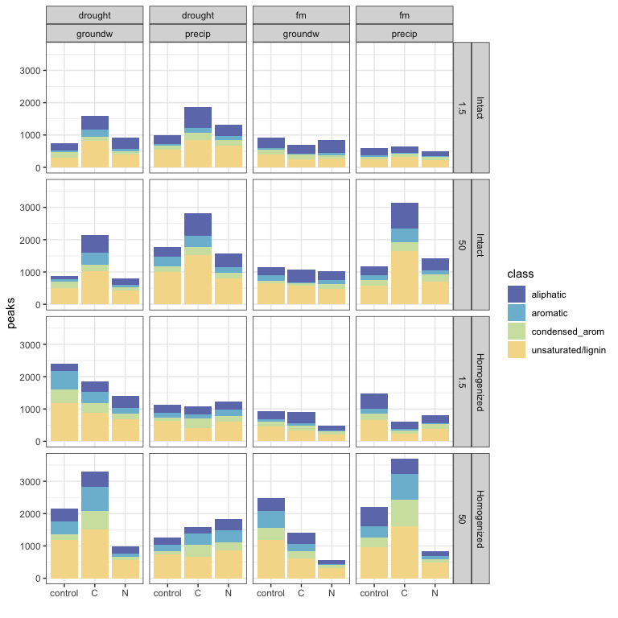
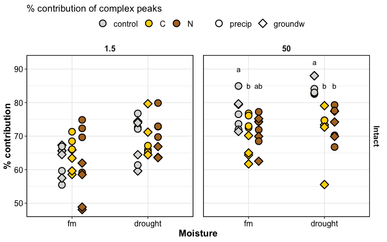
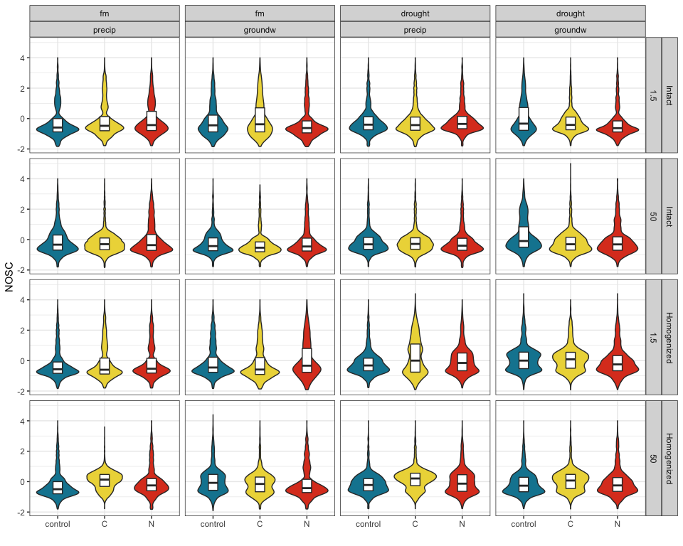
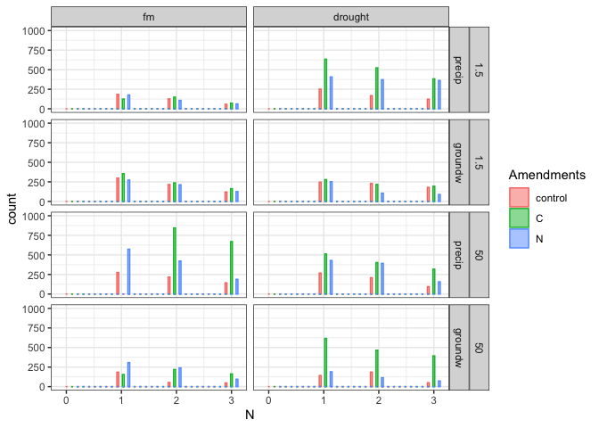
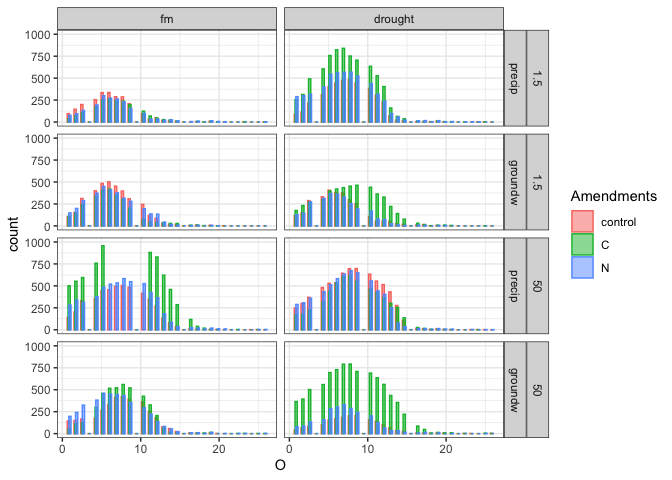

drake\_md\_report
================

-----

## HYPOTHESES

  - C amendments will increase diversity of SOM molecules
  - C amendments will cause a depletion of aromatic molecules,
    especially in fine pores
  - Homogenization will increase (a) total peaks, (b) diversity of
    peaks, (c) aromatic peaks

We selected only peaks seen in \>1 of the 4 replicates (i.e. n = 2 or 3
or 4)

-----

### setup

how many FTICR reps per treatment type?

click to open

| SampleAssignment                        | reps |
| :-------------------------------------- | ---: |
| 50-drought-groundw-control-Intact       |    2 |
| 50-drought-precip-C-Intact              |    2 |
| 1.5-drought-groundw-C-Homogenized       |    3 |
| 1.5-drought-groundw-C-Intact            |    3 |
| 1.5-drought-groundw-control-Homogenized |    3 |
| 1.5-drought-groundw-N-Intact            |    3 |
| 1.5-drought-precip-C-Homogenized        |    3 |
| 1.5-drought-precip-N-Homogenized        |    3 |
| 1.5-fm-precip-C-Intact                  |    3 |
| 1.5-fm-precip-N-Homogenized             |    3 |
| 50-drought-groundw-control-Homogenized  |    3 |
| 50-drought-groundw-N-Intact             |    3 |
| 50-drought-precip-control-Homogenized   |    3 |
| 50-fm-groundw-control-Intact            |    3 |
| 50-fm-groundw-N-Homogenized             |    3 |
| 50-fm-precip-control-Homogenized        |    3 |
| 50-fm-precip-N-Homogenized              |    3 |
| 1.5-drought-groundw-control-Intact      |    4 |
| 1.5-drought-groundw-N-Homogenized       |    4 |
| 1.5-drought-precip-C-Intact             |    4 |
| 1.5-drought-precip-control-Homogenized  |    4 |
| 1.5-drought-precip-control-Intact       |    4 |
| 1.5-drought-precip-N-Intact             |    4 |
| 1.5-fm-groundw-C-Homogenized            |    4 |
| 1.5-fm-groundw-C-Intact                 |    4 |
| 1.5-fm-groundw-control-Homogenized      |    4 |
| 1.5-fm-groundw-control-Intact           |    4 |
| 1.5-fm-groundw-N-Homogenized            |    4 |
| 1.5-fm-groundw-N-Intact                 |    4 |
| 1.5-fm-precip-C-Homogenized             |    4 |
| 1.5-fm-precip-control-Homogenized       |    4 |
| 1.5-fm-precip-control-Intact            |    4 |
| 1.5-fm-precip-N-Intact                  |    4 |
| 50-drought-groundw-C-Homogenized        |    4 |
| 50-drought-groundw-C-Intact             |    4 |
| 50-drought-groundw-N-Homogenized        |    4 |
| 50-drought-precip-C-Homogenized         |    4 |
| 50-drought-precip-control-Intact        |    4 |
| 50-drought-precip-N-Homogenized         |    4 |
| 50-drought-precip-N-Intact              |    4 |
| 50-fm-groundw-C-Homogenized             |    4 |
| 50-fm-groundw-C-Intact                  |    4 |
| 50-fm-groundw-control-Homogenized       |    4 |
| 50-fm-groundw-N-Intact                  |    4 |
| 50-fm-precip-C-Homogenized              |    4 |
| 50-fm-precip-C-Intact                   |    4 |
| 50-fm-precip-control-Intact             |    4 |
| 50-fm-precip-N-Intact                   |    4 |

**so we select formulae seen in at least 2 reps per treatment type**

-----

## van krevelens

domains, baseline

### fticr domains

<!-- -->

<!-- -->

VK by replication

### VK by replication

<!-- --><!-- --><!-- --><!-- -->

VK by treatment

#### VK diagrams by treatment

<!-- --><!-- -->

VK unique

#### VK unique

unique to each amendment, in each incubation type

<!-- --><!-- -->

-----

### peaks

graphs

<!-- -->

total peaks

<!-- -->

complex:simple compounds

<!-- -->

<!-- -->

peak count tables

tables – total peaks

| Homogenization | Moisture | Wetting | 1.5-control | 1.5-C      | 1.5-N      | 50-control | 50-C       | 50-N       |
| :------------- | :------- | :------ | :---------- | :--------- | :--------- | :--------- | :--------- | :--------- |
| Intact         | drought  | groundw | 736 ± 180   | 1598 ± 180 | 913 ± 381  | 884 ± 0    | 2155 ± 663 | 802 ± 70   |
| Intact         | drought  | precip  | 1008 ± 274  | 1857 ± 208 | 1326 ± 49  | 1768 ± 194 | 2823 ± 0   | 1567 ± 129 |
| Intact         | fm       | groundw | 915 ± 124   | 698 ± 34   | 848 ± 196  | 1144 ± 273 | 1064 ± 137 | 1036 ± 201 |
| Intact         | fm       | precip  | 596 ± 89    | 637 ± 61   | 497 ± 80   | 1181 ± 276 | 3149 ± 272 | 1423 ± 47  |
| Homogenized    | drought  | groundw | 2411 ± 136  | 1863 ± 245 | 1394 ± 221 | 2149 ± 205 | 3294 ± 290 | 992 ± 227  |
| Homogenized    | drought  | precip  | 1121 ± 391  | 1089 ± 109 | 1227 ± 151 | 1261 ± 173 | 1576 ± 701 | 1829 ± 584 |
| Homogenized    | fm       | groundw | 933 ± 134   | 899 ± 176  | 490 ± 47   | 2475 ± 455 | 1408 ± 175 | 568 ± 119  |
| Homogenized    | fm       | precip  | 1475 ± 209  | 609 ± 162  | 804 ± 129  | 2208 ± 141 | 3689 ± 339 | 844 ± 255  |

tables – complex peaks

| Homogenization | Moisture | Wetting | 1.5-control | 1.5-C      | 1.5-N      | 50-control | 50-C       | 50-N       |
| :------------- | :------- | :------ | :---------- | :--------- | :--------- | :--------- | :--------- | :--------- |
| Intact         | drought  | groundw | 520 ± 143   | 1159 ± 181 | 583 ± 241  | 778 ± 0    | 1609 ± 507 | 594 ± 61   |
| Intact         | drought  | precip  | 733 ± 204   | 1220 ± 136 | 977 ± 25   | 1469 ± 158 | 2109 ± 0   | 1148 ± 87  |
| Intact         | fm       | groundw | 590 ± 93    | 431 ± 16   | 442 ± 81   | 894 ± 233  | 689 ± 79   | 747 ± 166  |
| Intact         | fm       | precip  | 374 ± 64    | 439 ± 51   | 345 ± 62   | 905 ± 207  | 2341 ± 175 | 1039 ± 43  |
| Homogenized    | drought  | groundw | 2175 ± 121  | 1535 ± 227 | 1030 ± 187 | 1767 ± 215 | 2818 ± 233 | 774 ± 204  |
| Homogenized    | drought  | precip  | 889 ± 317   | 825 ± 90   | 978 ± 133  | 1045 ± 162 | 1396 ± 667 | 1488 ± 506 |
| Homogenized    | fm       | groundw | 677 ± 94    | 557 ± 120  | 331 ± 32   | 2094 ± 453 | 1065 ± 178 | 425 ± 79   |
| Homogenized    | fm       | precip  | 1007 ± 100  | 379 ± 107  | 557 ± 106  | 1605 ± 95  | 3229 ± 285 | 687 ± 229  |

-----

### relative abundances

<!-- -->

relative abundance of complex peaks

<!-- -->

### STATS

PERMANOVA

#### PERMANOVA

**overall**

    #> 
    #> Call:
    #> adonis(formula = relabund_wide %>% select(aliphatic:condensed_arom) ~      (Amendments + Moisture + Wetting + Suction + Homogenization)^3,      data = relabund_wide) 
    #> 
    #> Permutation: free
    #> Number of permutations: 999
    #> 
    #> Terms added sequentially (first to last)
    #> 
    #>                                     Df SumsOfSqs MeanSqs F.Model      R2 Pr(>F)
    #> Amendments                           2   0.14437 0.07219   7.811 0.04766  0.001
    #> Moisture                             1   0.21505 0.21505  23.270 0.07099  0.001
    #> Wetting                              1   0.00916 0.00916   0.991 0.00302  0.368
    #> Suction                              1   0.38447 0.38447  41.602 0.12691  0.001
    #> Homogenization                       1   0.17475 0.17475  18.909 0.05768  0.001
    #> Amendments:Moisture                  2   0.04268 0.02134   2.309 0.01409  0.052
    #> Amendments:Wetting                   2   0.05754 0.02877   3.113 0.01899  0.017
    #> Amendments:Suction                   2   0.02715 0.01357   1.469 0.00896  0.191
    #> Amendments:Homogenization            2   0.13898 0.06949   7.519 0.04588  0.001
    #> Moisture:Wetting                     1   0.01834 0.01834   1.985 0.00606  0.159
    #> Moisture:Suction                     1   0.05683 0.05683   6.149 0.01876  0.004
    #> Moisture:Homogenization              1   0.00560 0.00560   0.606 0.00185  0.586
    #> Wetting:Suction                      1   0.04302 0.04302   4.655 0.01420  0.015
    #> Wetting:Homogenization               1   0.05849 0.05849   6.329 0.01931  0.005
    #> Suction:Homogenization               1   0.02368 0.02368   2.562 0.00782  0.073
    #> Amendments:Moisture:Wetting          2   0.08926 0.04463   4.829 0.02946  0.001
    #> Amendments:Moisture:Suction          2   0.03187 0.01593   1.724 0.01052  0.145
    #> Amendments:Moisture:Homogenization   2   0.04422 0.02211   2.392 0.01460  0.058
    #> Amendments:Wetting:Suction           2   0.03512 0.01756   1.900 0.01159  0.096
    #> Amendments:Wetting:Homogenization    2   0.02055 0.01027   1.112 0.00678  0.347
    #> Amendments:Suction:Homogenization    2   0.08361 0.04181   4.524 0.02760  0.004
    #> Moisture:Wetting:Suction             1   0.02044 0.02044   2.212 0.00675  0.124
    #> Moisture:Wetting:Homogenization      1   0.00995 0.00995   1.077 0.00328  0.329
    #> Moisture:Suction:Homogenization      1   0.02605 0.02605   2.819 0.00860  0.079
    #> Wetting:Suction:Homogenization       1   0.01140 0.01140   1.233 0.00376  0.294
    #> Residuals                          136   1.25687 0.00924         0.41488       
    #> Total                              172   3.02945                 1.00000       
    #>                                       
    #> Amendments                         ***
    #> Moisture                           ***
    #> Wetting                               
    #> Suction                            ***
    #> Homogenization                     ***
    #> Amendments:Moisture                .  
    #> Amendments:Wetting                 *  
    #> Amendments:Suction                    
    #> Amendments:Homogenization          ***
    #> Moisture:Wetting                      
    #> Moisture:Suction                   ** 
    #> Moisture:Homogenization               
    #> Wetting:Suction                    *  
    #> Wetting:Homogenization             ** 
    #> Suction:Homogenization             .  
    #> Amendments:Moisture:Wetting        ***
    #> Amendments:Moisture:Suction           
    #> Amendments:Moisture:Homogenization .  
    #> Amendments:Wetting:Suction         .  
    #> Amendments:Wetting:Homogenization     
    #> Amendments:Suction:Homogenization  ** 
    #> Moisture:Wetting:Suction              
    #> Moisture:Wetting:Homogenization       
    #> Moisture:Suction:Homogenization    .  
    #> Wetting:Suction:Homogenization        
    #> Residuals                             
    #> Total                                 
    #> ---
    #> Signif. codes:  0 '***' 0.001 '**' 0.01 '*' 0.05 '.' 0.1 ' ' 1

**PERMANOVA for treatments**

1.5 kPa intact cores

    #> 
    #> Call:
    #> adonis(formula = intact_1_5 %>% select(aliphatic:condensed_arom) ~      Amendments * Moisture * Wetting, data = intact_1_5) 
    #> 
    #> Permutation: free
    #> Number of permutations: 999
    #> 
    #> Terms added sequentially (first to last)
    #> 
    #>                             Df SumsOfSqs  MeanSqs F.Model      R2 Pr(>F)    
    #> Amendments                   2   0.00603 0.003014  0.4995 0.01288  0.754    
    #> Moisture                     1   0.07530 0.075298 12.4784 0.16088  0.001 ***
    #> Wetting                      1   0.05498 0.054976  9.1107 0.11746  0.001 ***
    #> Amendments:Moisture          2   0.02583 0.012913  2.1399 0.05518  0.079 .  
    #> Amendments:Wetting           2   0.04222 0.021109  3.4981 0.09020  0.017 *  
    #> Moisture:Wetting             1   0.01142 0.011423  1.8931 0.02441  0.136    
    #> Amendments:Moisture:Wetting  2   0.05315 0.026576  4.4042 0.11356  0.006 ** 
    #> Residuals                   33   0.19913 0.006034         0.42545           
    #> Total                       44   0.46805                  1.00000           
    #> ---
    #> Signif. codes:  0 '***' 0.001 '**' 0.01 '*' 0.05 '.' 0.1 ' ' 1

50 kPa intact cores

    #> 
    #> Call:
    #> adonis(formula = intact_50 %>% select(aliphatic:condensed_arom) ~      Amendments * Moisture * Wetting, data = intact_50) 
    #> 
    #> Permutation: free
    #> Number of permutations: 999
    #> 
    #> Terms added sequentially (first to last)
    #> 
    #>                             Df SumsOfSqs  MeanSqs F.Model      R2 Pr(>F)    
    #> Amendments                   2   0.08850 0.044252  5.8702 0.19694  0.001 ***
    #> Moisture                     1   0.01117 0.011168  1.4815 0.02485  0.237    
    #> Wetting                      1   0.01314 0.013136  1.7426 0.02923  0.181    
    #> Amendments:Moisture          2   0.03599 0.017997  2.3875 0.08010  0.058 .  
    #> Amendments:Wetting           2   0.02278 0.011392  1.5112 0.05070  0.222    
    #> Moisture:Wetting             1   0.02859 0.028587  3.7923 0.06361  0.029 *  
    #> Amendments:Moisture:Wetting  2   0.02308 0.011538  1.5305 0.05135  0.225    
    #> Residuals                   30   0.22615 0.007538         0.50323           
    #> Total                       41   0.44940                  1.00000           
    #> ---
    #> Signif. codes:  0 '***' 0.001 '**' 0.01 '*' 0.05 '.' 0.1 ' ' 1

1.5 kPa homogenized cores

    #> 
    #> Call:
    #> adonis(formula = homo_1_5 %>% select(aliphatic:condensed_arom) ~      Amendments * Moisture * Wetting, data = homo_1_5) 
    #> 
    #> Permutation: free
    #> Number of permutations: 999
    #> 
    #> Terms added sequentially (first to last)
    #> 
    #>                             Df SumsOfSqs  MeanSqs F.Model      R2 Pr(>F)    
    #> Amendments                   2   0.11805 0.059026  7.9299 0.16791  0.001 ***
    #> Moisture                     1   0.20467 0.204672 27.4967 0.29111  0.001 ***
    #> Wetting                      1   0.01808 0.018077  2.4286 0.02571  0.078 .  
    #> Amendments:Moisture          2   0.02850 0.014249  1.9143 0.04053  0.112    
    #> Amendments:Wetting           2   0.03984 0.019918  2.6758 0.05666  0.046 *  
    #> Moisture:Wetting             1   0.01283 0.012831  1.7238 0.01825  0.164    
    #> Amendments:Moisture:Wetting  2   0.05037 0.025186  3.3836 0.07164  0.021 *  
    #> Residuals                   31   0.23075 0.007443         0.32819           
    #> Total                       42   0.70308                  1.00000           
    #> ---
    #> Signif. codes:  0 '***' 0.001 '**' 0.01 '*' 0.05 '.' 0.1 ' ' 1

50 kPa homogenized cores

    #> 
    #> Call:
    #> adonis(formula = homo_50 %>% select(aliphatic:condensed_arom) ~      Amendments * Moisture * Wetting, data = homo_50) 
    #> 
    #> Permutation: free
    #> Number of permutations: 999
    #> 
    #> Terms added sequentially (first to last)
    #> 
    #>                             Df SumsOfSqs  MeanSqs F.Model      R2 Pr(>F)    
    #> Amendments                   2   0.19013 0.095065  6.7194 0.22768  0.001 ***
    #> Moisture                     1   0.00599 0.005993  0.4236 0.00718  0.670    
    #> Wetting                      1   0.03243 0.032430  2.2922 0.03884  0.128    
    #> Amendments:Moisture          2   0.07244 0.036221  2.5602 0.08675  0.047 *  
    #> Amendments:Wetting           2   0.03066 0.015328  1.0835 0.03671  0.401    
    #> Moisture:Wetting             1   0.00933 0.009327  0.6593 0.01117  0.534    
    #> Amendments:Moisture:Wetting  2   0.05551 0.027754  1.9617 0.06647  0.099 .  
    #> Residuals                   31   0.43858 0.014148         0.52520           
    #> Total                       42   0.83506                  1.00000           
    #> ---
    #> Signif. codes:  0 '***' 0.001 '**' 0.01 '*' 0.05 '.' 0.1 ' ' 1

#### PCA

overall PCA

<!-- --><!-- -->

PCA individual treatments

**individual cores**

<!-- --><!-- -->

-----

### others

other plots

#### NOSC

<!-- -->

#### elements

<!-- --><!-- -->

## Session Info

click to expand

Date run: 2020-08-19

    #> R version 4.0.2 (2020-06-22)
    #> Platform: x86_64-apple-darwin17.0 (64-bit)
    #> Running under: macOS Catalina 10.15.6
    #> 
    #> Matrix products: default
    #> BLAS:   /System/Library/Frameworks/Accelerate.framework/Versions/A/Frameworks/vecLib.framework/Versions/A/libBLAS.dylib
    #> LAPACK: /Library/Frameworks/R.framework/Versions/4.0/Resources/lib/libRlapack.dylib
    #> 
    #> locale:
    #> [1] en_US.UTF-8/en_US.UTF-8/en_US.UTF-8/C/en_US.UTF-8/en_US.UTF-8
    #> 
    #> attached base packages:
    #> [1] stats     graphics  grDevices utils     datasets  methods   base     
    #> 
    #> other attached packages:
    #>  [1] lme4_1.1-23      Matrix_1.2-18    car_3.0-9        carData_3.0-4   
    #>  [5] visNetwork_2.0.9 vegan_2.5-6      lattice_0.20-41  permute_0.9-5   
    #>  [9] rmarkdown_2.3    here_0.1         patchwork_1.0.1  drake_7.12.4    
    #> [13] ggbiplot_0.55    PNWColors_0.1.0  forcats_0.5.0    stringr_1.4.0   
    #> [17] dplyr_1.0.1      purrr_0.3.4      readr_1.3.1      tidyr_1.1.1     
    #> [21] tibble_3.0.3     ggplot2_3.3.2    tidyverse_1.3.0 
    #> 
    #> loaded via a namespace (and not attached):
    #>  [1] minqa_1.2.4        colorspace_1.4-1   ellipsis_0.3.1     rio_0.5.16        
    #>  [5] rprojroot_1.3-2    fs_1.5.0           rstudioapi_0.11    farver_2.0.3      
    #>  [9] soilpalettes_0.1.0 fansi_0.4.1        lubridate_1.7.9    xml2_1.3.2        
    #> [13] splines_4.0.2      knitr_1.29         jsonlite_1.7.0     nloptr_1.2.2.2    
    #> [17] packrat_0.5.0      broom_0.7.0        cluster_2.1.0      dbplyr_1.4.4      
    #> [21] shiny_1.5.0        compiler_4.0.2     httr_1.4.2         backports_1.1.8   
    #> [25] assertthat_0.2.1   fastmap_1.0.1      cli_2.0.2          later_1.1.0.1     
    #> [29] htmltools_0.5.0    prettyunits_1.1.1  tools_4.0.2        igraph_1.2.5      
    #> [33] gtable_0.3.0       agricolae_1.3-3    glue_1.4.1         Rcpp_1.0.5        
    #> [37] cellranger_1.1.0   vctrs_0.3.2        nlme_3.1-148       xfun_0.16         
    #> [41] openxlsx_4.1.5     rvest_0.3.6        mime_0.9           miniUI_0.1.1.1    
    #> [45] lifecycle_0.2.0    statmod_1.4.34     MASS_7.3-51.6      scales_1.1.1      
    #> [49] hms_0.5.3          promises_1.1.1     parallel_4.0.2     yaml_2.2.1        
    #> [53] curl_4.3           labelled_2.5.0     stringi_1.4.6      highr_0.8         
    #> [57] klaR_0.6-15        AlgDesign_1.2.0    filelock_1.0.2     boot_1.3-25       
    #> [61] zip_2.1.0          storr_1.2.1        rlang_0.4.7        pkgconfig_2.0.3   
    #> [65] evaluate_0.14      htmlwidgets_1.5.1  labeling_0.3       tidyselect_1.1.0  
    #> [69] plyr_1.8.6         magrittr_1.5       R6_2.4.1           generics_0.0.2    
    #> [73] base64url_1.4      combinat_0.0-8     txtq_0.2.3         DBI_1.1.0         
    #> [77] pillar_1.4.6       haven_2.3.1        foreign_0.8-80     withr_2.2.0       
    #> [81] mgcv_1.8-31        abind_1.4-5        modelr_0.1.8       crayon_1.3.4      
    #> [85] questionr_0.7.1    utf8_1.1.4         progress_1.2.2     grid_4.0.2        
    #> [89] readxl_1.3.1       data.table_1.13.0  blob_1.2.1         reprex_0.3.0      
    #> [93] digest_0.6.25      xtable_1.8-4       httpuv_1.5.4       munsell_0.5.0

