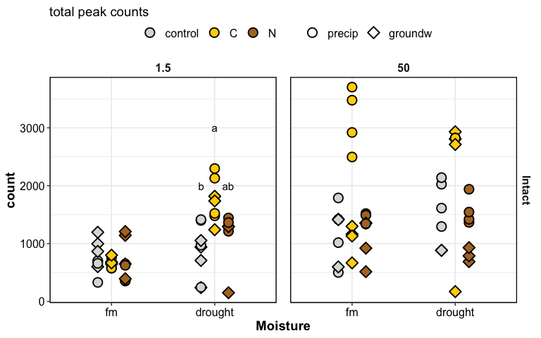
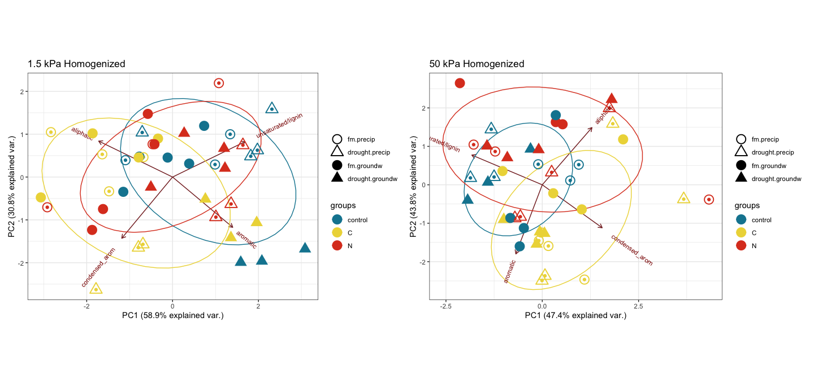

drake\_md\_report
================

-----

## HYPOTHESES

  - C amendments will increase diversity of SOM molecules
  - C amendments will cause a depletion of aromatic molecules,
    especially in fine pores
  - Homogenization will increase (a) total peaks, (b) diversity of
    peaks, (c) aromatic peaks

We selected only peaks seen in \>2/3 of the replicates

-----

### setup

how many FTICR reps per treatment type?

click to open

| SampleAssignment                        | reps |
| :-------------------------------------- | ---: |
| 50-drought-groundw-control-Intact       |    2 |
| 50-drought-precip-C-Intact              |    2 |
| 1.5-drought-groundw-C-Homogenized       |    3 |
| 1.5-drought-groundw-C-Intact            |    3 |
| 1.5-drought-groundw-control-Homogenized |    3 |
| 1.5-drought-groundw-N-Intact            |    3 |
| 1.5-drought-precip-C-Homogenized        |    3 |
| 1.5-drought-precip-N-Homogenized        |    3 |
| 1.5-fm-precip-C-Intact                  |    3 |
| 1.5-fm-precip-N-Homogenized             |    3 |
| 50-drought-groundw-control-Homogenized  |    3 |
| 50-drought-groundw-N-Intact             |    3 |
| 50-drought-precip-control-Homogenized   |    3 |
| 50-fm-groundw-control-Intact            |    3 |
| 50-fm-groundw-N-Homogenized             |    3 |
| 50-fm-precip-control-Homogenized        |    3 |
| 50-fm-precip-N-Homogenized              |    3 |
| 1.5-drought-groundw-control-Intact      |    4 |
| 1.5-drought-groundw-N-Homogenized       |    4 |
| 1.5-drought-precip-C-Intact             |    4 |
| 1.5-drought-precip-control-Homogenized  |    4 |
| 1.5-drought-precip-control-Intact       |    4 |
| 1.5-drought-precip-N-Intact             |    4 |
| 1.5-fm-groundw-C-Homogenized            |    4 |
| 1.5-fm-groundw-C-Intact                 |    4 |
| 1.5-fm-groundw-control-Homogenized      |    4 |
| 1.5-fm-groundw-control-Intact           |    4 |
| 1.5-fm-groundw-N-Homogenized            |    4 |
| 1.5-fm-groundw-N-Intact                 |    4 |
| 1.5-fm-precip-C-Homogenized             |    4 |
| 1.5-fm-precip-control-Homogenized       |    4 |
| 1.5-fm-precip-control-Intact            |    4 |
| 1.5-fm-precip-N-Intact                  |    4 |
| 50-drought-groundw-C-Homogenized        |    4 |
| 50-drought-groundw-C-Intact             |    4 |
| 50-drought-groundw-N-Homogenized        |    4 |
| 50-drought-precip-C-Homogenized         |    4 |
| 50-drought-precip-control-Intact        |    4 |
| 50-drought-precip-N-Homogenized         |    4 |
| 50-drought-precip-N-Intact              |    4 |
| 50-fm-groundw-C-Homogenized             |    4 |
| 50-fm-groundw-C-Intact                  |    4 |
| 50-fm-groundw-control-Homogenized       |    4 |
| 50-fm-groundw-N-Intact                  |    4 |
| 50-fm-precip-C-Homogenized              |    4 |
| 50-fm-precip-C-Intact                   |    4 |
| 50-fm-precip-control-Intact             |    4 |
| 50-fm-precip-N-Intact                   |    4 |

**so we select formulae seen in at least 2 reps per treatment type**

-----

## van krevelens

domains, baseline

#### fticr domains

<!-- -->

<!-- -->

VK by replication

#### VK by replication

    #> $gg_fticr_reps_1_5_intact

<!-- -->

    #> 
    #> $gg_fticr_reps_50_intact

<!-- -->

    #> 
    #> $gg_fticr_reps_1_5_homo

<!-- -->

    #> 
    #> $gg_fticr_reps_50_homo

<!-- -->

VK by treatment

#### VK diagrams by treatment

    #> $gg_fticr_pores_1_5kPa

<!-- -->

    #> 
    #> $gg_fticr_pores_50kPa

<!-- -->

VK unique

#### VK unique

unique to each amendment, in each incubation type

    #> $gg_fticr_unique_int

<!-- -->

    #> 
    #> $gg_fticr_unique_homo

<!-- -->

-----

## peaks

graphs

<!-- -->

total peaks

<!-- -->

complex:simple compounds

    #> $gg_aliph_aromatic

<!-- -->

    #> 
    #> $gg_aliph_aromatic_intact_suction

<!-- -->

peak count tables

tables – total peaks

tables – complex peaks

-----

### relative abundances

    #> $gg_fticr_relabund_barplots

<!-- -->

relative abundance of complex peaks

    #> $gg_complex_relabund

<!-- -->

### STATS

PERMANOVA

#### PERMANOVA

**overall**

    #> 
    #> Call:
    #> adonis(formula = relabund_wide %>% select(aliphatic:condensed_arom) ~      (Amendments + Moisture + Wetting + Suction + Homogenization)^3,      data = relabund_wide) 
    #> 
    #> Permutation: free
    #> Number of permutations: 999
    #> 
    #> Terms added sequentially (first to last)
    #> 
    #>                                     Df SumsOfSqs MeanSqs F.Model      R2 Pr(>F)
    #> Amendments                           2    0.2220 0.11098   6.950 0.03931  0.001
    #> Moisture                             1    0.4683 0.46831  29.328 0.08295  0.001
    #> Wetting                              1    0.0147 0.01472   0.922 0.00261  0.390
    #> Suction                              1    0.7053 0.70529  44.169 0.12492  0.001
    #> Homogenization                       1    0.5185 0.51854  32.474 0.09184  0.001
    #> Amendments:Moisture                  2    0.0420 0.02102   1.317 0.00745  0.248
    #> Amendments:Wetting                   2    0.1425 0.07125   4.462 0.02524  0.004
    #> Amendments:Suction                   2    0.0881 0.04407   2.760 0.01561  0.027
    #> Amendments:Homogenization            2    0.2338 0.11692   7.322 0.04142  0.001
    #> Moisture:Wetting                     1    0.0607 0.06066   3.799 0.01074  0.045
    #> Moisture:Suction                     1    0.0731 0.07307   4.576 0.01294  0.012
    #> Moisture:Homogenization              1    0.0137 0.01375   0.861 0.00243  0.456
    #> Wetting:Suction                      1    0.0742 0.07424   4.649 0.01315  0.018
    #> Wetting:Homogenization               1    0.0507 0.05069   3.175 0.00898  0.055
    #> Suction:Homogenization               1    0.0175 0.01752   1.097 0.00310  0.331
    #> Amendments:Moisture:Wetting          2    0.1693 0.08463   5.300 0.02998  0.001
    #> Amendments:Moisture:Suction          2    0.0418 0.02092   1.310 0.00741  0.272
    #> Amendments:Moisture:Homogenization   2    0.0827 0.04135   2.590 0.01465  0.049
    #> Amendments:Wetting:Suction           2    0.0543 0.02715   1.700 0.00962  0.150
    #> Amendments:Wetting:Homogenization    2    0.0489 0.02446   1.532 0.00866  0.206
    #> Amendments:Suction:Homogenization    2    0.1976 0.09878   6.186 0.03499  0.001
    #> Moisture:Wetting:Suction             1    0.0309 0.03093   1.937 0.00548  0.155
    #> Moisture:Wetting:Homogenization      1    0.0285 0.02853   1.787 0.00505  0.156
    #> Moisture:Suction:Homogenization      1    0.0887 0.08875   5.558 0.01572  0.012
    #> Wetting:Suction:Homogenization       1    0.0062 0.00620   0.388 0.00110  0.690
    #> Residuals                          136    2.1716 0.01597         0.38464       
    #> Total                              172    5.6459                 1.00000       
    #>                                       
    #> Amendments                         ***
    #> Moisture                           ***
    #> Wetting                               
    #> Suction                            ***
    #> Homogenization                     ***
    #> Amendments:Moisture                   
    #> Amendments:Wetting                 ** 
    #> Amendments:Suction                 *  
    #> Amendments:Homogenization          ***
    #> Moisture:Wetting                   *  
    #> Moisture:Suction                   *  
    #> Moisture:Homogenization               
    #> Wetting:Suction                    *  
    #> Wetting:Homogenization             .  
    #> Suction:Homogenization                
    #> Amendments:Moisture:Wetting        ***
    #> Amendments:Moisture:Suction           
    #> Amendments:Moisture:Homogenization *  
    #> Amendments:Wetting:Suction            
    #> Amendments:Wetting:Homogenization     
    #> Amendments:Suction:Homogenization  ***
    #> Moisture:Wetting:Suction              
    #> Moisture:Wetting:Homogenization       
    #> Moisture:Suction:Homogenization    *  
    #> Wetting:Suction:Homogenization        
    #> Residuals                             
    #> Total                                 
    #> ---
    #> Signif. codes:  0 '***' 0.001 '**' 0.01 '*' 0.05 '.' 0.1 ' ' 1

**PERMANOVA for treatments**

1.5 kPa intact cores

    #> 
    #> Call:
    #> adonis(formula = intact_1_5 %>% select(aliphatic:condensed_arom) ~      Amendments * Moisture * Wetting, data = intact_1_5) 
    #> 
    #> Permutation: free
    #> Number of permutations: 999
    #> 
    #> Terms added sequentially (first to last)
    #> 
    #>                             Df SumsOfSqs  MeanSqs F.Model      R2 Pr(>F)    
    #> Amendments                   2   0.01633 0.008163  0.7973 0.02346  0.560    
    #> Moisture                     1   0.11265 0.112649 11.0034 0.16190  0.001 ***
    #> Wetting                      1   0.03770 0.037702  3.6827 0.05419  0.022 *  
    #> Amendments:Moisture          2   0.05381 0.026905  2.6280 0.07734  0.033 *  
    #> Amendments:Wetting           2   0.08306 0.041528  4.0564 0.11937  0.005 ** 
    #> Moisture:Wetting             1   0.00923 0.009233  0.9019 0.01327  0.451    
    #> Amendments:Moisture:Wetting  2   0.04516 0.022581  2.2057 0.06491  0.065 .  
    #> Residuals                   33   0.33784 0.010238         0.48556           
    #> Total                       44   0.69578                  1.00000           
    #> ---
    #> Signif. codes:  0 '***' 0.001 '**' 0.01 '*' 0.05 '.' 0.1 ' ' 1

50 kPa intact cores

    #> 
    #> Call:
    #> adonis(formula = intact_50 %>% select(aliphatic:condensed_arom) ~      Amendments * Moisture * Wetting, data = intact_50) 
    #> 
    #> Permutation: free
    #> Number of permutations: 999
    #> 
    #> Terms added sequentially (first to last)
    #> 
    #>                             Df SumsOfSqs  MeanSqs F.Model      R2 Pr(>F)    
    #> Amendments                   2   0.23643 0.118217  8.7869 0.23254  0.001 ***
    #> Moisture                     1   0.06596 0.065958  4.9025 0.06487  0.016 *  
    #> Wetting                      1   0.03854 0.038541  2.8647 0.03791  0.079 .  
    #> Amendments:Moisture          2   0.05219 0.026094  1.9395 0.05133  0.115    
    #> Amendments:Wetting           2   0.03489 0.017445  1.2967 0.03432  0.282    
    #> Moisture:Wetting             1   0.09347 0.093470  6.9475 0.09193  0.002 ** 
    #> Amendments:Moisture:Wetting  2   0.09167 0.045835  3.4068 0.09016  0.014 *  
    #> Residuals                   30   0.40362 0.013454         0.39696           
    #> Total                       41   1.01677                  1.00000           
    #> ---
    #> Signif. codes:  0 '***' 0.001 '**' 0.01 '*' 0.05 '.' 0.1 ' ' 1

1.5 kPa homogenized cores

    #> 
    #> Call:
    #> adonis(formula = homo_1_5 %>% select(aliphatic:condensed_arom) ~      Amendments * Moisture * Wetting, data = homo_1_5) 
    #> 
    #> Permutation: free
    #> Number of permutations: 999
    #> 
    #> Terms added sequentially (first to last)
    #> 
    #>                             Df SumsOfSqs MeanSqs F.Model      R2 Pr(>F)    
    #> Amendments                   2   0.11234 0.05617   5.460 0.09488  0.002 ** 
    #> Moisture                     1   0.42212 0.42212  41.033 0.35652  0.001 ***
    #> Wetting                      1   0.02591 0.02591   2.519 0.02188  0.067 .  
    #> Amendments:Moisture          2   0.06126 0.03063   2.978 0.05174  0.032 *  
    #> Amendments:Wetting           2   0.08002 0.04001   3.889 0.06758  0.010 ** 
    #> Moisture:Wetting             1   0.04055 0.04055   3.941 0.03425  0.021 *  
    #> Amendments:Moisture:Wetting  2   0.12289 0.06144   5.973 0.10379  0.001 ***
    #> Residuals                   31   0.31891 0.01029         0.26935           
    #> Total                       42   1.18399                 1.00000           
    #> ---
    #> Signif. codes:  0 '***' 0.001 '**' 0.01 '*' 0.05 '.' 0.1 ' ' 1

50 kPa homogenized cores

    #> 
    #> Call:
    #> adonis(formula = homo_50 %>% select(aliphatic:condensed_arom) ~      Amendments * Moisture * Wetting, data = homo_50) 
    #> 
    #> Permutation: free
    #> Number of permutations: 999
    #> 
    #> Terms added sequentially (first to last)
    #> 
    #>                             Df SumsOfSqs  MeanSqs F.Model      R2 Pr(>F)    
    #> Amendments                   2   0.38098 0.190492  7.6607 0.25284  0.001 ***
    #> Moisture                     1   0.02208 0.022075  0.8878 0.01465  0.428    
    #> Wetting                      1   0.04095 0.040949  1.6468 0.02718  0.203    
    #> Amendments:Moisture          2   0.08431 0.042153  1.6952 0.05595  0.152    
    #> Amendments:Wetting           2   0.08385 0.041923  1.6860 0.05564  0.191    
    #> Moisture:Wetting             1   0.03016 0.030163  1.2130 0.02002  0.274    
    #> Amendments:Moisture:Wetting  2   0.09367 0.046833  1.8834 0.06216  0.126    
    #> Residuals                   31   0.77084 0.024866         0.51157           
    #> Total                       42   1.50683                  1.00000           
    #> ---
    #> Signif. codes:  0 '***' 0.001 '**' 0.01 '*' 0.05 '.' 0.1 ' ' 1

#### PCA

overall PCA

    #> $gg_pca_intact_suction

<!-- -->

    #> 
    #> $gg_pca_intact_amend

<!-- -->

    #> 
    #> $gg_fticr_pca_intact

<!-- -->

    #> $gg_pca_homo_amend

<!-- -->

    #> 
    #> $gg_pca_homo_suction

<!-- -->

    #> 
    #> $gg_fticr_pca_homo

<!-- -->

PCA individual treatments

**individual cores**

<!-- --><!-- -->

-----

### others

other plots

#### NOSC

<!-- -->

#### elements

    #> [1] NA

## Session Info

click to expand

Date run: 2020-09-09

    #> R version 4.0.2 (2020-06-22)
    #> Platform: x86_64-apple-darwin17.0 (64-bit)
    #> Running under: macOS Catalina 10.15.6
    #> 
    #> Matrix products: default
    #> BLAS:   /System/Library/Frameworks/Accelerate.framework/Versions/A/Frameworks/vecLib.framework/Versions/A/libBLAS.dylib
    #> LAPACK: /Library/Frameworks/R.framework/Versions/4.0/Resources/lib/libRlapack.dylib
    #> 
    #> locale:
    #> [1] en_US.UTF-8/en_US.UTF-8/en_US.UTF-8/C/en_US.UTF-8/en_US.UTF-8
    #> 
    #> attached base packages:
    #> [1] stats     graphics  grDevices utils     datasets  methods   base     
    #> 
    #> other attached packages:
    #>  [1] patchwork_1.0.1  lme4_1.1-23      Matrix_1.2-18    car_3.0-9       
    #>  [5] carData_3.0-4    visNetwork_2.0.9 vegan_2.5-6      lattice_0.20-41 
    #>  [9] permute_0.9-5    rmarkdown_2.3    drake_7.12.4     ggbiplot_0.55   
    #> [13] PNWColors_0.1.0  forcats_0.5.0    stringr_1.4.0    dplyr_1.0.1     
    #> [17] purrr_0.3.4      readr_1.3.1      tidyr_1.1.1      tibble_3.0.3    
    #> [21] ggplot2_3.3.2    tidyverse_1.3.0  here_0.1        
    #> 
    #> loaded via a namespace (and not attached):
    #>  [1] minqa_1.2.4        colorspace_1.4-1   ellipsis_0.3.1     rio_0.5.16        
    #>  [5] rprojroot_1.3-2    fs_1.5.0           rstudioapi_0.11    farver_2.0.3      
    #>  [9] soilpalettes_0.1.0 fansi_0.4.1        lubridate_1.7.9    xml2_1.3.2        
    #> [13] splines_4.0.2      knitr_1.29         jsonlite_1.7.0     nloptr_1.2.2.2    
    #> [17] packrat_0.5.0      broom_0.7.0        cluster_2.1.0      dbplyr_1.4.4      
    #> [21] shiny_1.5.0        compiler_4.0.2     httr_1.4.2         backports_1.1.8   
    #> [25] assertthat_0.2.1   fastmap_1.0.1      cli_2.0.2          later_1.1.0.1     
    #> [29] htmltools_0.5.0    prettyunits_1.1.1  tools_4.0.2        igraph_1.2.5      
    #> [33] gtable_0.3.0       agricolae_1.3-3    glue_1.4.1         Rcpp_1.0.5        
    #> [37] cellranger_1.1.0   vctrs_0.3.2        nlme_3.1-148       xfun_0.16         
    #> [41] openxlsx_4.1.5     rvest_0.3.6        mime_0.9           miniUI_0.1.1.1    
    #> [45] lifecycle_0.2.0    statmod_1.4.34     MASS_7.3-51.6      scales_1.1.1      
    #> [49] hms_0.5.3          promises_1.1.1     parallel_4.0.2     yaml_2.2.1        
    #> [53] curl_4.3           labelled_2.5.0     stringi_1.4.6      AlgDesign_1.2.0   
    #> [57] highr_0.8          klaR_0.6-15        filelock_1.0.2     boot_1.3-25       
    #> [61] zip_2.1.0          storr_1.2.1        rlang_0.4.7        pkgconfig_2.0.3   
    #> [65] evaluate_0.14      labeling_0.3       htmlwidgets_1.5.1  tidyselect_1.1.0  
    #> [69] plyr_1.8.6         magrittr_1.5       R6_2.4.1           generics_0.0.2    
    #> [73] base64url_1.4      combinat_0.0-8     txtq_0.2.3         DBI_1.1.0         
    #> [77] pillar_1.4.6       haven_2.3.1        foreign_0.8-80     withr_2.2.0       
    #> [81] mgcv_1.8-31        abind_1.4-5        modelr_0.1.8       crayon_1.3.4      
    #> [85] questionr_0.7.1    progress_1.2.2     grid_4.0.2         readxl_1.3.1      
    #> [89] data.table_1.13.0  blob_1.2.1         reprex_0.3.0       digest_0.6.25     
    #> [93] xtable_1.8-4       httpuv_1.5.4       munsell_0.5.0

