drake\_md\_report
================

-----

## HYPOTHESES

  - C amendments will increase diversity of SOM molecules
  - C amendments will cause a depletion of aromatic molecules,
    especially in fine pores
  - Homogenization will increase (a) total peaks, (b) diversity of
    peaks, (c) aromatic peaks

We selected only peaks seen in \>2/3 of the replicates

-----

**Color Palette:**  
[SoilPalettes:redox2](https://github.com/kaizadp/soilpalettes)

control: \#FFE733 (yellow)  
C: \#96001B (red)  
N: \#2E5894 (blue)

-----

### setup

how many FTICR reps per treatment type?

click to open

| SampleAssignment                        | reps |
| :-------------------------------------- | ---: |
| 50-drought-groundw-control-Intact       |    2 |
| 50-drought-precip-C-Intact              |    2 |
| 1.5-drought-groundw-C-Homogenized       |    3 |
| 1.5-drought-groundw-C-Intact            |    3 |
| 1.5-drought-groundw-control-Homogenized |    3 |
| 1.5-drought-groundw-N-Intact            |    3 |
| 1.5-drought-precip-C-Homogenized        |    3 |
| 1.5-drought-precip-N-Homogenized        |    3 |
| 1.5-fm-precip-C-Intact                  |    3 |
| 1.5-fm-precip-N-Homogenized             |    3 |
| 50-drought-groundw-control-Homogenized  |    3 |
| 50-drought-groundw-N-Intact             |    3 |
| 50-drought-precip-control-Homogenized   |    3 |
| 50-fm-groundw-control-Intact            |    3 |
| 50-fm-groundw-N-Homogenized             |    3 |
| 50-fm-precip-control-Homogenized        |    3 |
| 50-fm-precip-N-Homogenized              |    3 |
| 1.5-drought-groundw-control-Intact      |    4 |
| 1.5-drought-groundw-N-Homogenized       |    4 |
| 1.5-drought-precip-C-Intact             |    4 |
| 1.5-drought-precip-control-Homogenized  |    4 |
| 1.5-drought-precip-control-Intact       |    4 |
| 1.5-drought-precip-N-Intact             |    4 |
| 1.5-fm-groundw-C-Homogenized            |    4 |
| 1.5-fm-groundw-C-Intact                 |    4 |
| 1.5-fm-groundw-control-Homogenized      |    4 |
| 1.5-fm-groundw-control-Intact           |    4 |
| 1.5-fm-groundw-N-Homogenized            |    4 |
| 1.5-fm-groundw-N-Intact                 |    4 |
| 1.5-fm-precip-C-Homogenized             |    4 |
| 1.5-fm-precip-control-Homogenized       |    4 |
| 1.5-fm-precip-control-Intact            |    4 |
| 1.5-fm-precip-N-Intact                  |    4 |
| 50-drought-groundw-C-Homogenized        |    4 |
| 50-drought-groundw-C-Intact             |    4 |
| 50-drought-groundw-N-Homogenized        |    4 |
| 50-drought-precip-C-Homogenized         |    4 |
| 50-drought-precip-control-Intact        |    4 |
| 50-drought-precip-N-Homogenized         |    4 |
| 50-drought-precip-N-Intact              |    4 |
| 50-fm-groundw-C-Homogenized             |    4 |
| 50-fm-groundw-C-Intact                  |    4 |
| 50-fm-groundw-control-Homogenized       |    4 |
| 50-fm-groundw-N-Intact                  |    4 |
| 50-fm-precip-C-Homogenized              |    4 |
| 50-fm-precip-C-Intact                   |    4 |
| 50-fm-precip-control-Intact             |    4 |
| 50-fm-precip-N-Intact                   |    4 |

**so we select formulae seen in at least 2 reps per treatment type**

-----

## van krevelens

domains, baseline

#### fticr domains

<!-- -->

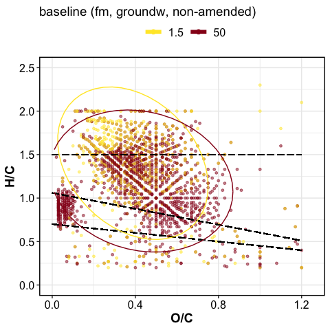<!-- -->

VK by replication

#### VK by replication

    #> $gg_fticr_reps_1_5_intact

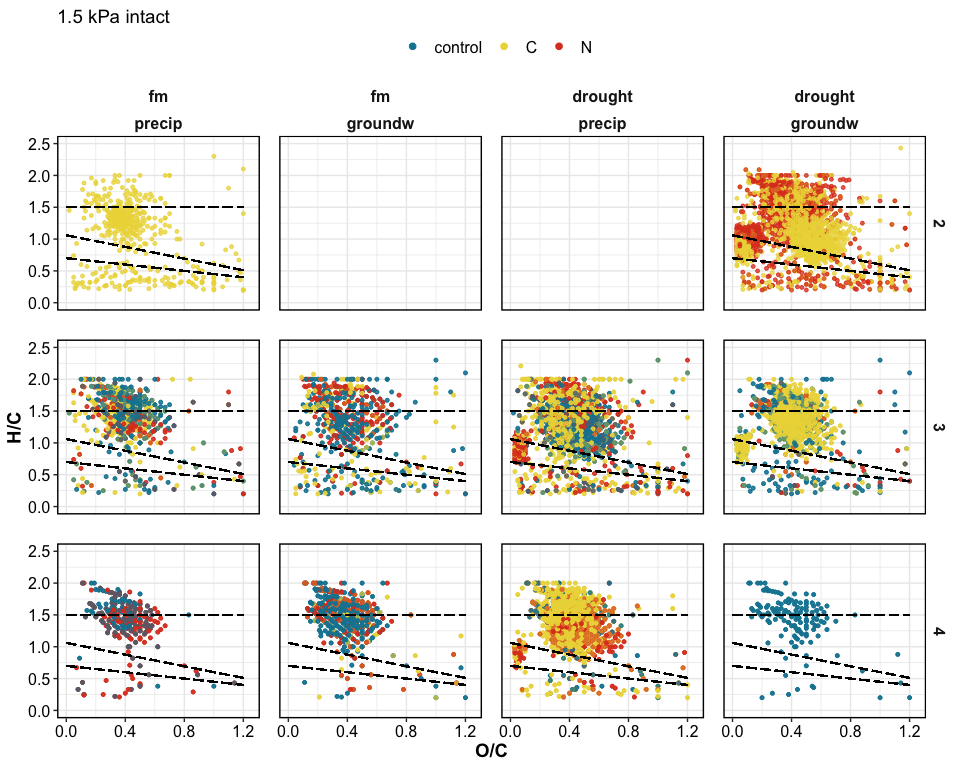<!-- -->

    #> 
    #> $gg_fticr_reps_50_intact

<!-- -->

    #> 
    #> $gg_fticr_reps_1_5_homo

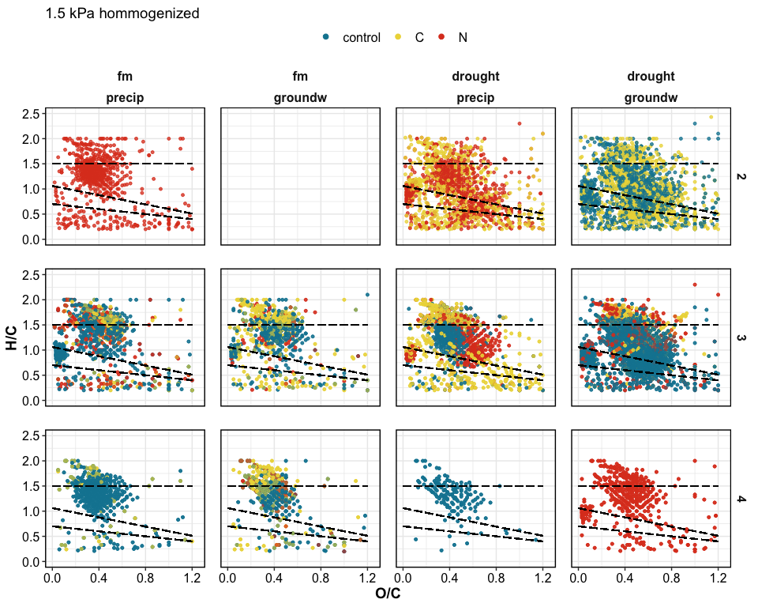<!-- -->

    #> 
    #> $gg_fticr_reps_50_homo

<!-- -->

VK by treatment

#### VK diagrams by treatment

    #> $gg_fticr_pores_1_5kPa

<!-- -->

    #> 
    #> $gg_fticr_pores_50kPa

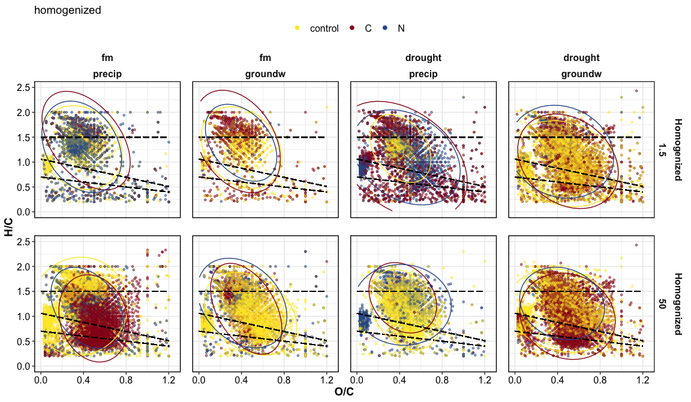<!-- -->

VK unique

#### VK unique

unique to each amendment, in each incubation type

Yellow peaks are peaks seen in control soils (all peaks)  
Blue and red are unique peaks in their respective treatments

    #> $gg_fticr_unique_int

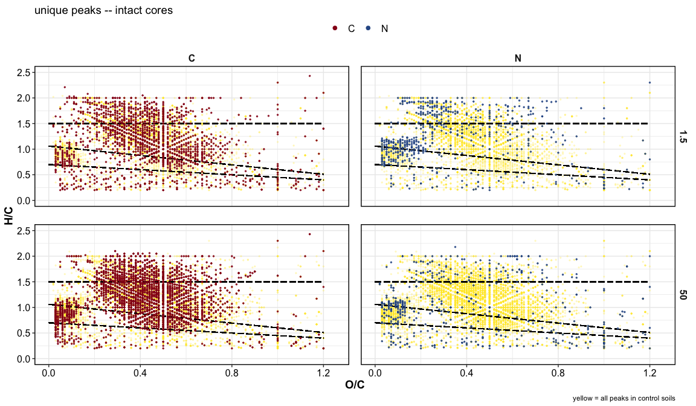<!-- -->

    #> 
    #> $gg_fticr_unique_homo

<!-- -->

-----

## peaks

graphs

<!-- -->

total peaks

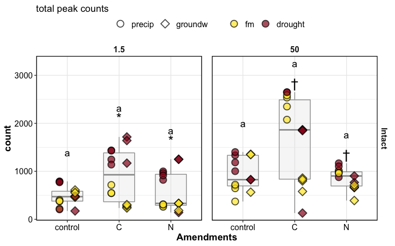<!-- -->

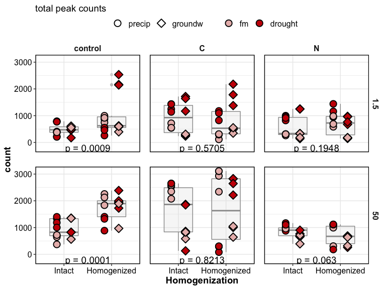<!-- -->

complex:simple compounds

    #> $gg_aliph_aromatic

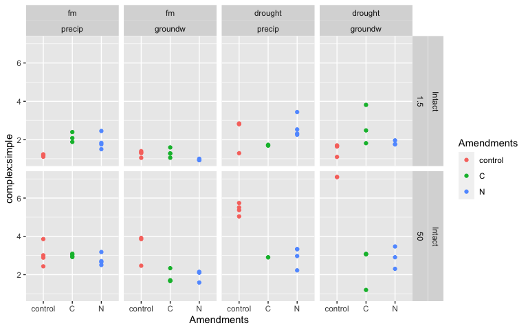<!-- -->

    #> 
    #> $gg_aliph_aromatic_intact_suction

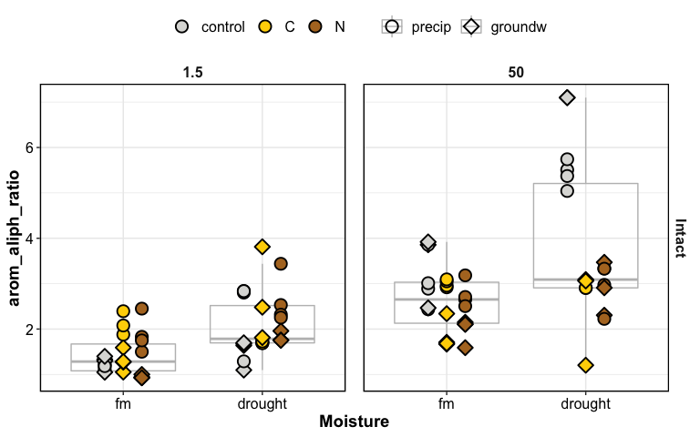<!-- -->

peak count tables

tables – total peaks

tables – complex peaks

-----

### relative abundances

    #> $gg_fticr_relabund_barplots

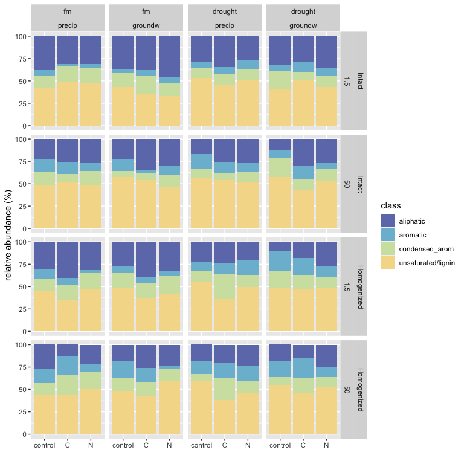<!-- -->

relative abundance of complex peaks

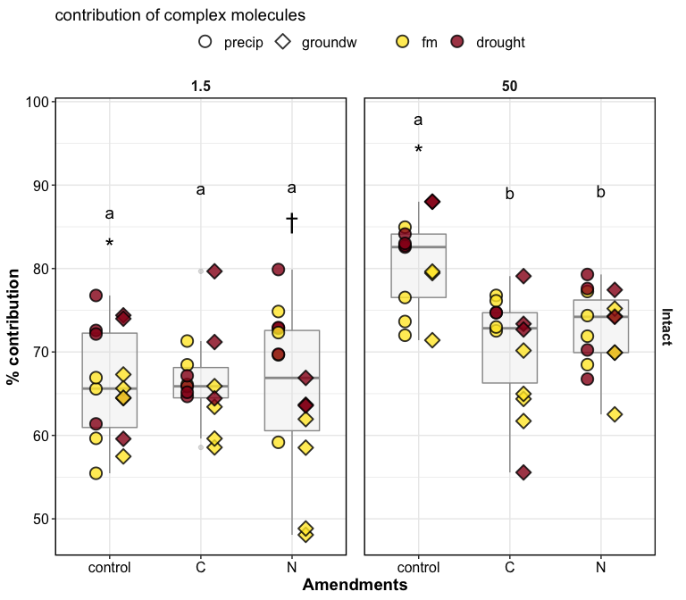<!-- -->

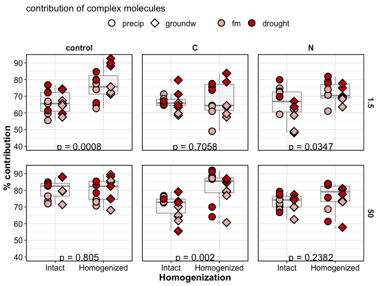<!-- -->

### STATS

PERMANOVA

#### PERMANOVA

**overall**

    #> # A tibble: 17 x 7
    #>    term                         df SumsOfSqs MeanSqs F.Model      R2 p.value
    #>    <chr>                     <dbl>     <dbl>   <dbl>   <dbl>   <dbl>   <dbl>
    #>  1 Amendments                    2    0.222   0.111    5.78  0.0393    0.002
    #>  2 Moisture                      1    0.468   0.468   24.4   0.0829    0.001
    #>  3 Wetting                       1    0.0147  0.0147   0.766 0.00261   0.475
    #>  4 Suction                       1    0.705   0.705   36.7   0.125     0.001
    #>  5 Homogenization                1    0.519   0.519   27.0   0.0918    0.001
    #>  6 Amendments:Moisture           2    0.0420  0.0210   1.09  0.00745   0.344
    #>  7 Amendments:Wetting            2    0.142   0.0712   3.71  0.0252    0.013
    #>  8 Amendments:Suction            2    0.0881  0.0441   2.29  0.0156    0.055
    #>  9 Amendments:Homogenization     2    0.234   0.117    6.08  0.0414    0.001
    #> 10 Moisture:Wetting              1    0.0607  0.0607   3.16  0.0107    0.053
    #> 11 Moisture:Suction              1    0.0731  0.0731   3.80  0.0129    0.021
    #> 12 Moisture:Homogenization       1    0.0137  0.0137   0.715 0.00243   0.497
    #> 13 Wetting:Suction               1    0.0742  0.0742   3.86  0.0131    0.028
    #> 14 Wetting:Homogenization        1    0.0507  0.0507   2.64  0.00898   0.07 
    #> 15 Suction:Homogenization        1    0.0175  0.0175   0.912 0.00310   0.416
    #> 16 Residuals                   152    2.92    0.0192  NA     0.517    NA    
    #> 17 Total                       172    5.65   NA       NA     1        NA

**PERMANOVA for treatments**

1.5 kPa intact cores

    #> # A tibble: 8 x 7
    #>   term                   df SumsOfSqs  MeanSqs F.Model     R2 p.value
    #>   <chr>               <dbl>     <dbl>    <dbl>   <dbl>  <dbl>   <dbl>
    #> 1 Amendments              2   0.0163   0.00816   0.746 0.0235   0.607
    #> 2 Moisture                1   0.113    0.113    10.3   0.162    0.001
    #> 3 Wetting                 1   0.0377   0.0377    3.45  0.0542   0.024
    #> 4 Amendments:Moisture     2   0.0538   0.0269    2.46  0.0773   0.049
    #> 5 Amendments:Wetting      2   0.0831   0.0415    3.79  0.119    0.009
    #> 6 Moisture:Wetting        1   0.00923  0.00923   0.844 0.0133   0.467
    #> 7 Residuals              35   0.383    0.0109   NA     0.550   NA    
    #> 8 Total                  44   0.696   NA        NA     1       NA

50 kPa intact cores

    #> # A tibble: 8 x 7
    #>   term                   df SumsOfSqs MeanSqs F.Model     R2 p.value
    #>   <chr>               <dbl>     <dbl>   <dbl>   <dbl>  <dbl>   <dbl>
    #> 1 Amendments              2    0.236   0.118     7.64 0.233    0.001
    #> 2 Moisture                1    0.0660  0.0660    4.26 0.0649   0.016
    #> 3 Wetting                 1    0.0385  0.0385    2.49 0.0379   0.097
    #> 4 Amendments:Moisture     2    0.0522  0.0261    1.69 0.0513   0.169
    #> 5 Amendments:Wetting      2    0.0349  0.0174    1.13 0.0343   0.325
    #> 6 Moisture:Wetting        1    0.0935  0.0935    6.04 0.0919   0.005
    #> 7 Residuals              32    0.495   0.0155   NA    0.487   NA    
    #> 8 Total                  41    1.02   NA        NA    1       NA

#### PCA

overall PCA

    #> $gg_fticr_pca_intact

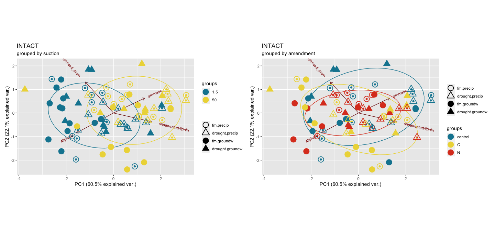<!-- -->

    #> $gg_fticr_pca_homo

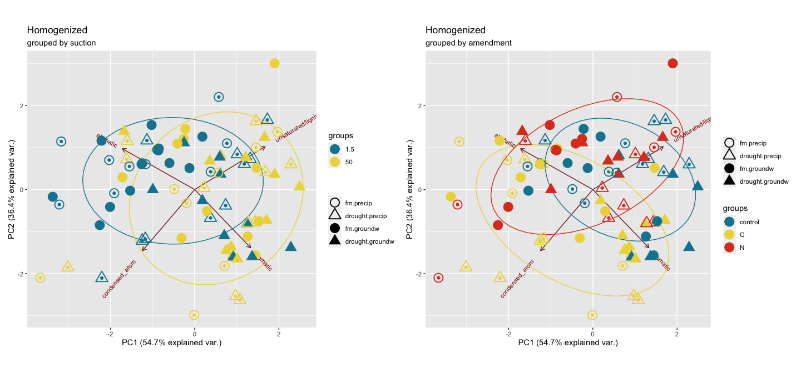<!-- -->

PCA individual treatments

**individual cores**

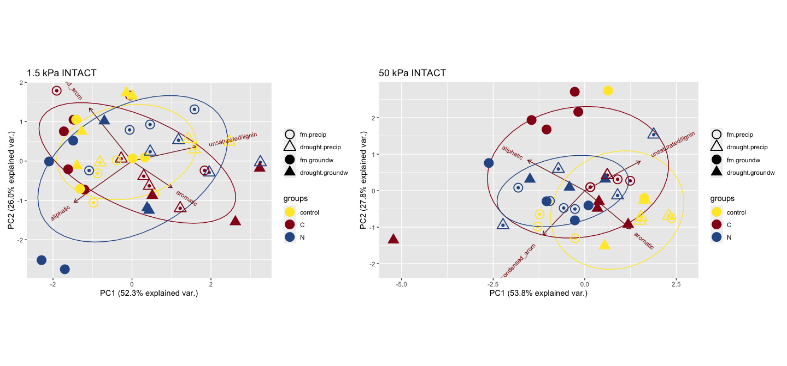<!-- --><!-- -->

-----

### others

other plots

#### NOSC

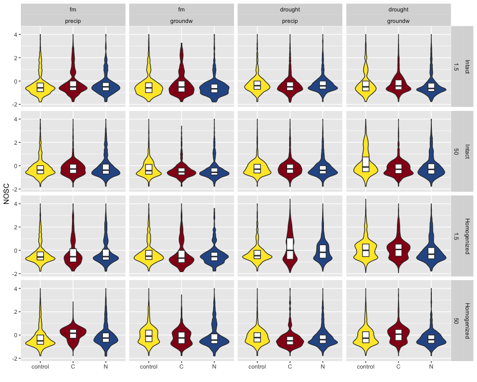<!-- -->

#### elements

    #> $gg_elements_n

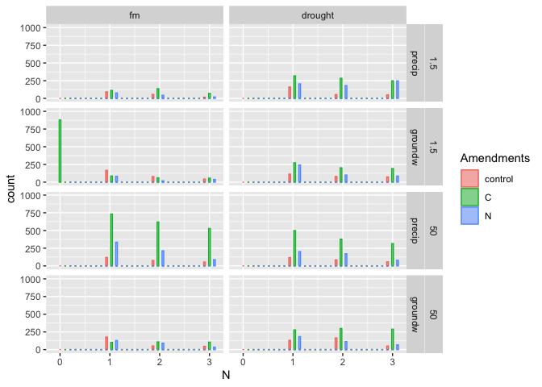<!-- -->

    #> 
    #> $gg_elements_o

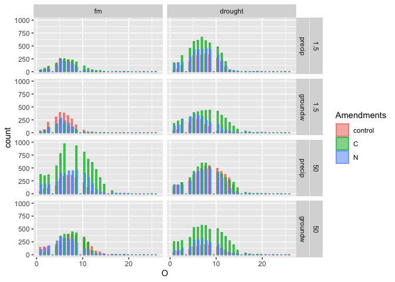<!-- -->

## Session Info

click to expand

Date run: 2020-09-14

    #> R version 4.0.2 (2020-06-22)
    #> Platform: x86_64-apple-darwin17.0 (64-bit)
    #> Running under: macOS Catalina 10.15.6
    #> 
    #> Matrix products: default
    #> BLAS:   /System/Library/Frameworks/Accelerate.framework/Versions/A/Frameworks/vecLib.framework/Versions/A/libBLAS.dylib
    #> LAPACK: /Library/Frameworks/R.framework/Versions/4.0/Resources/lib/libRlapack.dylib
    #> 
    #> locale:
    #> [1] en_US.UTF-8/en_US.UTF-8/en_US.UTF-8/C/en_US.UTF-8/en_US.UTF-8
    #> 
    #> attached base packages:
    #> [1] stats     graphics  grDevices utils     datasets  methods   base     
    #> 
    #> other attached packages:
    #>  [1] lme4_1.1-23      Matrix_1.2-18    visNetwork_2.0.9 vegan_2.5-6      lattice_0.20-41 
    #>  [6] permute_0.9-5    rmarkdown_2.3    here_0.1         patchwork_1.0.1  car_3.0-9       
    #> [11] carData_3.0-4    drake_7.12.4     ggbiplot_0.55    PNWColors_0.1.0  forcats_0.5.0   
    #> [16] stringr_1.4.0    dplyr_1.0.1      purrr_0.3.4      readr_1.3.1      tidyr_1.1.1     
    #> [21] tibble_3.0.3     ggplot2_3.3.2    tidyverse_1.3.0 
    #> 
    #> loaded via a namespace (and not attached):
    #>  [1] minqa_1.2.4        colorspace_1.4-1   ellipsis_0.3.1     rio_0.5.16        
    #>  [5] rprojroot_1.3-2    fs_1.5.0           rstudioapi_0.11    farver_2.0.3      
    #>  [9] soilpalettes_0.1.0 fansi_0.4.1        lubridate_1.7.9    xml2_1.3.2        
    #> [13] splines_4.0.2      knitr_1.29         jsonlite_1.7.0     nloptr_1.2.2.2    
    #> [17] packrat_0.5.0      broom_0.7.0        cluster_2.1.0      dbplyr_1.4.4      
    #> [21] shiny_1.5.0        compiler_4.0.2     httr_1.4.2         backports_1.1.8   
    #> [25] assertthat_0.2.1   fastmap_1.0.1      cli_2.0.2          later_1.1.0.1     
    #> [29] htmltools_0.5.0    prettyunits_1.1.1  tools_4.0.2        igraph_1.2.5      
    #> [33] gtable_0.3.0       agricolae_1.3-3    glue_1.4.1         tinytex_0.25      
    #> [37] Rcpp_1.0.5         cellranger_1.1.0   vctrs_0.3.2        nlme_3.1-148      
    #> [41] xfun_0.16          openxlsx_4.1.5     rvest_0.3.6        mime_0.9          
    #> [45] miniUI_0.1.1.1     lifecycle_0.2.0    statmod_1.4.34     MASS_7.3-51.6     
    #> [49] scales_1.1.1       hms_0.5.3          promises_1.1.1     parallel_4.0.2    
    #> [53] yaml_2.2.1         curl_4.3           labelled_2.5.0     stringi_1.4.6     
    #> [57] highr_0.8          klaR_0.6-15        AlgDesign_1.2.0    filelock_1.0.2    
    #> [61] boot_1.3-25        zip_2.1.0          storr_1.2.1        rlang_0.4.7       
    #> [65] pkgconfig_2.0.3    evaluate_0.14      labeling_0.3       htmlwidgets_1.5.1 
    #> [69] tidyselect_1.1.0   plyr_1.8.6         magrittr_1.5       R6_2.4.1          
    #> [73] generics_0.0.2     base64url_1.4      combinat_0.0-8     txtq_0.2.3        
    #> [77] DBI_1.1.0          mgcv_1.8-31        pillar_1.4.6       haven_2.3.1       
    #> [81] foreign_0.8-80     withr_2.2.0        abind_1.4-5        modelr_0.1.8      
    #> [85] crayon_1.3.4       questionr_0.7.1    utf8_1.1.4         progress_1.2.2    
    #> [89] grid_4.0.2         readxl_1.3.1       data.table_1.13.0  blob_1.2.1        
    #> [93] reprex_0.3.0       digest_0.6.25      xtable_1.8-4       httpuv_1.5.4      
    #> [97] munsell_0.5.0

