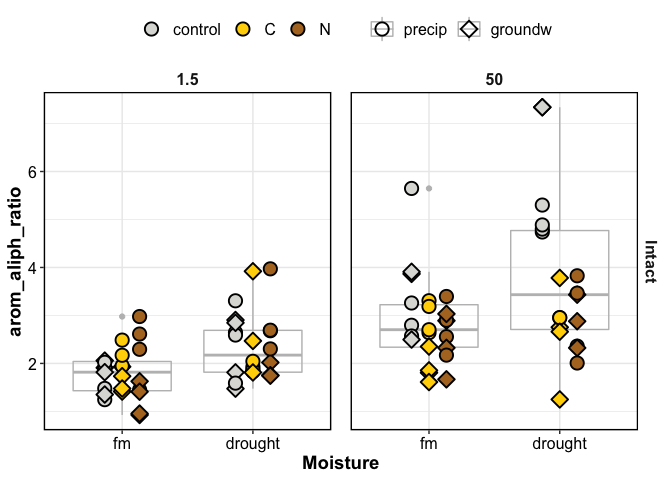

results
================

# HYPOTHESES:

We hypothesized that:

  - H1. Adding soluble C would alleviate substrate limitation, whereas
    adding soluble N would alleviate resource limitation, resulting in
    increased microbial activity, i.e. **greater CO2 production**,
    **increased diversity in SOM compounds**, and a **relative depletion
    in complex/aromatic compounds**. These responses would be influenced
    by soil physico-chemical properties:
    
      - H1a. pore size: The effect of C additions would be greater in
        tightly-held pore water.
    
      - H1b. wetting direction: The effect of C amendments would be
        greater in cores wet from below, due to C limitation at greater
        soil depths. Conversely, the effect of N amendments would be
        greater in cores wet from above.
    
      - H1c. antecedent moisture conditions: Respiration response to C
        amendments would be greater in soils previously maintained at
        field moist conditions, compared to soils previously subjected
        to drought.

  - H2. Homogenization would increase the diversity and the aromaticity
    of pore-water DOC, and this effect would be comparable across all
    treatments (i.e., non-amended vs. C or N amended), regardless of
    resource availability.

-----

We used linear mixed models to determine how our response variables
responded to the treatments. Homogenization, Moisture, Wetting,
Amendments, Suction were used as fixed effects in an exploratory
analysis.  
Because homogenization and suction both played an important role in the
amount and types of C detected, we analyzed those separately.  
Because Wetting direction did not have a significant effect, we removed
it as a fixed variable throughout, and instead used it as a random
variable.

-----

# RESPIRATION (core-scale results)

1.  **Amendments**
      - 
2.  **Homogenization**
      - for CONTROL cores, fluxes did not differ in intact
        vs. homogenized
      - for C and N amended cores, fluxes were significantly lower in
        homogenized cores

<!-- end list -->

    #> [1] NA

    #> NULL

-----

# DOC

    #> [1] NA

effect of homogenization

    #> [1] NA

-----

# FT-ICR-MS

## total peaks

total peak counts were influenced by:

  - not Homogenization
  - Suction (50 \> 1.5 kPa)
  - Moisture (drought \> fm)
  - not Wetting
  - Amendments (declines in N)

<!-- end list -->

    #> # A tibble: 173 x 9
    #>     Core SampleAssignment class counts Suction Moisture Wetting Amendments
    #>    <int> <chr>            <chr>  <int>   <dbl> <fct>    <fct>   <fct>     
    #>  1     1 1.5-fm-precip-c… total   1959     1.5 fm       precip  control   
    #>  2     1 1.5-fm-precip-c… total    330     1.5 fm       precip  control   
    #>  3     1 50-fm-precip-co… total    501    50   fm       precip  control   
    #>  4     3 1.5-fm-precip-C… total    153     1.5 fm       precip  C         
    #>  5     3 1.5-fm-precip-C… total    760     1.5 fm       precip  C         
    #>  6     3 50-fm-precip-C-… total   3547    50   fm       precip  C         
    #>  7     3 50-fm-precip-C-… total   3477    50   fm       precip  C         
    #>  8     4 1.5-drought-gro… total    947     1.5 drought  groundw N         
    #>  9     4 1.5-drought-gro… total    151     1.5 drought  groundw N         
    #> 10     4 50-drought-grou… total    365    50   drought  groundw N         
    #> # … with 163 more rows, and 1 more variable: Homogenization <fct>

In intact cores, total peak counts were influenced by:

  - suction:wetting
  - moisture:wetting

<!-- end list -->

    #> Anova Table (Type III tests)
    #> 
    #> Response: log(counts)
    #>                      Sum Sq Df  F value    Pr(>F)    
    #> (Intercept)         229.068  1 840.0260 < 2.2e-16 ***
    #> Suction               3.932  1  14.4209 0.0003025 ***
    #> Moisture              1.191  1   4.3661 0.0401943 *  
    #> Wetting               0.799  1   2.9283 0.0913439 .  
    #> Amendments            0.411  2   0.7544 0.4739684    
    #> Suction:Moisture      0.733  1   2.6866 0.1055555    
    #> Suction:Wetting       1.946  1   7.1381 0.0093260 ** 
    #> Suction:Amendments    0.200  2   0.3661 0.6947309    
    #> Moisture:Wetting      1.307  1   4.7947 0.0317893 *  
    #> Moisture:Amendments   0.836  2   1.5320 0.2230637    
    #> Wetting:Amendments    0.534  2   0.9799 0.3803058    
    #> Residuals            19.634 72                       
    #> ---
    #> Signif. codes:  0 '***' 0.001 '**' 0.01 '*' 0.05 '.' 0.1 ' ' 1

## diversity of peaks

## complex/aromatic peaks

Aromatic peaks (i.e. complex:simple ratio) were influenced by:

  - Homogenization (homogenized \> intact)
  - Suction (50 kPa \> 1.5 kPa)
  - Moisture (drought \> fm)
  - Amendments (control \> C \> N)
  - not Wetting direction

<!-- end list -->

    #> [1] NA

For intact soils, Amendment effects were greater in fine pores than in
coarse pores

  - in coarse pores, no effect of amendment
  - in fine pores, both C and N amendments caused a relative depletion
    of complex compounds

<!-- -->
